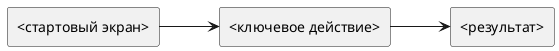

# Требования по фиче — <Русское название> (<feature-slug>)

Статус: **draft**
Фича: `features/<feature-slug>/feature.md`
Квартал: `<YYYY-QN>`
Дата обновления: `<YYYY-MM-DD>`
Формат: **новый лёгкий**
Шаблон: `.workflow/templates/requirements/feature-requirements.readable.template.md`

## Как читать документ

- Этот файл — главный источник бизнес-правил, спорных решений и общей логики фичи.
- Срезы ниже — короткие рабочие пакеты для разработки и тестирования.
- Подробные FE/BE детали лежат в `slices/*/requirements/*.md`, но не противоречат этому файлу.
- Диаграммы пишем только в PlantUML.

## Оглавление

1. Общий контур фичи
2. Быстрая схема
3. Порядок срезов
4. Бизнес-правила
5. Системные правила и интеграции
6. Контроль срезов
7. Общий чеклист для тестирования
8. Открытые вопросы и допущения

## Общий контур фичи

- Назначение:
- Что уже есть в `baseline/current`:
- Дельта фичи:
- Основные пользователи и роли:
- Визуальная база:
- Источники:

## Быстрая схема



## Порядок срезов

1. `01 <slice-slug>` — <Русское название среза>
2. `02 <slice-slug>` — <Русское название среза>
3. `03 <slice-slug>` — <Русское название среза>

---

## Бизнес-правила

### Сущности и термины

| Термин | Смысл | Важные ограничения |
|---|---|---|
| `<термин>` |  |  |

### Роли и доступность

| Роль | Просмотр | Создание/редактирование | Действия | Ограничения |
|---|---|---|---|---|
| `<роль>` |  |  |  |  |

### Основные правила

1.
2.
3.

## Системные правила и интеграции

### Статусы и переходы

```plantuml
@startuml
[*] --> <STATUS_1>
<STATUS_1> --> <STATUS_2> : <action>
<STATUS_2> --> [*]
@enduml
```

| Текущий статус | Действие | Новый статус | Что проверить |
|---|---|---|---|
| `<STATUS_1>` | `<action>` | `<STATUS_2>` |  |

### API

| Метод | Маршрут | Назначение |
|---|---|---|
| `<METHOD>` | `<path>` |  |

### Модель данных

| Сущность / таблица | Поле | Тип | Обяз. | Комментарий |
|---|---|---|---:|---|
|  |  |  |  |  |

---

## Контроль срезов

## <STORY/Jira/feature-slice-id> — <Русское название среза>

Карточка среза: `slices/<slice-slug>/slice.md`
Детализация FE: `slices/<slice-slug>/requirements/frontend.md`
Детализация BE: `slices/<slice-slug>/requirements/backend.md`
Плановая история: `planning/stories/STORY-<FEATURE>-NNN.md`

**Назначение**

- 

**Критерии приемки**

1.
2.
3.

**Что проверить тестировщику**

- [ ]
- [ ]
- [ ]

---

## Общий чеклист для тестирования

| Проверка | Где детализировано |
|---|---|
|  | `slices/<slice-slug>/requirements/*` |

## Открытые вопросы и допущения

- 

## Правила формата

- Бизнес-контекст, длинные объяснения и спорные решения держим здесь.
- Срезы должны быть короткими, наглядными и исчерпывающими только в рамках своего среза.
- В каждом срезе должна быть информация для тестировщика.
- Старый вариант требований не смешиваем с новым: если выбран этот шаблон, все slice cards и FE/BE packs ведём в новом лёгком стиле.
