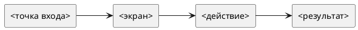

# <Русское название среза> (Фронтенд)

Статус: **draft**
Фича: `<feature-slug>`
Срез: `<slice-slug>`
Область: `<MVP / release / stretch>`
Дата обновления: `<YYYY-MM-DD>`
Формат: **новый лёгкий**
Шаблон: `.workflow/templates/requirements/frontend.readable.template.md`

## Цель среза

<1-2 предложения: что пользователь должен увидеть или сделать на фронте.>

## Экран / сценарий

## UI-состав

| Блок | Требование |
|---|---|
| Заголовок |  |
| Основной блок |  |
| Действия |  |
| Пустое состояние |  |
| Ошибка |  |

## UI-состояния

| Состояние | Что видно | Доступные действия |
|---|---|---|
| загрузка |  |  |
| пусто |  |  |
| данные загружены |  |  |
| ошибка |  |  |

## Интеграция

| Метод и маршрут | Когда вызывается | Что отправляем | Что читаем |
|---|---|---|---|
|  |  |  |  |

## Валидация на фронте

| Ситуация | Поведение / сообщение |
|---|---|
|  |  |

## Права и ограничения

| Роль / условие | Что доступно | Что недоступно |
|---|---|---|
|  |  |  |

## Чеклист для тестирования среза

- [ ] Основной пользовательский сценарий проходит без ручных обходов.
- [ ] Пустые состояния отличаются от ошибок.
- [ ] Ошибки API не превращаются в успешное локальное состояние.
- [ ] Действия скрываются или блокируются по правам и статусам.
- [ ] UI использует актуальные статусы, названия и маршруты из `../../requirements.md`.

## Открытые вопросы и допущения

- 
