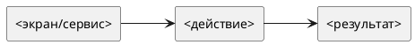

# Срез — <Русское название смыслового среза>

Статус: **draft**
Фича: `features/<feature-slug>/feature.md`
Порядок в требованиях фичи: `<01>`
Дата обновления: `<YYYY-MM-DD>`
Формат: **новый лёгкий**
Шаблон: `.workflow/templates/requirements/slice.readable.template.md`

## Назначение

<1-2 предложения: какую часть фичи закрывает срез и зачем он выделен отдельно.>

## Главное

- Главный источник бизнес-правил: `../../requirements.md`.
- Срез короткий: границы, ссылки, проверяемые правила и фокус тестирования.
- Если найдено новое правило или противоречие, сначала обновить `../../requirements.md`, затем синхронизировать этот срез.

## Границы среза

| Входит | Не входит |
|---|---|
|  |  |

## Схема среза

## Связанные плановые истории

- `STORY-<FEATURE>-NNN`

## Пакеты требований

- `../../requirements.md`
- `requirements/frontend.md`
- `requirements/backend.md`

## Связанные прототипы

- `../../planning/scope-prototype/prototype.html`
- `delivery-prototype/prototype.html`
- `delivery-prototype/notes.md`

## Фокус тестирования среза

- [ ] Проверить основной успешный сценарий.
- [ ] Проверить пустые состояния.
- [ ] Проверить ошибки API и недоступные действия.
- [ ] Проверить права ролей.
- [ ] Проверить отсутствие старых терминов/маршрутов/статусов, если срез заменяет прежнюю логику.

## Связанные артефакты исполнения

- `execution/tasks.md`
