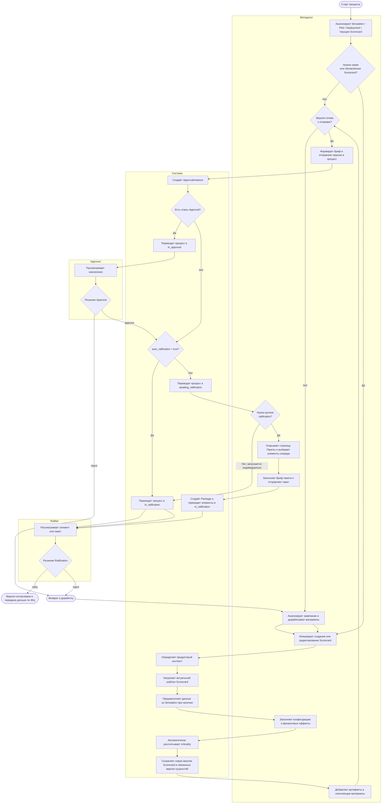

# Бизнес-описание процесса работы методолога в системе

Статус: для внутреннего использования и согласования
Дата: 2026-04-09
Основание: `final-spec/spec_domain_model.md` v3.3, `final-spec/REQ_roles_rbac.md`, `final-spec/REQ_scorecards_backend.md`, `final-spec/REQ_scorecards_frontend.md`, `final-spec/REQ_artifacts_core.md`, `final-spec/REQ_approval_core.md`, `final-spec/REQ_packages_page_backend.md`, `final-spec/REQ_approvals_page_backend.md`, `final-spec/REQ_deployments_frontend.md`

## 1. Роль методолога в системе

Методолог в АС КОДА отвечает за методологическую подготовку изменений риск-стратегии. В операционной модели системы это означает, что он:

- видит все ключевые сущности всех продуктов: `Simulation`, `Pilot`, `Deployment`, `Scorecard`;
- управляет скоркартами в рамках своего продуктового контура;
- сопровождает документы и ссылки на внешние материалы через механизм артефактов;
- может инициировать отправку подготовленных версий в процесс согласования и утверждения;
- может формировать пакеты для ручного ratification;
- может участвовать в согласовании или утверждении, если дополнительно назначен `approver` или `ratifier`.

При этом методолог не является владельцем полного жизненного цикла инициативы. В актуальной доменной модели он не создаёт и не редактирует `Initiative`, `Simulation`, `Pilot`, `Deployment`, не выполняет их активацию, внедрение и rollback. Его зона ответственности заканчивается на подготовке корректной методологической конфигурации и сопровождении её через этапы согласования.

## 2. Бизнес-цель процесса

Цель процесса работы методолога состоит в том, чтобы обеспечить для продукта методологически корректную, документированную и согласованную конфигурацию скоркарты, пригодную для использования в пилоте или внедрении.

Результатом процесса является одно из состояний:

- создана или обновлена скоркарта, связанная с `Pilot` или `Deployment`;
- приложены подтверждающие артефакты;
- подготовленная версия передана в маршрут `Approval/Ratification`;
- по результату процесса версия либо утверждена, либо возвращена на доработку.

## 3. Границы ответственности методолога

### Что делает методолог

- анализирует доступные симуляции, пилоты и внедрения всех продуктов;
- определяет, требуется ли новая скоркарта или изменение существующей;
- создаёт скоркарту из контекста `Pilot` или `Deployment`;
- при необходимости использует данные `Simulation` для частичного предзаполнения скоркарты;
- редактирует конфигурацию, финансовые эффекты и связанные параметры скоркарты;
- контролирует автоматически рассчитанную критичность;
- добавляет и актуализирует артефакты родительских сущностей;
- отправляет подготовленные версии в согласование;
- при ручном ratification формирует пакет из элементов очереди `awaiting_ratification`;
- отслеживает решения согласующих и утверждающих, после отклонения организует доработку.

### Что методолог не делает

- не создаёт и не редактирует сами `Simulation`, `Pilot`, `Deployment`;
- не управляет жизненным циклом внедрения;
- не выполняет production-внедрение и rollback;
- не является обязательным участником всех этапов согласования, если отдельно не назначен.

## 4. Основной бизнес-процесс

### Шаг 1. Анализ контекста изменения

Методолог открывает связанные сущности системы и анализирует контекст изменения:

- результаты `Simulation`, если они есть;
- текущие `Pilot` и `Deployment`;
- уже существующие скоркарты;
- текущие статусы и связи между сущностями.

На этом этапе он определяет, достаточно ли существующей скоркарты или требуется новая версия либо новая скоркарта.

### Шаг 2. Подготовка скоркарты

Если требуется методологическое изменение, методолог инициирует создание или редактирование скоркарты из контекста `Pilot` или `Deployment`.

Система при этом:

- автоматически определяет продуктовый контекст;
- загружает актуальную версию шаблона скоркарты для продукта;
- подставляет структуру полей, значения по умолчанию и пороги расчёта критичности;
- при сценарии с `Simulation` частично предзаполняет форму данными источника;
- формирует системное название скоркарты.

Методолог заполняет или уточняет конфигурацию и финансовые эффекты. При сохранении система выпускает новую версию скоркарты и, если это требуется сценарием, новую версию связанного доменного элемента.

### Шаг 3. Документирование

После подготовки скоркарты методолог прикладывает подтверждающие материалы через артефакты:

- расчётные материалы;
- методологические пояснения;
- ссылки на внешние документы;
- иные сопровождающие основания для согласования.

Артефакты наследуют права родительской сущности, поэтому методолог работает с документами в рамках своего продуктового контура.

### Шаг 4. Передача в согласование

Когда версия готова, методолог инициирует отправку `PilotVersion` или `DeploymentVersion` в процесс `Approval/Ratification`.

На этом этапе он:

- формирует бриф согласования;
- выбирает участников этапов `Approval` и `Ratification`;
- не может назначить самого себя;
- запускает процесс.

Если у маршрута есть этапы `Approval`, процесс начинается с `in_approval`. Если `Approval` отсутствует, элемент попадает либо сразу в `in_ratification`, либо в очередь `awaiting_ratification` в зависимости от настроек `auto_ratification`.

### Шаг 5. Работа с ручным утверждением

Если элемент попал в `awaiting_ratification`, методолог работает через страницу `Пакеты`.

Он:

- видит очередь элементов, ожидающих ручного утверждения;
- может выбрать два и более элемента;
- заполняет бриф пакета;
- отправляет пакет;
- переводит входящие `ApprovalInstance` в `in_ratification`.

Для методолога действует отдельное бизнес-исключение: он может формировать смешанный пакет из элементов разных продуктов.

### Шаг 6. Получение решения и возврат на доработку

После отправки методолог отслеживает процесс на странице `Согласования`.

Дальше возможны два исхода:

- если согласование и утверждение пройдены, подготовленная версия считается методологически согласованной и передаётся дальше по доменному жизненному циклу;
- если на этапе `Approval` или `Ratification` получен reject или recall, версия возвращается в цикл доработки, после чего методолог повторяет подготовку и повторную отправку.

## 5. Управленческий смысл процесса

С точки зрения бизнеса методолог в системе выполняет роль контрольной и стандартизирующей функции:

- обеспечивает единообразие скоринговых настроек;
- связывает результаты анализа (`Simulation`) с эксплуатационными сущностями (`Pilot`, `Deployment`);
- поддерживает прослеживаемость решений через версии скоркарт, связи и артефакты;
- снижает риск запуска методологически неподготовленных изменений;
- обеспечивает комплектность материалов для согласования и утверждения.

## 6. BPMN-диаграмма процесса

Ниже приведена BPMN-представленная схема в виде swimlane-диаграммы.

## 7. Допущение по источникам

В проектных материалах встречаются более ранние документы, где методологу местами разрешено создание `Pilot`. Для данного описания в качестве приоритетного источника использована актуальная доменная модель `v3.3` и пакет `final-spec`, где методолог:

- управляет `Scorecard`;
- управляет артефактами своих сущностей;
- видит все сущности;
- не выполняет CRUD `Initiative/Simulation/Pilot/Deployment`.

