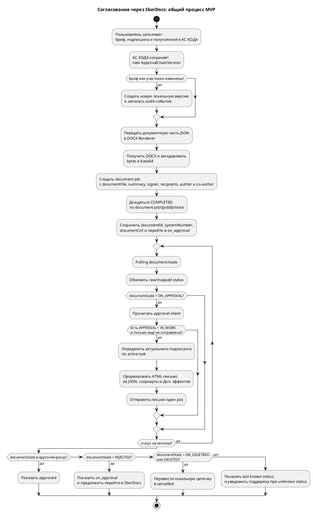
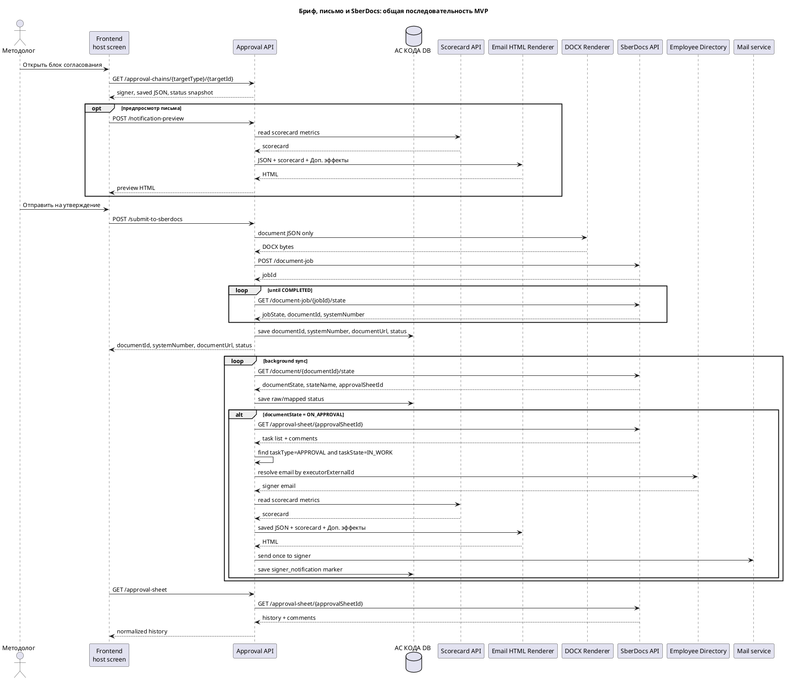

# Требования по feature — Согласования через SberDocs

Статус: **в работе**
Feature: `features/approvals/feature.md`
Квартал: `2026-Q2`
Дата обновления: `2026-06-01`
Шаблон: `.workflow/templates/requirements/feature-requirements.template.md`
Decision ID: `DEC-2026-05-25-APPROVALS-SBERDOCS-001`

## Оглавление

Используются заголовки до уровня `####`.

## Общий контур feature

- Назначение feature: заменить собственный процесс approval/ratification в АС КОДА на минимальную интеграцию со SberDocs.
- Что уже есть в baseline/current: карточки доменных сущностей, статусы внедрений, интеграционные принципы и ранее описанный внутренний approval flow.
- Какая дельта добавляется этой feature: АС КОДА готовит бриф и участников отправки для создания SberDocs-документа, отправляет документ в SberDocs, хранит локальную `new`-версию до отправки, дальше синхронизирует статус из SberDocs API, читает историю по запросу и скачивает актуальный DOCX.
- Что исключается из текущего scope: отдельная страница `Согласования`, собственные решения `approve/reject/ratify` в АС КОДА, package flow, собственный `ApprovalChain` как workflow-движок, ручная отправка письма.
- Какие slice входят в контрольный документ: `core-process`; slice `page` сохранён только как отменённый legacy-след и не создаёт разработки.

## Источники и принятое решение

| Источник | Как используется |
|---|---|
| `context/source-materials/change-requests/sberdocs-approvals/Цепочка_согласования_Сравнение_подходов.md` | Решение выбрать подход интеграции: АС КОДА готовит бриф и участников создания документа, согласование выполняется и донастраивается в SberDocs, статус читается по API. |
| `context/source-materials/change-requests/sberdocs-approvals/сбердокс.yaml` | Технический контракт SberDocs: health-check, создание document job, polling job state, polling document state, получение листа согласования, получение актуального документа. |
| `context/source-materials/change-requests/sberdocs-approvals/Бриф для утверждения.md` | Актуальные требования к форме документа, предпросмотру письма, скоркарте, полю `Доп. эффекты`, моменту отправки email и ответу backend на submit. |
| `context/source-materials/change-requests/sberdocs-approvals/StateMachine_внутреннего_документа.md` | Актуальная state machine внутреннего документа SberDocs; используется для маппинга `documentState` и определения перехода к подписанию. |
| `context/source-materials/change-requests/sberdocs-approvals/Бриф_для_утверждения.md` | Legacy-версия требований к брифу; заменена актуальным файлом `Бриф для утверждения.md`. |
| `context/source-materials/change-requests/sberdocs-approvals/Маршруты_согласований.md` | Исходная модель локального маршрута; используется только как legacy-контекст после отказа от native workflow. |
| `context/source-materials/change-requests/sberdocs-approvals/Согласование_Релизов_Риск_параметров.md` | Пример интеграции со SberDocs: `document-job`, `document-job/{jobId}/state`, `document/{documentId}/state`, `approval-sheet/{approvalSheetId}`, `systemNumber`. |
| `context/source-materials/change-requests/sberdocs-approvals/meeting.txt` | Расшифровка встречи 2026-05-25; источник решений по формату документа, участникам отправки, К2, автору/соавтору, отзыву в SberDocs и повторной отправке. |

## Порядок slice для контроля

1. `01 core-process — Интеграция согласования со SberDocs`
2. `02 page — Страница Согласования` — **исключена из MVP, разработки нет**

## Диаграмма общего процесса

## Общая диаграмма последовательности

---

## STORY-APPROVALS-001 — Интеграция согласования со SberDocs

Slice card: `slices/core-process/slice.md`
Детализация FE: `slices/core-process/requirements/frontend.md`
Детализация BE: `slices/core-process/requirements/backend.md`
Прототип: `slices/core-process/delivery-prototype/prototype.html`
Planning story: `planning/stories/STORY-APPROVALS-001.md` — требует отдельной planning-синхронизации.

### Бизнес-требования

- Согласование и подписание выполняются в SberDocs, а не в АС КОДА.
- АС КОДА должна позволять подготовить документ, сохранить драфт и отправить его в SberDocs с минимальным новым UI и backend scope.
- Любое изменение брифа, подписанта или получателей до отправки создаёт новую локальную версию `ApprovalChain`.
- После создания документа в SberDocs пользователь больше не редактирует его из АС КОДА; он переходит по ссылке в SberDocs и делает изменения там.
- Поле `Доп. эффекты` и скоркарта участвуют только в письме и его preview, но не в основном документе SberDocs.
- История согласования и комментарии не хранятся в АС КОДА и подтягиваются отдельным методом по запросу.

### Системные требования

- В SberDocs при создании документа передаются только подписант (`senderList`), получатели (`recipientList`), автор (`author`) и соавтор (`additionalAuthorList[]`).
- АС КОДА хранит локально только JSON документа, `Доп. эффекты`, подписанта, получателей и технический status snapshot SberDocs.
- Основной документ формируется как DOCX, кодируется в base64 и отправляется в `documentFile`; `attachmentList`, `route.executorList` и `restrictions.actions` в MVP не используются.
- `summary` заполняется из поля `Краткое содержание`.
- Успешный submit возвращает frontend `documentId`, `systemNumber`, `documentUrl`, mapped status и `lastSyncedAt`.
- Backend периодически вызывает `GET /public/Gateway/health-check` отдельным мониторинговым процессом; результат используется для диагностики и уведомления поддержки, но не блокирует каждый business-вызов к SberDocs.
- DOCX в формате base64 не должен превышать лимит SberDocs `10 МБ`.
- Письмо подписанту отправляется автоматически один раз, когда `approval-sheet` показывает активную задачу `taskType = APPROVAL` и `taskState = IN_WORK`.
- Адресат письма должен определяться по активной задаче из `approval-sheet`, чтобы корректно обработать возможную замену подписанта в SberDocs.
- При неизвестном raw status SberDocs или провале фонового health-check backend отправляет email на поддержку АС[СТ, РСП, КОДА, СРО].

### Пользовательские требования к АС КОДА

- Пользователь на host screen доменной сущности видит блок подготовки согласования: бриф, подписанта, получателей, предпросмотр и кнопку отправки.
- Пока документ не отправлен, пользователь может сохранить или изменить локальную `new`-версию брифа и участников отправки.
- После отправки пользователь видит номер/ссылку SberDocs, общий статус согласования и дату последней синхронизации; история загружается по запросу.
- Действия `Согласовать`, `Отклонить`, `Утвердить`, `Подписать` выполняются в SberDocs, а не в АС КОДА.
- При ошибке создания документа пользователь видит причину из SberDocs и может исправить сохранённую `new`-версию и отправить заново, только если backend однозначно знает, что документ в SberDocs не был создан.

### Критерии приемки

1. АС КОДА создаёт локальную `new`-версию брифа и участников отправки до SberDocs и не создаёт собственный workflow route.
2. `POST /public/Gateway/document-job` вызывается с DOCX-брифом, `summary`, подписантом, получателями, автором/соавтором и идентификатором внешнего документа.
3. `POST /submit-to-sberdocs` дожидается `COMPLETED` по `document-job/{jobId}/state` и возвращает frontend `documentId`, `systemNumber`, `documentUrl`, mapped status и `lastSyncedAt`.
4. `GET /public/Gateway/document/{documentId}/state` обновляет локальный интеграционный статус и `systemNumber`.
5. `GET /public/Gateway/approval-sheet/{approvalSheetId}` отдаёт поимённую историю и комментарии для отображения в АС КОДА по запросу пользователя; результат не сохраняется локально.
6. В MVP не отправляем `attachmentList`: бриф передаётся как основной документ `documentFile`.
7. Документ создаётся без `restrictions.actions`; в SberDocs допускаются штатные изменения документа и маршрута.
8. `author` в SberDocs заполняется методологом, который отправил документ на согласование; `additionalAuthorList[]` содержит ПРМа как соавтора.
9. `senderList` содержит подписанта; `route.executorList` и список согласующих в `DocumentJobRequest` не передаются.
10. АС КОДА не устанавливает признак `Коммерческая тайна (К2)` через API; после создания документа пользователь устанавливает К2 в интерфейсе SberDocs.
11. SberDocs-статусы маппятся в статусы АС КОДА по таблице в backend pack; unmapped значения не ломают UI и попадают в audit/monitoring.
12. На этапе polling backend отлавливает переход документа к подписанию, читает `approval-sheet` и отправляет письмо, только когда обнаружена активная задача `APPROVAL/IN_WORK`.
13. Письмо уходит автоматически текущему подписанту; ручной отправки и отдельного UI-статуса письма в MVP нет.
14. При определении адресата backend ориентируется на активную задачу подписания из `approval-sheet`, а не только на исходный `senderList`.
15. После согласования backend предоставляет отдельный метод получения актуального DOCX-документа из SberDocs, потому что документ мог измениться в SberDocs.
16. Raw `REJECTED` не переводит локальную цепочку в `new`: АС КОДА оставляет mapped status `on_approval`, показывает raw status/комментарии и направляет пользователя в SberDocs.
17. Raw `ON_DELETING` и `DELETED` переводят локальную цепочку в terminal status `cancelled`.
18. Raw `CANCELLED` после `approved` не должен понижать локальный статус.
19. Если фоновый SberDocs health-check обнаружил недоступность сервиса либо получен неизвестный/unmapped raw status SberDocs, backend фиксирует событие и отправляет email на поддержку АС[СТ, РСП, КОДА, СРО].
20. `COMPLETED` по `document-job/{jobId}/state` без обязательных идентификаторов (`documentId`, `systemNumber`) считается интеграционной ошибкой: локальный статус не переходит в `on_approval`, support уведомляется, а автоматический повторный submit блокируется до ручного разбора.
21. Страница `Согласования`, package flow, ручная отправка письма и массовые решения в АС КОДА недоступны и не требуются для MVP.

### USE CASES

- **осн. сценарий 1** методолог создаёт документ на host screen, заполняет поля документа и `Доп. эффекты`, сохраняет `new`-версию, проверяет предпросмотр HTML-письма и отправляет DOCX в SberDocs; ПРМ передаётся в SberDocs как соавтор.
- **осн. сценарий 2** backend получает `jobId`, дожидается `documentId`, `systemNumber` и URL, после чего frontend сразу переводит экран в read-only состояние ожидания согласования.
- **осн. сценарий 3** АС КОДА периодически проверяет `document/state`; при `ON_APPROVAL` читает `approval-sheet`, подтверждает `taskType = APPROVAL` и `taskState = IN_WORK`, после чего отправляет письмо текущему подписанту один раз.
- **осн. сценарий 4** при открытии раздела истории frontend вызывает отдельный метод `approval-sheet` и показывает поимённую историю с комментариями без локального хранения.
- **альт. сценарий 1** периодический мониторинг фиксирует, что SberDocs недоступен; backend уведомляет поддержку, но business-вызовы не получают отдельный pre-check gate и обрабатывают фактические ошибки SberDocs или транспорта.
- **альт. сценарий 2** SberDocs возвращает `FAILED` или `VALIDATION_ERROR` на создании документа; backend показывает ошибку, `documentId` не создаётся, пользователь исправляет сохранённую версию и отправляет снова.
- **альт. сценарий 2а** SberDocs возвращает `COMPLETED`, но без `documentId` или `systemNumber`; backend считает ответ неконсистентным, уведомляет поддержку и не разрешает автоматический повторный submit, чтобы не создать дубль документа.
- **альт. сценарий 3** SberDocs возвращает raw `REJECTED`; пользователь открывает документ в SberDocs, исправляет его там и запускает повторный процесс уже в интерфейсе SberDocs.
- **альт. сценарий 4** SberDocs возвращает raw `ON_DELETING` или `DELETED`; локальный статус меняется на `cancelled`.
- **альт. сценарий 5** SberDocs вернул неизвестный status; UI показывает оригинальный код, backend уведомляет поддержку.

## Scope и impact для соседних артефактов

### Что меняется в root UX

- оставить только подготовку документа, подписанта/получателей, предпросмотр HTML-письма, submit в SberDocs и read-only мониторинг результата;
- после submit скрывать форму редактирования и отображать `systemNumber`, ссылку на SberDocs, статус и историю по запросу;
- не показывать кнопку ручной отправки письма и отдельный статус его доставки;
- для всех действий по самому документу после отправки предлагать перейти в SberDocs.

### Что меняется в backend модели

- хранить `ApprovalChain` как контейнер версий брифа и участников отправки, а не как workflow engine;
- хранить интеграционные идентификаторы SberDocs, состояние синхронизации и последний snapshot фонового health-check;
- генерировать DOCX только из документной части JSON и проверять лимит `10 МБ` для base64-представления;
- реализовать polling `document/state`, определять момент отправки письма по активной задаче `APPROVAL/IN_WORK`, а историю UI читать отдельным методом;
- реализовать получение актуального DOCX из SberDocs через `document-files`.

### Что меняется в доменных связях

| Область | Новая роль |
|---|---|
| АС КОДА | Подготовка брифа, хранение локальной версии, запуск интеграции, мониторинг статуса |
| SberDocs | Владелец маршрута, статусов, решений, комментариев и актуального документа |
| Письмо подписанту | Формируется backend из JSON + скоркарты + `Доп. эффекты`, отправляется автоматически |
| База данных | `ApprovalChain` + версии брифа/участников отправки + technical status snapshot |
| Host entity | Блокирует свои действия, пока существует связанный `ApprovalChain` |

## Аудит и поддержка

- В аудит АС КОДА попадают: сохранение `new`-версии, отправка в SberDocs, `jobId`, `documentId`, `systemNumber`, изменение mapped status, отправка письма подписанту, провал фонового health-check, неизвестные статусы SberDocs, email-уведомления поддержки, ошибки интеграции и время синхронизации.
- История согласования и комментарии не дублируются в аудит как бизнес-данные: они читаются из SberDocs по запросу.
- При провале фонового health-check или unknown status backend обязан отправить уведомление на поддержку АС[СТ, РСП, КОДА, СРО].
