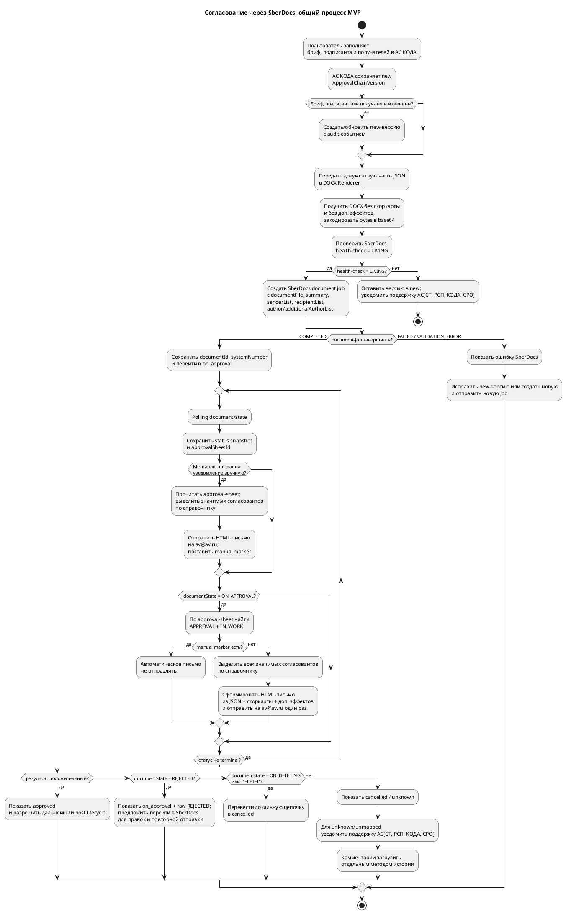
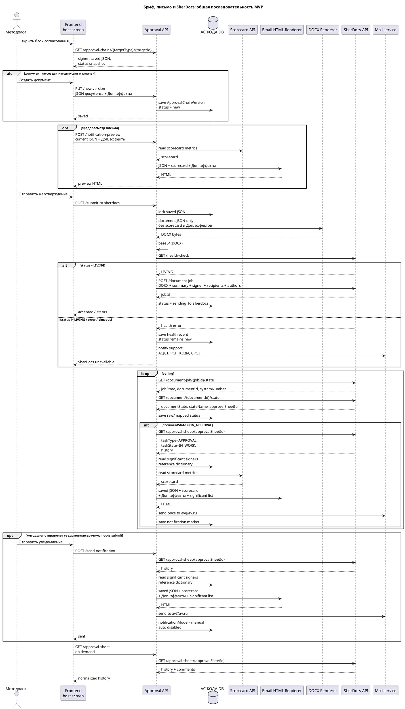

# Требования по feature — Согласования через SberDocs

Статус: **в работе**
Feature: `features/approvals/feature.md`
Квартал: `2026-Q2`
Дата обновления: `2026-05-27`
Шаблон: `.workflow/templates/requirements/feature-requirements.template.md`
Decision ID: `DEC-2026-05-25-APPROVALS-SBERDOCS-001`

## Оглавление

Используются заголовки до уровня `####`.

## Общий контур feature

- Назначение feature: заменить собственный процесс approval/ratification в АС КОДА на минимальную интеграцию со SberDocs.
- Что уже есть в baseline/current: карточки доменных сущностей, статусы внедрений, интеграционные принципы и ранее описанный внутренний approval flow.
- Какая дельта добавляется этой feature: АС КОДА готовит бриф и участников для создания SberDocs-документа, отправляет документ в SberDocs, хранит локальную `new`-версию до отправки, дальше синхронизирует статус из SberDocs API, а историю читает по запросу.
- Что исключается из текущего scope: отдельная страница `Согласования`, собственные решения `approve/reject/ratify` в АС КОДА, package flow, собственный `ApprovalChain` как workflow-движок.
- Какие slice входят в контрольный документ: `core-process`; slice `page` сохранён только как отменённый legacy-след и не создаёт разработки.

## Источники и принятое решение

| Источник | Как используется |
|---|---|
| `context/source-materials/change-requests/sberdocs-approvals/Цепочка_согласования_Сравнение_подходов.md` | Решение выбрать подход интеграции: АС КОДА готовит бриф и участников создания документа, согласование выполняется и донастраивается в SberDocs, статус читается по API. |
| `context/source-materials/change-requests/sberdocs-approvals/сбердокс.yaml` | Технический контракт SberDocs: health-check, создание document job, polling job state, polling document state, получение листа согласования. |
| `context/source-materials/change-requests/sberdocs-approvals/Бриф для утверждения.md` | Актуальные требования к форме документа, предпросмотру письма, скоркарте, полю `Доп. эффекты` и моменту отправки email. |
| `context/source-materials/change-requests/sberdocs-approvals/StateMachine_внутреннего_документа.md` | Актуальная state machine внутреннего документа SberDocs; используется для маппинга `documentState` и определения перехода к подписанию через `ON_APPROVAL`. |
| `context/source-materials/change-requests/sberdocs-approvals/Бриф_для_утверждения.md` | Legacy-версия требований к брифу; заменена актуальным файлом `Бриф для утверждения.md`. |
| `context/source-materials/change-requests/sberdocs-approvals/Маршруты_согласований.md` | Правила ручного задания маршрута до решения о выносе workflow в SberDocs. |
| `context/source-materials/change-requests/sberdocs-approvals/Согласование_Релизов_Риск_параметров.md` | Пример интеграции со SberDocs: `document-job`, `document-job/{jobId}/state`, `document/{documentId}/state`, `systemNumber`. |
| `context/source-materials/change-requests/sberdocs-approvals/meeting.txt` | Расшифровка встречи 2026-05-25; источник решений по формату документа, участникам отправки в SberDocs, К2, автору/соавтору, отзыву в SberDocs и повторной отправке. |

## Порядок slice для контроля

1. `01 core-process — Интеграция согласования со SberDocs`
2. `02 page — Страница Согласования` — **исключена из MVP, разработки нет**

## Диаграмма общего процесса

## Общая диаграмма последовательности

---

## STORY-APPROVALS-001 — Интеграция согласования со SberDocs

Slice card: `slices/core-process/slice.md`
Детализация FE: `slices/core-process/requirements/frontend.md`
Детализация BE: `slices/core-process/requirements/backend.md`
Прототип: `slices/core-process/delivery-prototype/prototype.html`
Planning story: `planning/stories/STORY-APPROVALS-001.md` — требуется отдельная planning-синхронизация, текущий режим правит только requirements.

**Бизнес-требования**

- Цель: минимизировать собственную разработку approval workflow и использовать SberDocs как систему исполнения согласования/утверждения.
- АС КОДА остаётся местом подготовки: пользователь заполняет/проверяет бриф, выбирает подписанта/получателей и подтверждает отправку.
- Бриф передаётся в SberDocs как основной документ (`documentFile`) в формате DOCX, не как приложение; краткое содержание документа передаётся в `DocumentJobRequest.summary`.
- Документный DOCX содержит только поля формы документа: адресат, наименование, цель, периметр применения, основные правила/изменения, риски и заключение Антифрод; номер документа присваивает SberDocs, ручного ввода номера в форме нет.
- Скоркарта и поле `Доп. эффекты` не попадают в DOCX-документ SberDocs: они сохраняются в локальном JSON и используются только для предпросмотра и итогового HTML-письма на адрес `av@av.ru`.
- В `ApprovalChainVersion` сохраняются только участники, реально передаваемые в SberDocs: подписант, получатели, автор и соавтор; согласующие и этапы согласования локально не хранятся и в SberDocs не передаются.
- В SberDocs при создании документа передаются только подписант/утверждающий (`senderList`), получатели (`recipientList`), автор (`author`) и соавтор (`additionalAuthorList[]`).
- После успешной отправки АС КОДА хранит identifiers/status snapshot SberDocs (`jobId`, `documentId`, `systemNumber`, `approvalSheetId`) и ссылку, построенную по шаблону, но не хранит историю согласования локально и не исполняет маршрут как workflow-источник истины.
- Локальный `ApprovalChain` хранит версии брифа и участников отправки: любое изменение брифа, подписанта или получателей создаёт новую версию; после отправки версия становится read-only и не редактирует SberDocs-документ.
- Пока у доменного элемента существует связанный `ApprovalChain`, действия с самим доменным элементом в АС КОДА запрещены; вместо них пользователь переходит по ссылке в SberDocs и выполняет правки/решения там.
- Бриф хранится как JSON; backend DOCX Renderer принимает документную часть JSON, генерирует DOCX, а интеграционный backend передаёт DOCX как основной `documentFile` в base64.
- Backend формирует HTML-письмо-уведомление из сохранённого JSON, read-only скоркарты с метриками, поля `Доп. эффекты` и перечня значимых согласовантов из SberDocs approval sheet; frontend может запросить предпросмотр базового HTML до отправки.
- Backend ведёт справочник значимых подписантов/согласовантов. Если участник из справочника появляется в истории согласования SberDocs и успел принять участие в согласовании, он включается в HTML-письмо; в письмо включаются все такие участники, найденные на момент отправки.
- Уведомление всегда отправляется на единый адрес `av@av.ru`, а не фактическому подписанту SberDocs.
- Статус документа и итоговое решение читаются из SberDocs API; поимённая история участников и комментарии не хранятся локально и читаются через approval sheet отдельным методом при открытии раздела истории.
- Отдельные пакеты и отдельная страница назначений в АС КОДА исключаются из MVP.

**Пользовательские требования к АС КОДА**

- Пользователь на host screen доменной сущности видит вкладку/блок подготовки согласования: бриф, подписанта, получателей, предпросмотр, кнопку отправки.
- Пока документ не отправлен, пользователь может сохранить или изменить локальную `new`-версию брифа и участников отправки.
- После отправки пользователь видит номер/ссылку SberDocs, общий статус согласования и дату последней синхронизации; методолог может вручную отправить HTML-уведомление на `av@av.ru`, поимённая история загружается при открытии раздела истории.
- Действия `Согласовать`, `Отклонить`, `Утвердить`, `Подписать` выполняются в SberDocs, а не в АС КОДА.
- При ошибке создания документа пользователь видит причину из SberDocs и может исправить new-версию брифа/участников отправки и отправить заново.

**Критерии приемки**

1. АС КОДА создаёт локальную `new`-версию брифа и участников отправки до SberDocs, но не создаёт собственный `ApprovalChain` как workflow-движок.
2. `GET /public/Gateway/health-check` перед созданием документа возвращает `LIVING`, после чего `POST /public/Gateway/document-job` вызывается один раз при подтверждённой отправке и содержит DOCX-бриф, краткое содержание, подписанта, получателей, автора/соавтора и идентификатор внешнего документа.
3. `GET /public/Gateway/document-job/{jobId}/state` доводит создание документа до `COMPLETED` или ошибки.
4. `GET /public/Gateway/document/{documentId}/state` обновляет локальный интеграционный статус и `systemNumber`.
5. `GET /public/Gateway/approval-sheet/{approvalSheetId}` отдаёт поимённую историю согласующих/подписантов и комментарии для отображения в АС КОДА по запросу пользователя; результат не сохраняется локально.
6. В MVP не отправляем `attachmentList`: бриф передаётся как основной документ `documentFile`, внешние файлы не прикладываются.
7. Документ создаётся без `restrictions.actions`: в SberDocs допускаются штатные изменения документа и маршрута.
8. `author` в SberDocs заполняется методологом, который отправил документ на согласование; `additionalAuthorList[]` содержит ПРМа как соавтора.
9. `senderList` содержит подписанта/утверждающего; `route.executorList` и список согласующих в `DocumentJobRequest` не передаются.
10. АС КОДА не устанавливает признак `Коммерческая тайна (К2)` через API; после создания документа пользователь устанавливает К2 в интерфейсе SberDocs, submit из АС КОДА из-за К2 не блокируется.
11. SberDocs-статусы маппятся в статусы АС КОДА по таблице в backend pack; unmapped значения не ломают UI и попадают в audit/monitoring.
12. На этапе polling backend должен отлавливать переход документа к подписанию по `GET /public/Gateway/document/{documentId}/state`: `documentState = ON_APPROVAL` означает, что документ направлен на утверждение/подписание.
13. Backend хранит справочник значимых подписантов/согласовантов и при каждой отправке HTML-уведомления читает `approval-sheet`, чтобы включить в письмо всех участников из справочника, которые уже приняли участие в согласовании.
14. Методолог в любой момент после успешного submit в SberDocs может вручную отправить HTML-уведомление на `av@av.ru`; backend читает актуальный `approval-sheet`, включает значимых участников, успевших согласовать к этому моменту, сохраняет manual marker и после этого автоматическое уведомление не отправляет.
15. Если ручной отправки не было, после `ON_APPROVAL` backend читает `approval-sheet`, ищет активную задачу `taskType = APPROVAL` + `taskState = IN_WORK`, формирует HTML-письмо из JSON + скоркарты + `Доп. эффекты` + значимых участников и отправляет его на `av@av.ru` один раз; `taskType = AGREEMENT` означает задачу согласования и сам по себе email не запускает.
16. После согласования backend предоставляет отдельный метод получения актуального DOCX-документа из SberDocs, потому что документ мог измениться в SberDocs.
17. Raw `REJECTED` не переводит локальную цепочку в `new`: АС КОДА оставляет mapped status `on_approval`, показывает raw status/комментарии и направляет пользователя в SberDocs, где документ должен быть исправлен и снова переведён в процесс.
18. Raw `ON_DELETING` и `DELETED` переводят локальную цепочку в terminal status `cancelled`; возврат в `new` после создания SberDocs-документа в MVP не выполняется.
19. Raw `CANCELLED` после `approved` не должен понижать локальный статус: АС КОДА сохраняет raw snapshot/audit, но оставляет цепочку согласованной.
20. Если SberDocs health-check не вернул `LIVING` либо получен неизвестный/unmapped raw status SberDocs, backend фиксирует событие и отправляет email-уведомление на поддержку АС[СТ, РСП, КОДА, СРО].
21. Страница `Согласования`, package flow и массовые решения в АС КОДА недоступны и не требуются для MVP.

**USE CASES**

- **осн. сценарий 1** методолог создаёт документ на host screen, заполняет поля документа и `Доп. эффекты`, сохраняет new-версию, проверяет предпросмотр HTML-письма и отправляет документный DOCX в SberDocs; ПРМ передаётся в SberDocs как соавтор.
- **осн. сценарий 2** АС КОДА получает `jobId`, затем `documentId`, `systemNumber`, URL и переводит доменную сущность в статус ожидания согласования.
- **осн. сценарий 3** АС КОДА периодически проверяет `health-check`, затем синхронизирует статус создания и статус документа из SberDocs; при `documentState = ON_APPROVAL` читает `approval-sheet`, подтверждает `taskType = APPROVAL` и `taskState = IN_WORK`, после чего, если ручного письма ещё не было, отправляет HTML-письмо на `av@av.ru`.
- **осн. сценарий 3a** методолог после submit вручную нажимает `Отправить уведомление`; АС КОДА читает актуальный `approval-sheet`, включает значимых участников из справочника, отправляет HTML-письмо на `av@av.ru` и отключает будущую автоматическую отправку.
- **осн. сценарий 4** пользователь запрашивает актуальный согласованный документ; АС КОДА получает основной DOCX-файл из SberDocs и отдаёт его без локального хранения копии файла.
- **альт. сценарий 3.1** SberDocs возвращает validation/creation error; АС КОДА оставляет new-версию редактируемой и показывает диагностическое сообщение.
- **альт. сценарий 3.2** SberDocs возвращает `REJECTED`; АС КОДА остаётся в `on_approval`, отображает raw status/комментарии и предлагает перейти в SberDocs для правок и повторной отправки внутри SberDocs.
- **альт. сценарий 3.3** методолог-автор или ПРМ-соавтор отзывает/редактирует документ в интерфейсе SberDocs; АС КОДА не предоставляет кнопку отзыва в MVP и только синхронизирует итоговый статус.
- **альт. сценарий 3.4** SberDocs возвращает `ON_DELETING` или `DELETED`; АС КОДА переводит локальную цепочку в `cancelled` и не открывает повторную отправку из этой версии.
- **альт. сценарий 3.5** SberDocs health-check не `LIVING` или SberDocs вернул неизвестный raw status; АС КОДА показывает пользователю безопасное сообщение, сохраняет диагностический snapshot и отправляет email на поддержку АС[СТ, РСП, КОДА, СРО].

### Функциональные требования

#### Реализация для FRONTEND

**Описание UI**

| Экран | Результат |
| --- | --- |
| Host pages `Pilot` / `Deployment` / релевантная карточка сущности | Отображают подготовку брифа, подписанта/получателей до отправки и read-only SberDocs status после отправки |

Требования на фронт:

- убрать сценарии принятия решений из АС КОДА;
- оставить только подготовку документа, подписанта/получателей, предпросмотр HTML-письма, submit в SberDocs, ручную отправку AV-уведомления и read-only мониторинг результата;
- показывать `systemNumber`, ссылку на SberDocs, локальный статус и дату синхронизации; поимённую историю загружать отдельным методом при открытии раздела истории;
- показывать кнопку `Отправить уведомление` после submit, если backend ещё не зафиксировал ручную или автоматическую отправку на `av@av.ru`;
- не показывать отдельную страницу `Согласования` и пакетные карточки.

Связанный детальный FE pack: `slices/core-process/requirements/frontend.md`

#### Реализация BACKEND

Требования на бэк:

- хранить локальный `ApprovalChain` с версиями брифа и участников отправки; изменение брифа, подписанта или получателей создаёт новую версию;
- хранить бриф как JSON, где скоркарта и `Доп. эффекты` являются данными для письма, но не для SberDocs DOCX; вызывать DOCX Renderer только с документной частью JSON, кодировать DOCX в base64 и передавать как основной `documentFile`;
- сформировать SberDocs `DocumentJobRequest` и передать краткое содержание в `summary`, подписанта в `senderList`, получателей в `recipientList`, методолога-отправителя в `author`, ПРМа в `additionalAuthorList[]`; `route.executorList` и `restrictions.actions` не передавать;
- не устанавливать К2 через API; после создания документа показывать пользователю напоминание установить признак `Коммерческая тайна (К2)` в SberDocs;
- хранить интеграционные идентификаторы SberDocs, состояние синхронизации и последний health-check snapshot;
- запрещать действия с доменным элементом, пока существует связанный `ApprovalChain`; в ответах статуса возвращать признак блокировки и SberDocs URL при наличии `documentId`;
- перед submit/polling/on-demand history проверять `GET /public/Gateway/health-check` и продолжать только при `status = LIVING`;
- реализовать справочник значимых подписантов/согласовантов и при формировании email включать всех участников из этого справочника, которые уже приняли участие в согласовании по данным `approval-sheet`;
- реализовать polling job state и document state; в polling отлавливать `documentState = ON_APPROVAL`, затем читать `approval-sheet`, не реагировать на `taskType = AGREEMENT`, определять активную задачу подписания по `taskType = APPROVAL` + `taskState = IN_WORK` и, если ручной отправки ещё не было, отправлять HTML-письмо на `av@av.ru`; approval sheet для UI читать отдельным методом по запросу frontend;
- реализовать ручную отправку уведомления методологом после submit: письмо уходит на `av@av.ru`, включает значимых участников на текущий момент и блокирует последующую автоматическую отправку;
- реализовать получение актуального основного DOCX-документа из SberDocs отдельным методом после согласования;
- реализовать маппинг SberDocs статусов на статусы АС КОДА;
- не реализовывать отзыв из интерфейса АС КОДА в MVP; не создавать новую `new`-версию из raw `REJECTED`, `ON_DELETING` или `DELETED`; удаление документа в SberDocs маппить в `cancelled`;
- отправлять email-уведомление на поддержку АС[СТ, РСП, КОДА, СРО] при провале health-check SberDocs и при неизвестных/unmapped статусах SberDocs;
- исключить собственные action endpoints для `approve/reject/ratify` и package workflow из MVP.

Связанный детальный BE pack: `slices/core-process/requirements/backend.md`

| | |
| --- | --- |
| **Сервис** | `approval-sberdocs-integration` |
| ИФТ URL | `уточняется по стенду SberDocs` |
| База данных | `ApprovalChain` + версии брифа/участников отправки + integration snapshot, без собственного workflow engine |
| Методы | `см. slices/core-process/requirements/backend.md` |

**Изменения в ролевой модели**

- В АС КОДА нужны только права на подготовку и отправку в SberDocs на host screen; кнопка `Отозвать` в MVP не реализуется.
- Роли согласующих/подписантов исполняются в SberDocs; АС КОДА передаёт в SberDocs подписанта, получателей, автора и соавтора, но не даёт кнопки решения в своём UI. Отзыв/редактирование документа при необходимости выполняют в SberDocs методолог-автор или ПРМ-соавтор.

**Отправка в Аудит**

- В аудит АС КОДА попадают: сохранение `new`-версии, отправка в SberDocs, `jobId`, `documentId`, `systemNumber`, изменение mapped status, ручная/автоматическая отправка email на `av@av.ru`, список значимых участников, включённых в письмо, провал health-check, неизвестные статусы SberDocs, email-уведомления поддержки, ошибки интеграции и время синхронизации.
- Итоговый статус попадает в аудит из `document/state`; детальные решения согласующих не копируются в локальный аудит; при необходимости они читаются из approval sheet on demand.

**BUGS (Если есть)**

- Старые требования по `ApprovalChain`, странице `Согласования` и пакетам считаются superseded этим решением.

### Доп. пояснения

- Собственная логика параллельных/последовательных решений в АС КОДА не реализуется в MVP; список согласующих и порядок исполнения маршрута настраиваются и исполняются в SberDocs.
- В обязательном MVP АС КОДА показывает document state, ссылку/номер документа и загружает поимённый лист согласования из approval sheet отдельным методом.

---

## STORY-APPROVALS-002 — Страница Согласования

Slice card: `slices/page/slice.md`
Детализация FE: `slices/page/requirements/frontend.md`
Детализация BE: `slices/page/requirements/backend.md`
Прототип: `slices/page/delivery-prototype/prototype.html` — **устарел, не актуализировать без отдельного решения**
Planning story: `planning/stories/STORY-APPROVALS-002.md` — требуется отдельная planning-синхронизация.

**Решение по scope**

- От отдельной страницы `Согласования` в АС КОДА отказываемся.
- Назначения, решения и действия согласующих выполняются в SberDocs.
- В АС КОДА остаётся только read-only отображение статуса и on-demand истории на host screen сущности, отправленной в SberDocs.

**Критерии приемки отмены**

1. В требованиях нет нового API для списка назначений АС КОДА.
2. В требованиях нет UI-кнопок `approve`, `reject`, `ratify` в АС КОДА.
3. Пакетные карточки и массовые действия не входят в MVP.
4. Delivery prototype страницы `Согласования` помечен как устаревший в `domain-impact.md` / backlog, если не будет синхронизирован сразу.
