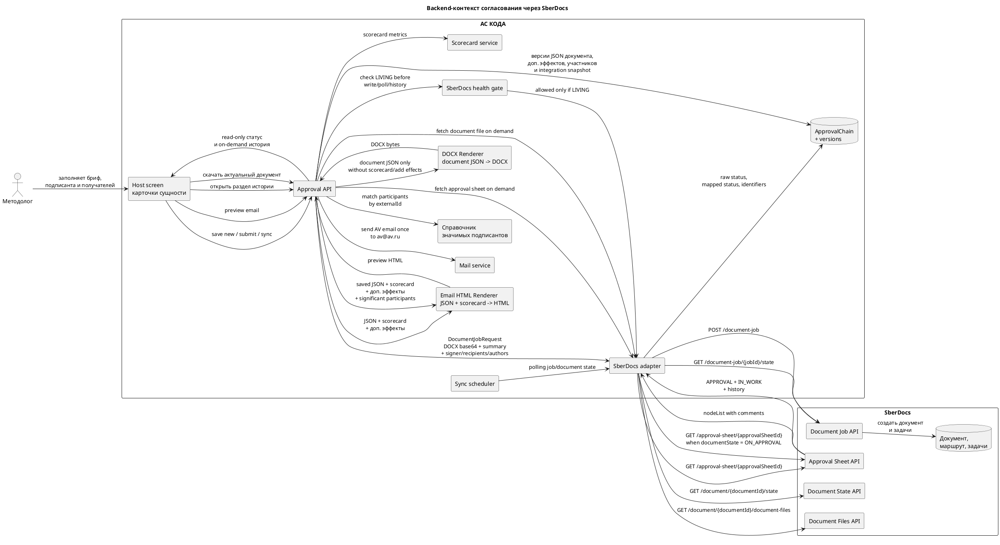
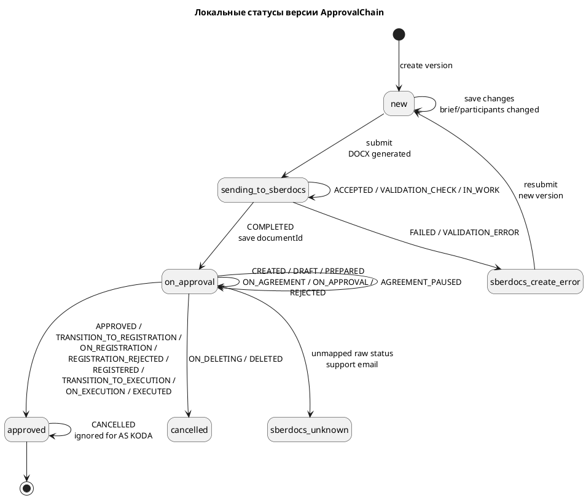
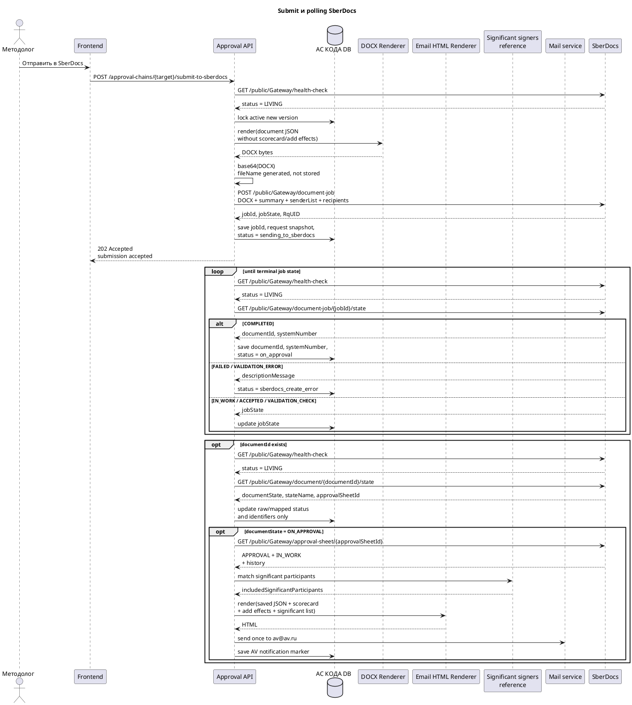
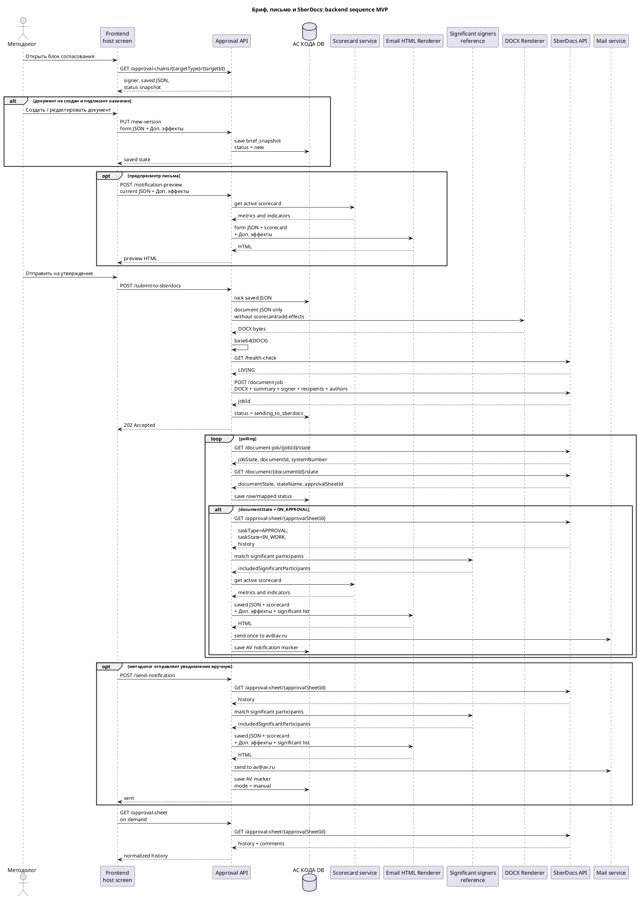
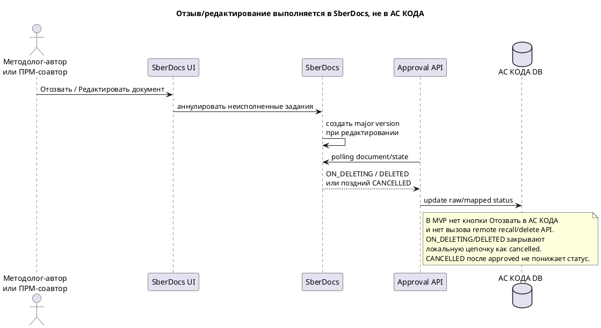
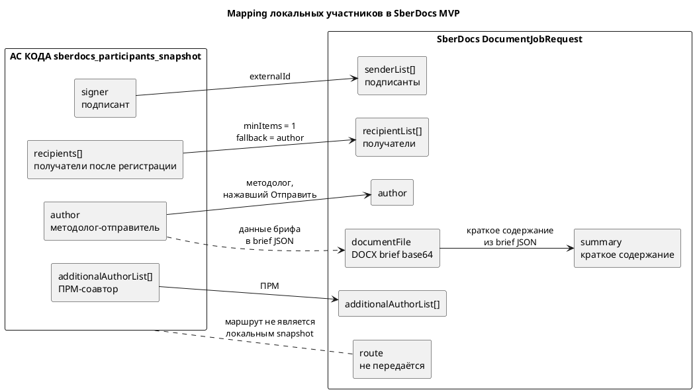

# Системные требования — Backend согласования через SberDocs

Статус: **в работе**
Область: MVP
Дата обновления: 2026-05-27
Decision ID: `DEC-2026-05-25-APPROVALS-SBERDOCS-001`

## Оглавление

1. [Назначение backend-среза](#назначение-backend-среза)
2. [Источник правды](#источник-правды)
3. [Диаграммы процесса](#диаграммы-процесса)
4. [Ключевые решения](#ключевые-решения)
5. [Жизненный цикл `ApprovalChain`](#жизненный-цикл-approvalchain)
6. [Модель данных](#модель-данных)
7. [Формирование брифа, DOCX и письма](#формирование-брифа-docx-и-письма)
8. [Участники для SberDocs](#участники-для-sberdocs)
9. [Создание документа в SberDocs](#создание-документа-в-sberdocs)
10. [Polling и маппинг статусов](#polling-и-маппинг-статусов)
11. [История согласования и комментарии](#история-согласования-и-комментарии)
12. [Альтернативные сценарии](#альтернативные-сценарии)
13. [Внутренний API АС КОДА](#внутренний-api-ас-кода)
14. [Интеграция со SberDocs](#интеграция-со-sberdocs)
15. [Ошибки, аудит и мониторинг](#ошибки-аудит-и-мониторинг)
16. [Критерии приемки](#критерии-приемки)

## Назначение backend-среза

Backend должен реализовать минимальную интеграцию с SberDocs для согласования/подписания документа без собственного workflow engine в АС КОДА.

АС КОДА отвечает за:

- локальную сущность согласования `ApprovalChain` и её версии;
- хранение JSON документа, поля `Доп. эффекты`, подписанта и получателей до отправки;
- вызов backend DOCX Renderer, который принимает документную часть JSON и возвращает DOCX;
- кодирование DOCX-байтов в base64 для основного `documentFile` SberDocs;
- создание нового документа SberDocs через `document-job`;
- polling статуса создания и статуса документа;
- on-demand получение листа согласования и комментариев по отдельному API;
- отображаемый mapped status для host entity;
- аудит версий, изменений и интеграционных событий.

SberDocs отвечает за:

- фактическое исполнение маршрута согласования и подписания;
- задачи согласующих, подписантов и получателей;
- комментарии, решения и статусы задач;
- регистрацию/исполнение документа в контуре SberDocs.

АС КОДА не реализует собственные кнопки `approve`, `reject`, `ratify`, `sign`, `recall`, не редактирует уже созданный документ/маршрут в SberDocs и не хранит локальную копию истории согласования.

## Источник правды

| Источник                                                                                              | Как используется                                                                                                                                       |
| ----------------------------------------------------------------------------------------------------- | ------------------------------------------------------------------------------------------------------------------------------------------------------ |
| `context/source-materials/change-requests/sberdocs-approvals/meeting.txt`                             | Расшифровка встречи 2026-05-25; основной источник ответов на открытые вопросы.                                                                         |
| `context/source-materials/change-requests/sberdocs-approvals/сбердокс.yaml`                           | Формальный API-контракт SberDocs.                                                                                                                      |
| `context/source-materials/change-requests/sberdocs-approvals/Бриф для утверждения.md`                 | Актуальный состав формы документа, правила поля `Доп. эффекты`, предпросмотра HTML-письма и отправки AV-уведомления.                                    |
| `context/source-materials/change-requests/sberdocs-approvals/StateMachine_внутреннего_документа.md`   | State machine SberDocs внутреннего документа; используется для маппинга `documentState`, включая переход к подписанию через `ON_APPROVAL`.              |
| `context/source-materials/change-requests/sberdocs-approvals/Бриф_для_утверждения.md`                 | Legacy-версия состава брифа; не является актуальным источником для новой формы.                                                                        |
| `context/source-materials/change-requests/sberdocs-approvals/Маршруты_согласований.md`                | Исходная модель цепочки согласования: этапы, утверждающий, права, отзыв, история изменений.                                                            |
| `context/source-materials/change-requests/sberdocs-approvals/Согласование_Релизов_Риск_параметров.md` | Практический пример методов SberDocs: `document-job`, `document-job/{jobId}/state`, `document/{documentId}/state`, `approval-sheet/{approvalSheetId}`. |

## Диаграммы процесса

### Контекст интеграции



### Жизненный цикл версии `ApprovalChain`



### Последовательность отправки и синхронизации



### Общая последовательность: форма, письмо, SberDocs



### Отзыв и редактирование в интерфейсе SberDocs



### Mapping участников в `DocumentJobRequest`



## Ключевые решения

- `ApprovalChain` остаётся локальной сущностью АС КОДА, но не является workflow engine: она хранит версии брифа, участников для создания SberDocs-документа и integration snapshot SberDocs.
- Центральная часть `ApprovalChain` — JSON документа. Любое изменение документных полей или `Доп. эффекты` создаёт новую версию `ApprovalChain`, если изменение фиксируется как новая отправляемая версия.
- В локальной версии не храним этапы согласования и согласующих: АС КОДА передаёт только подписанта, получателей, автора и соавтора, а согласующих пользователь настраивает в SberDocs.
- После создания SberDocs-документа АС КОДА не создаёт новый документ из raw `REJECTED`, `ON_DELETING` или `DELETED`: пользователь исправляет и повторно отправляет документ в SberDocs, а удаление документа в SberDocs закрывает локальную цепочку как `cancelled`. Новый `document-job` из АС КОДА допустим только до создания `documentId`, если предыдущая job завершилась ошибкой.
- DOCX Renderer является backend-компонентом: он принимает только документную часть JSON и возвращает DOCX-байты. АС КОДА не хранит имя DOCX-файла.
- Скоркарта и поле `Доп. эффекты` не передаются в DOCX для SberDocs; они сохраняются в JSON версии и используются только для HTML-письма на `av@av.ru`.
- Email HTML Renderer формирует предпросмотр и итоговое письмо из сохранённого JSON документа, read-only скоркарты с метриками и поля `Доп. эффекты`.
- Основной файл SberDocs создаётся как `DOCX` с `fileType = DOCUMENT`; в SberDocs не передаётся HTML.
- `restrictions.actions` в MVP не передаются: SberDocs должен разрешать штатное редактирование документа и маршрута, а АС КОДА после согласования получает актуальный DOCX из SberDocs.
- АС КОДА не может создать документ с признаком `Коммерческая тайна (К2)` через текущий API SberDocs; документ создаётся как есть, а признак К2 устанавливает пользователь в интерфейсе SberDocs.
- `senderList` — подписанты/утверждающие; в MVP это единственный маршрутный участник, передаваемый из АС КОДА в SberDocs.
- `route` и `route.executorList` в `DocumentJobRequest` не передаются: список согласующих и порядок согласования донастраиваются в интерфейсе SberDocs.
- `recipientList` — получатели документа после регистрации/на исполнение; это не согласующие. Если бизнес не определил получателя, используем автора документа как минимально допустимого получателя.
- `author` в SberDocs — методолог, который отправил документ на согласование из АС КОДА; `additionalAuthorList[]` включает ПРМа как соавтора, чтобы он мог выполнять авторские действия в интерфейсе SberDocs.
- Краткое содержание передаётся в стандартное поле SberDocs `DocumentJobRequest.summary` (`maxLength = 500` по контракту).
- URL документа SberDocs в ответах API не гарантирован; backend строит ссылку по конфигурируемому шаблону из `documentId`.
- Перед критическими запросами к SberDocs backend выполняет `GET /public/Gateway/health-check`; дальнейший запрос допускается только при `status = LIVING`.
- История согласования и комментарии не сохраняются в БД АС КОДА; они читаются из SberDocs отдельным backend-методом при открытии соответствующего раздела на frontend.
- Для автоматического email-уведомления backend во время polling сначала ловит `documentState = ON_APPROVAL` из `document/state`, затем читает `approval-sheet` и ищет активную задачу `taskType = APPROVAL` + `taskState = IN_WORK`; если ручной отправки не было, письмо уходит на `av@av.ru`, а локально сохраняется только compact marker уведомления и список значимых участников, попавших в письмо, не вся история.
- Методолог может вручную отправить уведомление на `av@av.ru` после submit; ручная отправка использует текущий `approval-sheet`, включает значимых участников из справочника и отключает будущую автоматическую отправку.
- После положительного результата согласования backend должен уметь получить актуальный основной DOCX через `GET /public/Gateway/document/{documentId}/document-files`, потому что файл мог измениться в SberDocs.

## Жизненный цикл `ApprovalChain`

### Назначение сущности

`ApprovalChain` — локальный агрегат АС КОДА, связывающий host entity с версиями брифа, участниками создания SberDocs-документа и документами SberDocs.

`ApprovalChain` не исполняет маршрут сам:

- не считает кворум;
- не принимает решения за согласующих;
- не хранит собственные action-команды согласования;
- не подменяет статусы SberDocs.

### Версионирование

Каждая версия `ApprovalChainVersion` содержит независимый snapshot:

- JSON документа и поле `Доп. эффекты`;
- snapshot участников для `DocumentJobRequest`: подписант, получатели, автор, соавтор;
- request snapshot для SberDocs без `route.executorList` и без `documentFile.content`;
- integration snapshot SberDocs после отправки.

Новая версия создаётся, если изменился хотя бы один из блоков:

- пользовательские поля брифа;
- данные брифа, которые включаются в документ;
- поле `Доп. эффекты`, которое сохраняется в JSON и используется только для письма;
- подписант/утверждающий;
- получатели;
- причина новой отправки после ошибки создания SberDocs-документа до появления `documentId`.

Предыдущая версия становится архивной и остаётся доступной как часть истории `ApprovalChain`. Активной может быть только одна версия.

### Статусы версии

| Локальный статус        | Когда устанавливается                                                                                                          |                                                                                 Можно редактировать бриф/участников отправки |
| ----------------------- | ------------------------------------------------------------------------------------------------------------------------------ | ---------------------------------------------------------------------------------------------------------------------------: |
| `new`                   | версия сохранена в АС КОДА, SberDocs job ещё не создан                                                                          | Да для документа согласования; действия доменного элемента всё равно заблокированы, пока существует связка с `ApprovalChain` |
| `sending_to_sberdocs`   | создан `jobId`, идёт создание документа                                                                                        |                                                                                                                          Нет |
| `sberdocs_create_error` | `document-job/state` вернул `FAILED` или `VALIDATION_ERROR`, `documentId` не получен                                           |                                                 Да, через новую версию или правку текущей `new`-версии до повторной отправки |
| `on_approval`           | документ создан, идёт согласование/подписание в SberDocs                                                                       |                                                                                                                          Нет |
| `approved`              | SberDocs показал положительный результат, достаточный для host lifecycle                                                       |                                                                                                                          Нет |
| `cancelled`             | SberDocs вернул `ON_DELETING` или `DELETED`                                                                                    |                                                                                                                          Нет |
| `sberdocs_unknown`      | получен неизвестный raw status                                                                                                 |                                                                                                       Нет до ручного разбора |

### Блокировка действий доменного элемента

Пока существует связь доменного элемента с `ApprovalChain`, backend должен считать действия с доменным элементом заблокированными. Это правило не зависит от mapped status `ApprovalChain` и действует до отдельного списка исключений.

Правила:

- backend не должен выполнять бизнес-действия host entity, если для неё существует связанная `ApprovalChain`, кроме явно разрешённых исключений;
- в ответах host entity / approval status backend должен возвращать признак блокировки действий и ссылку на SberDocs, если `documentId` уже известен;
- вместо действий с доменным элементом пользователь должен перейти в SberDocs и выполнить корректировки/решения там;
- действия с самой локальной формой согласования (`new`-версия до отправки, просмотр истории, скачивание документа, ручной refresh статуса) регулируются отдельными правилами `ApprovalChain` и не считаются действиями host entity.

## Модель данных

### `approval_chain`

| Поле                | Тип         | Обяз. | Описание                                       |
| ------------------- | ----------- | ----: | ---------------------------------------------- |
| `id`                | UUID        |    Да | Идентификатор локальной сущности согласования  |
| `target_type`       | String      |    Да | Тип host entity, например `DEPLOYMENT_VERSION` |
| `target_id`         | String/UUID |    Да | Идентификатор host entity                      |
| `active_version_id` | UUID        |   Нет | Текущая активная версия                        |
| `status`            | Enum        |    Да | Mapped status активной версии                  |
| `created_by`        | String      |    Да | Пользователь, создавший `ApprovalChain`        |
| `created_at`        | DateTime    |    Да | Дата создания                                  |
| `updated_at`        | DateTime    |    Да | Дата последнего изменения                      |

### `approval_chain_version`

| Поле                             | Тип      | Обяз. | Описание                                                                                                                                                                                                    |
| -------------------------------- | -------- | ----: | ----------------------------------------------------------------------------------------------------------------------------------------------------------------------------------------------------------- |
| `id`                             | UUID     |    Да | Идентификатор версии                                                                                                                                                                                        |
| `approval_chain_id`              | UUID     |    Да | Ссылка на `approval_chain`                                                                                                                                                                                  |
| `version_number`                 | Integer  |    Да | Порядковый номер локальной версии                                                                                                                                                                           |
| `is_active`                      | Boolean  |    Да | Признак активной версии                                                                                                                                                                                     |
| `status`                         | Enum     |    Да | Локальный mapped status версии                                                                                                                                                                              |
| `brief_snapshot`                 | JSONB    |    Да | JSON формы документа по `Бриф для утверждения.md`: документные поля для DOCX плюс `additionalEffects` для письма; скоркарта хранится как ссылка/снимок только если это нужно для повторяемости письма       |
| `sberdocs_participants_snapshot` | JSONB    |    Да | Локальные участники для создания документа: подписант/утверждающий, получатели, автор, ПРМ-соавтор; согласующих и этапы согласования не хранит                                                              |
| `sberdocs_snapshot`              | JSONB    |   Нет | `jobId`, `documentId`, `systemNumber`, `approvalSheetId`, raw/mapped statuses, URL, last sync, request snapshot без base64-контента                                                                         |
| `av_notification_snapshot`       | JSONB    |   Нет | Compact marker HTML-уведомления на `av@av.ru`: `mode = manual/auto`, `recipient = av@av.ru`, `triggeredBy`, `taskId`, `detectedAt`, `sentAt`, `deliveryStatus`, `includedSignificantParticipants[]`; без локального хранения всей истории SberDocs |
| `support_notification_snapshot`  | JSONB    |   Нет | Compact markers уведомлений поддержки по health-check failure и unknown/unexpected SberDocs status: `eventType`, `dedupeKey`, `sentAt`, `cooldownUntil`, `deliveryStatus`                                  |
| `sberdocs_author_external_id`    | String   |    Да | Табельный номер методолога, отправившего документ; передаётся в SberDocs `author`                                                                                                                           |
| `prm_coauthor_external_id`       | String   |    Да | Табельный номер ПРМа; передаётся в SberDocs `additionalAuthorList[]` как соавтор                                                                                                                            |
| `created_by`                     | String   |    Да | Кто создал версию                                                                                                                                                                                           |
| `created_at`                     | DateTime |    Да | Когда создана версия                                                                                                                                                                                        |
| `change_reason`                  | String   |   Нет | Причина создания новой версии: правка брифа, подписанта/получателей, повторная отправка после ошибки создания SberDocs-документа и т.д.                                                                     |

Отдельная таблица истории участников не создаётся: `approval-sheet` читается из SberDocs по запросу пользователя и возвращается frontend без сохранения в БД АС КОДА.

### Справочник значимых подписантов/согласовантов

Backend должен вести администрируемый справочник значимых участников, которые должны попадать в HTML-уведомление на `av@av.ru`, если они участвовали в согласовании SberDocs.

Минимальная структура справочника:

| Поле | Тип | Обяз. | Описание |
| --- | --- | ---: | --- |
| `id` | UUID | Да | Идентификатор записи справочника |
| `employee_number` | String | Да | Табельный номер / `externalId`, по которому участник сопоставляется с `approval-sheet` |
| `full_name` | String | Да | Отображаемое ФИО в письме |
| `role_title` | String | Нет | Бизнес-роль или должность для письма |
| `is_active` | Boolean | Да | Неактивные записи не включаются в письмо |
| `valid_from`, `valid_to` | Date | Нет | Период действия записи, если требуется |

Правила:

- справочник не является маршрутом согласования и не передаётся в SberDocs;
- сопоставление выполняется по табельному номеру / externalId участника из `approval-sheet`;
- в письмо включаются только активные записи справочника, для которых в `approval-sheet` есть участник, уже принявший участие в согласовании к моменту отправки письма;
- если значимых участников к моменту отправки нет, письмо всё равно может быть отправлено на `av@av.ru`, но содержит пустой/явный блок `Значимые согласованты: нет`;
- полный `approval-sheet` локально не сохраняется, допускается сохранить только compact list `includedSignificantParticipants[]` в `av_notification_snapshot` для аудита отправленного письма.

### `approval_chain_event`

Backend должен хранить историю изменений `ApprovalChain`:

- создание версии;
- изменение брифа;
- изменение подписанта/получателей/автора/соавтора;
- отправка в SberDocs;
- получение `jobId`;
- получение `documentId`/`systemNumber`;
- смена mapped status;
- обнаружение перехода к подписанию, ручная/автоматическая отправка HTML-письма на `av@av.ru` и состав значимых участников в письме;
- ошибки SberDocs;
- отзыв/отмена из SberDocs;
- новая отправка после ошибки создания SberDocs-документа до появления `documentId`.

Каждое событие должно содержать `event_code`, `actor`, `created_at`, `version_id`, `old_value`, `new_value` или компактный diff. Для совместимости с исходной моделью маршрутов используются event codes уровня `approvalChainCreated`, `approvalChainUpdated`, `approvalRevoked` и дополнительные интеграционные коды SberDocs.

## Формирование брифа, DOCX и письма

### Источник данных брифа

Backend принимает и хранит JSON брифа по правилам `Бриф для утверждения.md`.

Документная часть JSON, которая идёт в DOCX для SberDocs:

- адресат;
- наименование документа;
- краткое содержание документа для поля SberDocs `summary`;
- цель;
- периметр применения;
- основные правила/изменения;
- риски;
- заключение Антифрод.

Правила по исключённым данным:

- ручного поля номера/реквизитов нет: номер документа (`systemNumber`) присваивает SberDocs после создания документа;
- поле «Эффекты (влияние)» в форме отсутствует;
- read-only скоркарта, финансовые метрики, индикаторы и поле `Доп. эффекты` не передаются в DOCX-документ SberDocs;
- `Доп. эффекты` сохраняется в JSON версии и включается в HTML-письмо, если заполнено.

Валидация при сохранении/отправке:

- обязательны `Адресат`, `Наименование документа`, `Цель`;
- в `Периметр применения` должно быть заполнено хотя бы одно поле;
- `Риски`, `Заключение Антифрод` и `Доп. эффекты` необязательны;
- предпросмотр письма не блокируется незаполненными обязательными полями.

### DOCX Renderer

DOCX Renderer на backend принимает документную часть JSON и возвращает DOCX-байты. Для одной версии `ApprovalChainVersion` один и тот же документный JSON должен давать один и тот же DOCX, если версия шаблона DOCX Renderer не менялась.

Требования:

- АС КОДА хранит `brief_snapshot` JSONB, но не имя DOCX-файла;
- DOCX генерируется server-side, без участия frontend;
- скоркарта и `Доп. эффекты` не передаются в DOCX Renderer;
- DOCX-байты кодируются в base64 только перед вызовом SberDocs;
- `actualSizeBytes` равен размеру исходного DOCX в байтах до base64;
- если генерация DOCX не удалась, `document-job` в SberDocs не создаётся;
- имя файла для `documentFile.file.fileName` генерируется детерминированно на момент вызова SberDocs и не хранится как отдельное поле схемы.

Минимальный pipeline:

```text
document JSON -> DOCX Renderer -> DOCX bytes -> base64 -> SberDocs documentFile.content
```

### Предпросмотр и отправка HTML-уведомления

Backend должен формировать HTML-уведомление на `av@av.ru` из:

- документной части JSON;
- read-only скоркарты с метриками, критичностью, признаком исключения метрик, индикаторами и деталями;
- поля `Доп. эффекты`, если оно заполнено;
- перечня значимых согласовантов из справочника, которые уже приняли участие в согласовании по данным SberDocs `approval-sheet`.

Правила:

- frontend не формирует HTML самостоятельно и показывает только HTML, полученный от backend;
- endpoint предпросмотра до submit возвращает базовый HTML по составу письма без SberDocs-истории, потому что `approval-sheet` ещё отсутствует;
- письмо не отправляется при нажатии `Отправить на утверждение`;
- методолог может вручную отправить уведомление в любой момент после успешного submit в SberDocs; backend перед отправкой читает актуальный `approval-sheet`, включает значимых участников, успевших согласовать к этому моменту, и сохраняет `av_notification_snapshot.mode = manual`;
- если ручной отправки не было, письмо отправляется автоматически при polling, когда SberDocs перевёл документ в `documentState = ON_APPROVAL`, а в `approval-sheet` найдена активная задача `taskType = APPROVAL` + `taskState = IN_WORK`;
- если ручная отправка уже была, автоматическая отправка больше не выполняется;
- получатель письма всегда `av@av.ru`; фактический подписант SberDocs не используется как email-recipient;
- frontend может показывать compact статус отправки AV-уведомления, чтобы методолог понимал, доступна ли ручная кнопка; backend хранит только compact marker для аудита и защиты от дублей.

### Ограничения размера

Backend должен валидировать размер DOCX до отправки:

- не превышать лимит `FileContent.content.maxLength` после base64;
- отдельно учитывать практический лимит SberDocs на base64-файл, если он зафиксирован в интеграционной анкете/инструкции;
- возвращать пользователю валидационную ошибку до вызова SberDocs, если DOCX заведомо не пройдёт лимиты.

## Участники для SberDocs

### Локальная структура участников

Локальный `sberdocs_participants_snapshot` хранится в версии `ApprovalChain` и содержит только тех участников, которых АС КОДА реально передаёт в `DocumentJobRequest`. Это не локальная структура маршрута: согласующие, этапы, parallel/sequential порядок и `route.executorList` в snapshot не входят.

```json
{
  "signer": {
    "employeeNumber": "444444",
    "fullName": "Петров Петр Петрович"
  },
  "recipients": [
    { "employeeNumber": "555555", "fullName": "Сидоров Сидор Сидорович" }
  ],
  "author": {
    "employeeNumber": "111111",
    "fullName": "Иванов Иван Иванович"
  },
  "additionalAuthors": [
    {
      "role": "PRM",
      "employeeNumber": "222222",
      "fullName": "Смирнов Сергей Сергеевич"
    }
  ]
}
```

`signer` обязателен: он маппится в SberDocs `senderList` как подписант/утверждающий. Согласующие и этапы согласования в локальной структуре не сохраняются и не передаются, потому что пользователь донастраивает их в SberDocs.

### Валидация участников

Backend валидирует:

- наличие обязательного утверждающего/подписанта;
- наличие хотя бы одного получателя SberDocs `recipientList`; если получатель не выбран, backend использует автора документа как fallback-получателя;
- табельные номера передаются без добавления лидирующих нулей;
- для отправки HTML-уведомления не требуется email подписанта: письмо всегда уходит на фиксированный адрес `av@av.ru`.

### Mapping в SberDocs

| Локальный блок                         | Поле SberDocs            | Правило                                                                                      |
| -------------------------------------- | ------------------------ | -------------------------------------------------------------------------------------------- |
| `signer`                               | `senderList[]`           | Подписант/утверждающий.                                                                      |
| `recipients[]`                         | `recipientList[]`        | Получатели документа после регистрации/на исполнение; не являются согласующими.              |
| методолог, отправивший на согласование | `author`                 | Основной автор документа в SberDocs.                                                         |
| ПРМ                                    | `additionalAuthorList[]` | Соавтор документа в SberDocs; получает возможность авторских действий в интерфейсе SberDocs. |

## Создание документа в SberDocs

### Общий сценарий

1. Пользователь подтверждает отправку активной версии `ApprovalChain` со статусом `new`.
2. Backend блокирует версию от дальнейшего редактирования и переводит её в `sending_to_sberdocs`.
3. Backend вызывает DOCX Renderer с документной частью `brief_snapshot` и получает DOCX-байты.
4. Backend собирает `DocumentJobRequest`, генерируя имя файла только для тела запроса.
5. Backend вызывает `GET /public/Gateway/health-check` и продолжает только при `status = LIVING`.
6. Backend вызывает `POST /public/Gateway/document-job`.
7. Backend сохраняет `jobId`, начальный `jobState`, `RqUID`, raw response и request snapshot без `documentFile.content`.
8. Дальше `documentId` ожидается только через polling `GET /public/Gateway/document-job/{jobId}/state`.

### `DocumentJobRequest`

Backend должен применить правила по полям:

| Поле SberDocs            | Правило заполнения                                                                                                                                                                                                     |
| ------------------------ | ---------------------------------------------------------------------------------------------------------------------------------------------------------------------------------------------------------------------- |
| `externalDocumentId`     | Устойчивый идентификатор локальной версии, например `APPROVAL-{approvalChainId}-V{versionNumber}` или согласованный бизнес-ключ версии внедрения.                                                                      |
| `type`                   | `INTERNAL`.                                                                                                                                                                                                            |
| `kind`                   | Конфигурируемый вид документа. Признак `Коммерческая тайна (К2)` через API не устанавливается.                                                                                                                         |
| `senderList`             | Подписант/утверждающий из `signer`, в MVP ровно один участник.                                                                                                                                                         |
| `recipientList`          | Получатели документа; минимум 1.                                                                                                                                                                                       |
| `additionalAuthorList`   | ПРМ как соавтор документа; не дублировать методолога, если роли совпали в одном пользователе.                                                                                                                          |
| `author`                 | Методолог, который нажал «Отправить в SberDocs».                                                                                                                                                                       |
| `summary`                | Краткое содержание из JSON документа, до 500 символов. Это стандартное поле API SberDocs `DocumentJobRequest.summary`. Если текст длиннее, backend обрезает по согласованному правилу или возвращает validation error. |
| `documentFile`           | DOCX-документ как основной документ: без скоркарты и без `Доп. эффекты`.                                                                                                                                               |
| `route`                  | Не передавать в MVP; SberDocs-route настраивается пользователем в SberDocs.                                                                                                                                            |
| `attachmentList`         | Не передавать в MVP.                                                                                                                                                                                                   |
| `hasSignatureDetached`   | `false`.                                                                                                                                                                                                               |
| `hasRmsProtected`        | `false`, если АС КОДА отправляет незашифрованный DOCX.                                                                                                                                                                 |
| `externalDocumentSource` | `PPRB_CM_FL`, если не согласован отдельный код источника.                                                                                                                                                              |
| `registration`           | Не передавать в MVP.                                                                                                                                                                                                   |
| `restrictions`           | Не передавать в MVP: действия с документом не запрещаем.                                                                                                                                                               |

### `documentFile`

```json
{
  "documentFile": {
    "file": {
      "fileName": "approval-brief-APPROVAL-123-V2.docx",
      "extension": "DOCX",
      "actualSizeBytes": 123456
    },
    "content": "UEsDBBQABgAIAAAAIQ...",
    "fileType": "DOCUMENT"
  }
}
```

`content` — base64 DOCX-байтов. Нельзя кодировать строковое представление JSON в base64 и выдавать его за DOCX.

### Редактирование документа в SberDocs

Backend не передаёт `restrictions` и не добавляет запрещённые `actions` в `DocumentJobRequest`.

Правила:

- SberDocs остаётся местом штатного редактирования документа и маршрута после создания документа;
- АС КОДА не пытается синхронизировать изменения брифа обратно в свою локальную `ApprovalChainVersion`;
- после положительного результата согласования актуальным файлом считается файл из SberDocs, а не локально сгенерированный DOCX;
- если пользователю нужно получить финальный документ, backend скачивает текущий основной файл из SberDocs отдельным методом.

### Признак `Коммерческая тайна (К2)`

АС КОДА не устанавливает признак `Коммерческая тайна (К2)` через API SberDocs.

MVP-правила:

- backend создаёт документ в SberDocs как есть, без блокировки submit из-за К2;
- backend не отправляет произвольное поле К2, отсутствующее в контракте `сбердокс.yaml`;
- frontend после успешной отправки показывает пользователю напоминание: установить признак `Коммерческая тайна (К2)` в интерфейсе SberDocs;
- при наличии доступа backend может читать `privacyList` через `GET /public/Gateway/document/{documentId}/actual-info` и показывать/логировать фактический признак К2, но отсутствие К2 в API-ответе не блокирует создание документа.

## Polling и маппинг статусов

### Health gate SberDocs

Так как согласование находится на критическом пути, backend должен проверять доступность SberDocs через:

```text
GET /public/Gateway/health-check
```

Правила:

- запросы создания документа, polling `document-job`, polling `document/state` и on-demand `approval-sheet` выполняются только если health-check вернул `status = LIVING`;
- `ACCESS_RESTRICTED`, `NOT_READY_WRITE`, `DEGRADED`, HTTP error или timeout считаются недоступностью SberDocs для текущей операции;
- при недоступности на submit backend не создаёт `document-job`, оставляет версию в `new` и возвращает пользователю понятную ошибку `SberDocs временно недоступен: <message>`;
- при недоступности во время polling backend не меняет последний успешный mapped status, фиксирует `healthStatus`, `message`, `lastHealthCheckedAt` и повторяет попытку по расписанию;
- при любом провале health-check (`status != LIVING`, HTTP error, timeout) backend отправляет email-уведомление на поддержку АС[СТ, РСП, КОДА, СРО] с операцией, `approvalChainId`, `versionId`, `targetType/targetId`, `jobId/documentId` при наличии, `RqUID`, `healthStatus` и текстом ошибки;
- уведомление поддержки должно дедуплицироваться минимум по ключу `approvalChainVersionId + operation + healthStatus/errorCode` до смены статуса или истечения настроенного cooldown, чтобы polling не создавал email-шторм;
- результат health-check не заменяет обработку ошибок конкретного метода: даже после `LIVING` backend должен обработать 4xx/5xx/timeout целевого запроса.

### Polling `document-job`

Backend вызывает `GET /public/Gateway/document-job/{jobId}/state` до terminal state.

| `jobState`         | Локальный статус        | Действие backend                                                                                                                       |
| ------------------ | ----------------------- | -------------------------------------------------------------------------------------------------------------------------------------- |
| `ACCEPTED`         | `sending_to_sberdocs`   | Продолжать polling.                                                                                                                    |
| `VALIDATION_CHECK` | `sending_to_sberdocs`   | Продолжать polling.                                                                                                                    |
| `IN_WORK`          | `sending_to_sberdocs`   | Продолжать polling.                                                                                                                    |
| `COMPLETED`        | `on_approval`           | Сохранить `documentId`, `systemNumber`, построить URL, начать polling `document/state`.                                                |
| `FAILED`           | `sberdocs_create_error` | Сохранить `descriptionMessage`; повторная отправка только после исправления и новой версии или новой job без переиспользования старой. |
| `VALIDATION_ERROR` | `sberdocs_create_error` | Сохранить `descriptionMessage`; повторная отправка только после исправления и новой версии или новой job без переиспользования старой. |

При `FAILED`/`VALIDATION_ERROR` другого способа продолжить текущую job нет: backend должен дать пользователю исправить данные и создать новую job.

### Polling `document/state`

После получения `documentId` backend вызывает `GET /public/Gateway/document/{documentId}/state`.

| Raw `documentState` SberDocs                          | Локальный статус   | Комментарий                                                                                                                                                                                                                              |
| ----------------------------------------------------- | ------------------ | ---------------------------------------------------------------------------------------------------------------------------------------------------------------------------------------------------------------------------------------- |
| `CREATED`, `CREATED_VERSION`, `DRAFT`, `PREPARED`     | `on_approval`      | Документ создан/подготовлен в SberDocs; ожидаем настройку и запуск маршрута.                                                                                                                                                             |
| `ON_AGREEMENT`                                        | `on_approval`      | Документ направлен на согласование.                                                                                                                                                                                                      |
| `AGREEMENT_PAUSED`                                    | `on_approval`      | Документ на согласовании, маршрут редактируется; отдельный локальный статус не вводим.                                                                                                                                                   |
| `AGREEMENT_DRAFT`, `AGREEMENT_PREPARED`               | `on_approval`      | Документ редактируется в SberDocs в рамках согласования; AV-уведомление автоматически не отправляем.                                                                                                                                     |
| `ON_APPROVAL`                                         | `on_approval`      | Ключевой статус: документ направлен на утверждение/подписание или утверждён и готов к регистрации. На первом входе в этот статус backend проверяет `approval-sheet` и, если ручного уведомления не было, отправляет письмо на `av@av.ru`. |
| `APPROVED`                                            | `approved`         | Считаем согласованным.                                                                                                                                                                                                                   |
| `TRANSITION_TO_REGISTRATION`, `ON_REGISTRATION`       | `approved`         | Считаем согласованным, даже если SberDocs ещё выполняет регистрацию.                                                                                                                                                                     |
| `REGISTRATION_REJECTED`                               | `approved`         | Считаем согласованным для АС КОДА; регистрационный отказ не возвращает approval chain в `rejected`.                                                                                                                                      |
| `REGISTERED`                                          | `approved`         | Считаем согласованным.                                                                                                                                                                                                                   |
| `TRANSITION_TO_EXECUTION`, `ON_EXECUTION`, `EXECUTED` | `approved`         | Считаем согласованным.                                                                                                                                                                                                                   |
| `REJECTED`                                            | `on_approval`      | Согласование/утверждение отклонено или документ возвращён автору для принятия решения. В АС КОДА не переводим в `new`: пользователь должен перейти в SberDocs, внести правки и снова направить документ в `ON_APPROVAL` внутри SberDocs. |
| `CANCELLED`                                           | без понижения      | По данным SberDocs этот статус появляется уже после положительного завершения. Если локальный статус `approved`, сохраняем raw snapshot/audit и оставляем `approved`; если пришёл до `approved`, считаем это unexpected status.          |
| `ON_DELETING`, `DELETED`                              | `cancelled`        | Документ удаляется или удалён в SberDocs; локальная цепочка закрывается terminal status `cancelled`, возврат в `new` не выполняется.                                                                                                     |
| любое неизвестное или unexpected значение             | `sberdocs_unknown` | Сохранить raw value, не менять host entity lifecycle автоматически, поднять monitoring event и отправить email на поддержку АС[СТ, РСП, КОДА, СРО].                                                                                      |

Backend должен сохранять raw `documentState`, `stateName`, `systemNumber`, `approvalSheetId` при каждом изменении в `sberdocs_snapshot`.

### Уведомление на `av@av.ru`

Backend должен поддержать два способа отправки одного и того же HTML-уведомления на фиксированный адрес `av@av.ru`: ручной запуск методологом и автоматический запуск при переходе документа к подписанию.

Ручная отправка:

- доступна методологу после успешного submit версии в SberDocs, то есть после того, как версия уже не `new` и есть активная попытка создания/созданный SberDocs-документ;
- backend перед отправкой проверяет `health-check` и, если доступен `approvalSheetId`, читает `GET /public/Gateway/approval-sheet/{approvalSheetId}`;
- если `approvalSheetId` ещё не получен, backend может отправить письмо без значимых участников и зафиксировать `approvalSheetNotReady = true` в marker; отсутствие истории не блокирует ручную отправку;
- backend сопоставляет участников `approval-sheet` со справочником значимых подписантов/согласовантов и включает в письмо тех, кто уже успел согласовать к моменту ручной отправки;
- после успешной ручной отправки сохраняется `av_notification_snapshot.mode = manual`, `sentBy`, `sentAt`, `includedSignificantParticipants[]`, и автоматическая отправка навсегда отключается для этой версии.

Автоматическая отправка:

- trigger для проверки — первый переход raw `documentState` в `ON_APPROVAL`;
- автоматическая отправка выполняется только если `av_notification_snapshot.sentAt` ещё отсутствует;
- после получения `ON_APPROVAL` и `approvalSheetId` backend читает `GET /public/Gateway/approval-sheet/{approvalSheetId}`;
- ищет в `nodeList[]` активную задачу подписания с `taskType = APPROVAL` и `taskState = IN_WORK`;
- `documentState = ON_APPROVAL` + активная задача `APPROVAL/IN_WORK` означает, что можно отправить письмо на `av@av.ru`;
- перед рендерингом backend сопоставляет историю `approval-sheet` со справочником значимых участников и включает в письмо всех значимых согласовантов, которые принимали участие в согласовании;
- отправка выполняется один раз на версию `ApprovalChainVersion`; после успеха сохраняется `av_notification_snapshot.mode = auto`.

Правила отбора значимых участников:

- `taskType = AGREEMENT` означает задачу согласования и сам по себе не запускает автоматическое письмо, но участник такой задачи может попасть в блок значимых согласовантов, если он есть в справочнике и его задача уже завершена как согласованная;
- `taskType = APPROVAL` используется как признак перехода к подписанию и также может дать участника для блока значимых, если этот участник есть в справочнике и уже выполнил задачу;
- значение в API пишется `APPROVAL` именно так; опечаточное `APPOVAL` не использовать в коде и маппингах;
- если в `approval-sheet` один и тот же значимый участник встречается несколько раз, в письмо включается одна запись с последним релевантным статусом/датой;
- если значимых участников нет, письмо всё равно отправляется на `av@av.ru`, но блок значимых участников явно показывает отсутствие записей.

Риски и ограничения:

- один только `documentState = ON_APPROVAL` недостаточен для автоматической отправки, потому что не содержит активной задачи подписания;
- если `approval-sheet` не позволяет определить активную задачу `APPROVAL/IN_WORK`, backend не отправляет автоматическое письмо вслепую, фиксирует warning и повторяет попытку на следующем polling cycle, пока документ остаётся в `ON_APPROVAL`;
- фактический подписант SberDocs может отличаться от исходного `senderList`, но это больше не влияет на email-recipient: письмо всегда направляется на `av@av.ru`.

### Stop conditions polling

Polling можно остановить, когда версия достигла одного из статусов:

- `approved`;
- `cancelled`;
- `sberdocs_create_error`;
- `sberdocs_unknown`, если политика мониторинга требует ручного разбора.

Для `approved` backend может продолжать редкий background sync только если нужно обновить raw `documentState`/`stateName`; это не должно блокировать host lifecycle.

## История согласования и комментарии

### Получение approval sheet по запросу

История согласования не хранится в БД АС КОДА. Когда пользователь открывает раздел истории/листа согласования на frontend, backend выполняет:

```text
GET /public/Gateway/approval-sheet/{approvalSheetId}
```

Backend возвращает frontend normalized DTO с полями:

- `executorName`;
- `executorExternalId`;
- `taskState`;
- `taskStateName`;
- `comment`;
- `isChanged`;
- `taskId`;
- `taskType`;
- `updatedAt`;
- `decisionAt`;
- `rawNode` только для пользователей с технической ролью, если такая роль будет согласована.

Правила:

- `approvalSheetId` берётся из `sberdocs_snapshot`, полученного при polling `document/state`;
- если `approvalSheetId` ещё нет, backend возвращает пустой список и признак `notReady`, а не ошибку сценария;
- ответ не сохраняется в `approval_chain_version` и не создаёт локальную таблицу истории;
- для отклонённого согласования frontend получает комментарии тем же on-demand методом.

### Особенности approval sheet

Backend должен учитывать:

- лист согласования формируется постепенно: участники поздних последовательных этапов могут отсутствовать, пока до них не дошёл маршрут;
- `taskId` — идентификатор конкретной задачи сотрудника;
- `isChanged = true` означает, что согласующий внёс изменения/замечания в рамках SberDocs, но не даёт АС КОДА полного diff документа;
- специального статуса «согласовано с замечаниями» может не быть, поэтому замечания определяются по `comment` и `isChanged`, а не по отдельному document status.

Если в будущем подключается `GET /public/Gateway/document/{documentId}/version-state`, backend может дополнительно читать `DocumentVersionState.reason`, но это не основной источник MVP.

## Альтернативные сценарии

### Отзыв/прекращение согласования в SberDocs

В MVP АС КОДА не предоставляет кнопку `Отозвать` и не вызывает remote recall/delete API SberDocs. Возможность отзыва/редактирования остаётся в интерфейсе SberDocs для автора, соавтора и заместителя автора.

Для этого при создании документа:

- `author` = методолог, который отправил документ на согласование из АС КОДА;
- `additionalAuthorList[]` содержит ПРМа как соавтора;
- если методолог и ПРМ совпадают, backend не дублирует пользователя в `additionalAuthorList[]`.

Поведение SberDocs, которое учитывает АС КОДА:

- при редактировании документа в SberDocs создаётся новая major version и SberDocs аннулирует неисполненные задания согласования/подписания;
- АС КОДА не редактирует этот документ и не продолжает маршрут через major version API;
- backend обнаруживает прекращение/отзыв через `document/state`;
- raw `CANCELLED` не используется для локального прекращения после `approved`: backend сохраняет raw status/audit, но не понижает локальный `approved`;
- при raw `ON_DELETING` или `DELETED` backend переводит активную версию в terminal status `cancelled` и сохраняет raw status;
- из raw `REJECTED` новая локальная версия не создаётся: пользователь продолжает процесс в SberDocs.

### Отклонение согласования/подписания

При `REJECTED`:

- backend сохраняет raw `documentState = REJECTED`, но локально оставляет версию в `on_approval`;
- не редактирует SberDocs-документ;
- не разрешает создать новую `new`-версию из `REJECTED`;
- направляет пользователя в SberDocs: правки документа/маршрута и повторная отправка должны выполняться там, после чего SberDocs должен снова перейти в `ON_APPROVAL` или другой следующий статус своей state machine;
- комментарии/причины доработки доступны пользователю через on-demand получение approval sheet.

Если SberDocs вернул отказ регистратора отдельным `REGISTRATION_REJECTED`, backend маппит его в `approved` по текущему бизнес-правилу. Если SberDocs вернул raw `REJECTED`, backend отображает возврат/отклонение внутри `on_approval` с raw `stateName` и комментариями, если они есть в approval sheet.

### Повторное согласование

Повторное согласование из `REJECTED` в АС КОДА не создаёт новую `new`-версию и новый документ SberDocs. Пока существует связка доменного элемента с `ApprovalChain`, корректировки выполняются в SberDocs.

Raw `ON_DELETING` и `DELETED` не возвращают цепочку в `new`: backend переводит активную версию в `cancelled`. Новый локальный запуск из этой же версии в MVP запрещён; дальнейший бизнес-сценарий требует отдельного исключения или новой инициативы.

Backend не использует SberDocs major version API для повторного согласования.

### Изменение документа в SberDocs участниками

Документ и маршрут могут штатно меняться в SberDocs после создания, потому что АС КОДА не передаёт `restrictions.actions`.

Правила:

- backend показывает `isChanged` из approval sheet в on-demand истории;
- локальный `brief_snapshot` не перезаписывается изменениями из SberDocs;
- после согласования актуальным результатом считается файл, полученный из SberDocs;
- для выгрузки актуального документа используется `GET /public/Gateway/document/{documentId}/document-files` с `fileTypes=DOCUMENT` и `includeSignature=false`;
- если требуется архив с подписью или приложениями, может использоваться `GET /public/Gateway/document/{documentId}/document-files-archive`, но это не happy path MVP.

## Внутренний API АС КОДА

### Получить активную цепочку согласования

```http
GET /api/v1/approval-chains/{targetType}/{targetId}
```

Возвращает активную версию, `brief_snapshot`, `sberdocs_participants_snapshot`, `sberdocs_snapshot`, `av_notification_snapshot` и mapped status. История участников в этот ответ не входит.

### Сохранить `new`-версию

```http
PUT /api/v1/approval-chains/{targetType}/{targetId}/new-version
```

Запрос:

```json
{
  "brief": {
    "document": {},
    "additionalEffects": ""
  },
  "signer": {},
  "recipients": [],
  "changeReason": "Обновлены подписант, получатели и риски"
}
```

Правила:

- создаёт новую версию, если active version уже была отправлена или если меняется сохранённый snapshot;
- обновляет текущую `new`-версию, если она ещё не отправлена и нет требования хранить каждое промежуточное изменение;
- возвращает `409 Conflict` при конкурентном изменении версии.

### Предпросмотр письма-уведомления

```http
POST /api/v1/approval-chains/{targetType}/{targetId}/notification-preview
```

Генерирует HTML письма-уведомления из текущего или сохранённого JSON документа, read-only скоркарты и поля `Доп. эффекты`. До submit SberDocs-истории ещё нет, поэтому блок значимых участников в preview пустой или помечен как недоступный. Валидация обязательных полей документа не блокирует предпросмотр. Метод не создаёт DOCX и не отправляет письмо.

### Отправить AV-уведомление вручную

```http
POST /api/v1/approval-chains/{targetType}/{targetId}/send-notification
```

Назначение: методолог вручную отправляет HTML-уведомление на `av@av.ru`, не дожидаясь автоматического триггера `ON_APPROVAL`.

Правила:

- доступен после успешного submit в SberDocs для активной версии, у которой ещё нет `av_notification_snapshot.sentAt`;
- проверяет права методолога на host entity и право видеть/отправлять текущий `ApprovalChain`;
- перед отправкой выполняет `health-check`;
- если `approvalSheetId` уже известен, читает `GET /public/Gateway/approval-sheet/{approvalSheetId}` и включает в письмо значимых участников из справочника, успевших согласовать к моменту вызова;
- если `approvalSheetId` ещё неизвестен, письмо может быть отправлено без значимых участников с marker `approvalSheetNotReady = true`;
- отправляет письмо только на `av@av.ru`;
- после успешной отправки сохраняет `av_notification_snapshot.mode = manual`, `sentBy`, `sentAt`, `recipient`, `includedSignificantParticipants[]`;
- после ручной отправки автоматическая отправка для этой версии не выполняется;
- повторный вызов после успешной ручной или автоматической отправки возвращает `409 Conflict` или идемпотентный ответ `alreadySent = true` по принятому стандарту АС КОДА.

### Отправить в SberDocs

```http
POST /api/v1/approval-chains/{targetType}/{targetId}/submit-to-sberdocs
```

Правила:

- доступен только для активной версии со статусом `new`;
- атомарно блокирует версию от повторного submit;
- генерирует DOCX и вызывает `POST /public/Gateway/document-job`;
- возвращает `202 Accepted` с минимальным результатом отправки: `approvalChainId`, `versionId`, `status = sending_to_sberdocs`, `accepted = true`;
- `jobId`, `documentId`, `systemNumber`, brief/participants snapshot и SberDocs raw details в ответ submit не возвращаются; они сохраняются backend и читаются отдельным GET/status refresh при необходимости.

Ответ `202 Accepted`:

```json
{
  "approvalChainId": "8f0c4b6e-4b18-4c9d-9fd5-0d4e7f4d6a10",
  "versionId": "f2b3e0b2-6e5f-4a5c-8c7f-9ef1b7b8b001",
  "status": "sending_to_sberdocs",
  "accepted": true
}
```

Назначение ответа — закрыть диалог отправки и обновить локальный статус на host screen. Детали SberDocs не нужны frontend в момент submit.

### Синхронизировать SberDocs

```http
POST /api/v1/approval-chains/{targetType}/{targetId}/sync-sberdocs
```

Выполняет один цикл sync:

- сначала вызывает `health-check` и продолжает только при `status = LIVING`;
- если есть активный `jobId` без terminal job state — вызывает `document-job/{jobId}/state`;
- если есть `documentId` — вызывает `document/{documentId}/state`;
- approval sheet этим методом обычно не возвращается frontend и не сохраняется; backend может прочитать его внутри sync только для определения активной задачи `APPROVAL/IN_WORK`, отбора значимых участников и автоматической отправки email на `av@av.ru`.

### Получить историю согласования

```http
GET /api/v1/approval-chains/{targetType}/{targetId}/approval-sheet
```

Правила:

- используется при открытии раздела истории на frontend;
- читает `approvalSheetId` из `sberdocs_snapshot` активной или запрошенной версии;
- перед вызовом проверяет `health-check` и продолжает только при `status = LIVING`;
- вызывает `GET /public/Gateway/approval-sheet/{approvalSheetId}`;
- возвращает нормализованный список участников, статусов и комментариев;
- не сохраняет результат в БД АС КОДА.

### Получить актуальный документ из SberDocs

```http
GET /api/v1/approval-chains/{targetType}/{targetId}/document-file
```

Правила:

- используется после отправки документа в SberDocs, прежде всего после положительного результата согласования/подписания;
- перед вызовом проверяет `health-check` и продолжает только при `status = LIVING`;
- вызывает `GET /public/Gateway/document/{documentId}/document-files` с `fileTypes=DOCUMENT`, `includeSignature=false`;
- если SberDocs вернул несколько файлов, backend выбирает основной `fileType = DOCUMENT` и актуальную версию по правилам SberDocs-ответа; `versionId` можно передать query-параметром только для диагностики/повторяемости;
- возвращает frontend/download proxy `fileName`, `extension`, `actualSizeBytes`, `contentType` и content stream/base64 по принятому в АС КОДА стандарту скачивания файлов;
- не сохраняет файл в БД АС КОДА.

### Подготовить повторный запуск

```http
POST /api/v1/approval-chains/{targetType}/{targetId}/resubmit
```

`resubmit` создаёт новую `new`-версию только если:

- предыдущий `document-job` завершился `sberdocs_create_error` и `documentId` не был создан.

`resubmit` запрещён из raw `REJECTED`, `ON_DELETING`, `DELETED` и после любого состояния, где `documentId` уже создан: в этих состояниях пользователь должен открыть SberDocs и выполнить доступные действия там. Отзыва из интерфейса АС КОДА в MVP нет; отзыв или редактирование уже созданного документа выполняется в SberDocs автором/соавтором.

## Интеграция со SberDocs

### Используемые методы

| Сценарий                         | Метод                                                                                                      | Что сохраняем/возвращаем                                                                                                                                        |
| -------------------------------- | ---------------------------------------------------------------------------------------------------------- | --------------------------------------------------------------------------------------------------------------------------------------------------------------- |
| Health gate                      | `GET /public/Gateway/health-check`                                                                         | `status`, `message`, `RqUID`, `lastHealthCheckedAt`; последующие запросы только при `LIVING`                                                                    |
| Создание документа               | `POST /public/Gateway/document-job`                                                                        | `jobId`, `jobState`, `RqUID`, raw response, request snapshot без base64-контента                                                                                |
| Polling создания                 | `GET /public/Gateway/document-job/{jobId}/state`                                                           | `jobState`, `descriptionMessage`, `documentId`, `systemNumber`                                                                                                  |
| Polling документа                | `GET /public/Gateway/document/{documentId}/state`                                                          | `documentState`, `stateName`, `systemNumber`, `approvalSheetId`                                                                                                 |
| История согласования             | `GET /public/Gateway/approval-sheet/{approvalSheetId}`                                                     | Возвращаем frontend `nodeList` как поимённую историю задач и комментариев; локально не сохраняем                                                                |
| Ручная отправка AV-уведомления   | `GET /public/Gateway/approval-sheet/{approvalSheetId}`                                                     | По кнопке методолога читаем историю, отбираем значимых участников из справочника, отправляем письмо на `av@av.ru` и сохраняем manual marker                    |
| Автоматическая отправка AV-уведомления | `GET /public/Gateway/document/{documentId}/state` + `GET /public/Gateway/approval-sheet/{approvalSheetId}` | Trigger: `documentState = ON_APPROVAL`; затем ищем `taskType = APPROVAL` + `taskState = IN_WORK`, отбираем значимых участников, отправляем HTML-письмо на `av@av.ru` и сохраняем notification marker |
| Получение актуального DOCX       | `GET /public/Gateway/document/{documentId}/document-files`                                                 | Возвращаем основной `DOCUMENT`-файл пользователю; локально не сохраняем                                                                                         |
| Чтение карточки/К2               | `GET /public/Gateway/document/{documentId}/actual-info`                                                    | Не для установки К2; можно показать фактический `privacyList`, если метод доступен                                                                              |
| Получение архива файлов          | `GET /public/Gateway/document/{documentId}/document-files-archive`                                         | Не happy path; ZIP с основным документом/приложениями/подписями для диагностики или будущего сценария                                                           |

### Не используем в MVP

| Метод / возможность                                         | Почему не используем                                                                                                                                                                                    |
| ----------------------------------------------------------- | ------------------------------------------------------------------------------------------------------------------------------------------------------------------------------------------------------- |
| `PUT /public/Gateway/document/{documentId}/document-header` | Метод создаёт новую major version и может аннулировать неисполненные задания, но для новых потребителей он не рекомендован/нестабилен; в MVP правки уже созданного документа выполняются в SberDocs UI. |
| API исполнения задач согласования/подписания                | В public API не подтверждено; действия выполняются в SberDocs UI.                                                                                                                                       |
| API remote recall/delete                                    | В текущем YAML не найден; отзыв/удаление документа при необходимости выполняется автором/соавтором в интерфейсе SberDocs.                                                                               |
| `POST /public/Gateway/task/user-tasks`                      | Не нужен для MVP: активную задачу подписания определяем по `approval-sheet` конкретного документа, чтобы не искать задания пользователя шире этого документа.                                           |
| `attachmentList`                                            | В MVP нет внешних файлов, бриф — основной документ.                                                                                                                                                     |
| прямой HTML document content                                | В `FileExtension` нет HTML; передаём DOCX.                                                                                                                                                              |

## Ошибки, аудит и мониторинг

### Валидационные ошибки до SberDocs

Backend возвращает `422 Unprocessable Entity`, если:

- не заполнены обязательные поля брифа;
- отсутствует утверждающий/подписант;
- нет получателя и невозможно применить fallback;
- DOCX не сгенерирован;
- DOCX превышает лимиты;
- табельный номер отсутствует или имеет неверный формат;
- SberDocs health-check не вернул `LIVING`.

### Ошибки SberDocs

| Ошибка                                              | Поведение                                                                                                               |
| --------------------------------------------------- | ----------------------------------------------------------------------------------------------------------------------- |
| Health-check не `LIVING` перед submit               | Не создаём `document-job`, версия остаётся в `new`, возвращаем пользователю сообщение из `HealthCheckResponse.message`. |
| Health-check не `LIVING` при polling/sync           | Не меняем последний успешный статус, фиксируем health event и повторяем позже.                                          |
| Health-check не `LIVING`, HTTP error или timeout    | Отправляем email на поддержку АС[СТ, РСП, КОДА, СРО] с диагностикой и применяем дедупликацию уведомлений.              |
| HTTP 4xx на `document-job`                          | Сохраняем ошибку, версия остаётся в `new`, если `jobId` не создан.                                                      |
| HTTP 5xx/timeout на `document-job`                  | Сохраняем integration error; допускаем retry submit только при идемпотентной проверке отсутствия `jobId`.               |
| `FAILED`/`VALIDATION_ERROR` на `document-job/state` | Статус `sberdocs_create_error`; исправление и новая job.                                                                |
| Ошибка `document/state`                             | Не меняем последний успешный status, фиксируем sync error и повторяем позже.                                            |
| Ошибка `approval-sheet`                             | Не блокируем общий статус; frontend показывает, что история временно недоступна.                                        |
| Не удалось определить активную задачу подписания    | Автоматическое email не отправляем вслепую, фиксируем warning и повторяем определение на следующем polling cycle; ручная отправка остаётся доступной по отдельным правилам. |
| Ошибка ручной отправки AV-уведомления               | Письмо не считаем отправленным, `av_notification_snapshot.sentAt` не заполняем, frontend получает ошибку и может повторить действие. |
| Ошибка `document-files`                             | Не меняем статус согласования; frontend показывает, что актуальный документ временно недоступен для скачивания.         |
| Неизвестный/unexpected raw status SberDocs          | Переводим версию в `sberdocs_unknown` или оставляем `approved` для позднего `CANCELLED`, сохраняем raw snapshot, отправляем email на поддержку АС[СТ, РСП, КОДА, СРО]. |

### Audit

Обязательно логируются:

- `approvalChainId`, `versionId`, `targetType`, `targetId`;
- пользовательское действие и actor;
- `RqUID` каждого SberDocs-вызова, включая `health-check`;
- `HealthCheckResponse.status`, `message`, `lastHealthCheckedAt`;
- `jobId`, `documentId`, `systemNumber`;
- raw и mapped status до/после;
- `descriptionMessage` / `ServerError.userMessage`;
- факт генерации DOCX и размер DOCX без хранения имени файла;
- факт, что `restrictions` в `DocumentJobRequest` не передавались;
- факт перехода в `ON_APPROVAL`, обнаружения активной задачи подписания и результат ручной/автоматической отправки HTML-письма на `av@av.ru`;
- состав `includedSignificantParticipants[]`, попавший в письмо на `av@av.ru`, и источник отправки `manual/auto`;
- факт отправки email-уведомления поддержки по health-check failure или unknown/unexpected SberDocs status, включая dedupe key/cooldown result;
- факт выгрузки актуального DOCX из SberDocs без сохранения файла в БД;
- факт отображения пользователю напоминания установить К2 в SberDocs; при наличии `actual-info` — фактический `privacyList`;
- события создания новой версии, изменения брифа/участников отправки и прекращения/отзыва, полученного из SberDocs.

Raw request/response SberDocs можно хранить в техническом журнале с маскированием `documentFile.content`, ограниченным доступом и сроком хранения.

## Критерии приемки

### Версионирование

- [ ] Backend хранит `ApprovalChain` и версии, где JSON документа, `Доп. эффекты`, подписант, получатели, автор и соавтор являются неотъемлемыми snapshot-частями версии.
- [ ] Любое изменение брифа создаёт новую версию или фиксируется как изменение текущей `new`-версии до отправки.
- [ ] `brief_snapshot` хранит документную часть JSON и поле `Доп. эффекты`; скоркарта не передаётся в DOCX, но включается в HTML-письмо.
- [ ] Любое изменение подписанта или получателей создаёт новую версию или фиксируется как изменение текущей `new`-версии до отправки.
- [ ] После отправки версии в SberDocs она становится read-only в АС КОДА.

### DOCX и отправка

- [ ] Backend вызывает DOCX Renderer с документной частью JSON по правилам `Бриф для утверждения.md`.
- [ ] Backend получает DOCX-байты от DOCX Renderer, считает размер и кодирует DOCX в base64.
- [ ] Backend не хранит имя DOCX-файла в схеме `ApprovalChain`.
- [ ] DOCX, отправляемый в SberDocs, не содержит скоркарту и поле `Доп. эффекты`.
- [ ] `POST /public/Gateway/document-job` получает `documentFile.file.extension = DOCX`, `documentFile.fileType = DOCUMENT`, `documentFile.content = base64(DOCX)`.
- [ ] `attachmentList` в MVP не передаётся.
- [ ] Backend формирует предпросмотр HTML-письма и итоговое письмо из JSON документа, скоркарты, поля `Доп. эффекты` и значимых участников из справочника; frontend не формирует HTML самостоятельно.
- [ ] Backend отправляет итоговое HTML-письмо только на `av@av.ru`, а не на адрес подписанта SberDocs.

### Участники SberDocs

- [ ] Backend не хранит локальные `approvalStages`/`approvers` и не передаёт согласующих в `DocumentJobRequest`.
- [ ] Согласующие и порядок согласования настраиваются в SberDocs.
- [ ] Утверждающий/подписант передаётся в `senderList`.
- [ ] `recipientList` содержит минимум одного получателя.

### Редактирование в SberDocs и К2

- [ ] `DocumentJobRequest.restrictions` не передаётся.
- [ ] Backend не запрещает штатное редактирование документа и маршрута в SberDocs.
- [ ] Backend не отправляет произвольное поле, отсутствующее в `сбердокс.yaml`.
- [ ] Backend не пытается установить К2 через API и не блокирует submit из-за К2.
- [ ] Frontend показывает пользователю напоминание установить `Коммерческая тайна (К2)` в интерфейсе SberDocs.

### Polling и история

- [ ] Backend перед созданием документа, polling и on-demand approval sheet проверяет `health-check` и продолжает только при `status = LIVING`.
- [ ] При любом провале health-check backend не выполняет целевой SberDocs-запрос, сохраняет diagnostic snapshot и отправляет дедуплицированное email-уведомление на поддержку АС[СТ, РСП, КОДА, СРО].
- [ ] Backend сохраняет `jobId` после создания job и получает `documentId` только через `document-job/{jobId}/state` при `COMPLETED`.
- [ ] `FAILED`/`VALIDATION_ERROR` переводят версию в `sberdocs_create_error` и требуют новой job после исправления.
- [ ] Backend синхронизирует `document/state`, `systemNumber`, `approvalSheetId`.
- [ ] Backend ведёт справочник значимых подписантов/согласовантов и включает в AV-уведомление всех участников из справочника, которые уже приняли участие в согласовании по `approval-sheet`.
- [ ] Методолог может вручную отправить AV-уведомление после submit; письмо уходит на `av@av.ru`, содержит значимых участников на текущий момент и сохраняет marker `mode = manual`.
- [ ] После ручной отправки автоматическая отправка для этой версии не выполняется.
- [ ] Если ручной отправки не было, backend определяет переход к подписанию по `document/state.documentState = ON_APPROVAL`, затем подтверждает `approval-sheet.nodeList[].taskType = APPROVAL` и `taskState = IN_WORK`, после чего отправляет HTML-письмо один раз на `av@av.ru`.
- [ ] Backend не хранит историю согласования локально.
- [ ] Backend предоставляет отдельный метод, который по запросу frontend читает `approval-sheet/{approvalSheetId}` и возвращает поимённую историю с комментариями.
- [ ] Backend предоставляет отдельный метод получения актуального основного DOCX из SberDocs через `document-files` и не сохраняет файл локально.
- [ ] При raw `REJECTED` локальный status остаётся `on_approval`, комментарии из approval sheet доступны пользователю через отдельный метод истории, а UI направляет пользователя в SberDocs.

### Альтернативные сценарии

- [ ] Отклонение SberDocs не переводит локальную цепочку в `new`; повторная отправка выполняется в SberDocs, а не через новый SberDocs document job из АС КОДА.
- [ ] Raw `ON_DELETING` / `DELETED` переводит локальную цепочку в `cancelled`, а не в `new`.
- [ ] Поздний raw `CANCELLED` после `approved` не понижает локальный статус; unexpected `CANCELLED` до `approved` обрабатывается как статус, требующий разбора поддержки.
- [ ] Unknown/unmapped SberDocs status сохраняется в snapshot, переводит версию в `sberdocs_unknown` и отправляет email на поддержку АС[СТ, РСП, КОДА, СРО].
- [ ] Отзыв/отмена в SberDocs синхронизируется как terminal status локальной версии.
- [ ] В MVP нет отзыва из интерфейса АС КОДА; пользователь открывает SberDocs, где автор/соавтор может отозвать или редактировать документ.
- [ ] Новая версия сохраняет историю того, кто, когда и почему изменил бриф, подписанта или получателей.
