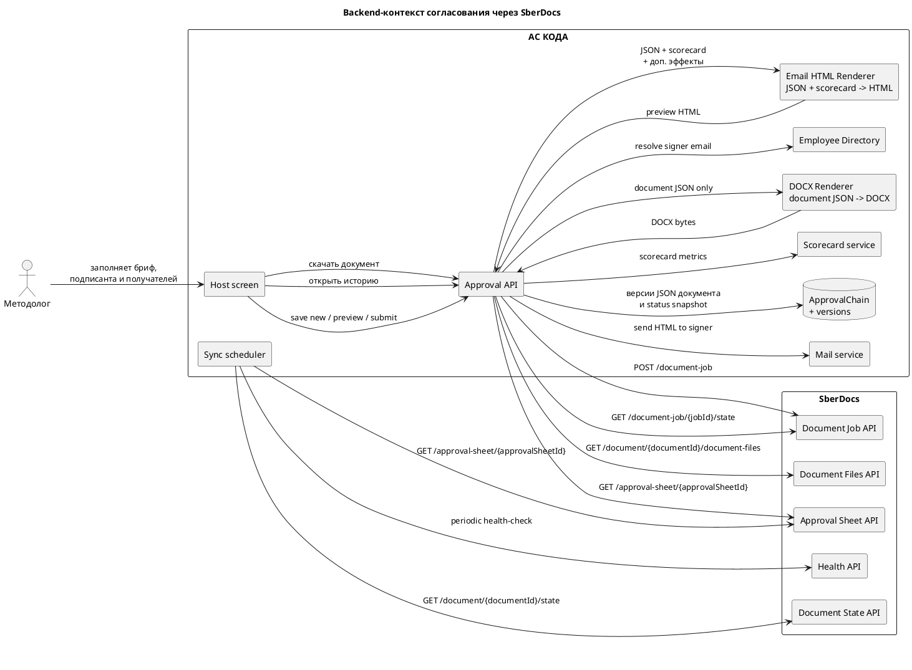
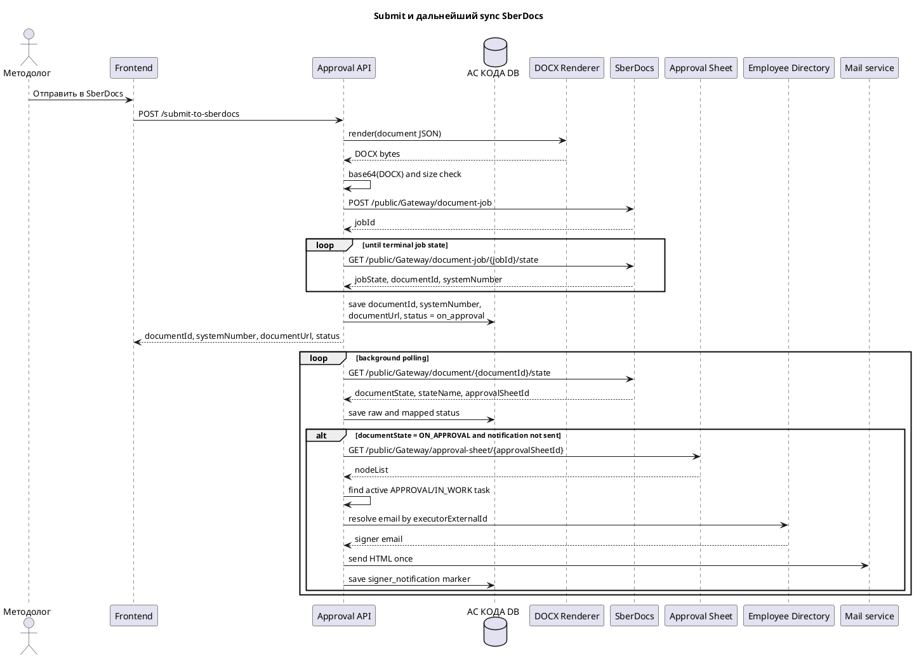
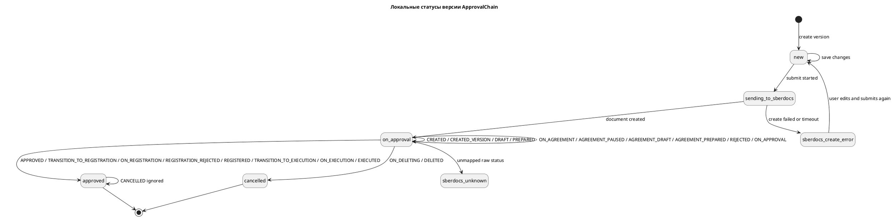

# Системные требования — Backend согласования через SberDocs

Статус: **в работе**
Область: MVP
Дата обновления: 2026-06-01
Decision ID: `DEC-2026-06-01-APPROVALS-NOTIFICATION-004`

## Оглавление

1. [Назначение backend-среза](#назначение-backend-среза)
2. [Источник правды](#источник-правды)
3. [Диаграммы процесса](#диаграммы-процесса)
4. [Ключевые решения](#ключевые-решения)
5. [Жизненный цикл `ApprovalChain`](#жизненный-цикл-approvalchain)
6. [Модель данных](#модель-данных)
7. [Формирование брифа, DOCX и письма](#формирование-брифа-docx-и-письма)
8. [Участники для SberDocs](#участники-для-sberdocs)
9. [Создание документа в SberDocs](#создание-документа-в-sberdocs)
10. [Polling и маппинг статусов](#polling-и-маппинг-статусов)
11. [История согласования и комментарии](#история-согласования-и-комментарии)
12. [Альтернативные сценарии и методы, которые не используем](#альтернативные-сценарии-и-методы-которые-не-используем)
13. [Внутренний API АС КОДА](#внутренний-api-ас-кода)
14. [Интеграция со SberDocs](#интеграция-со-sberdocs)
15. [Ошибки, аудит и мониторинг](#ошибки-аудит-и-мониторинг)
16. [Критерии приемки](#критерии-приемки)

## Назначение backend-среза

Backend должен реализовать минимальную интеграцию с SberDocs для согласования и подписания документа без собственного workflow engine в АС КОДА.

АС КОДА отвечает за:

- локальную сущность согласования `ApprovalChain` и её версии;
- хранение JSON документа, поля `Доп. эффекты`, подписанта и получателей до отправки;
- вызов backend DOCX Renderer, который принимает документную часть JSON и возвращает DOCX;
- кодирование DOCX-байтов в base64 для основного `documentFile` SberDocs;
- синхронный submit в SberDocs с ожиданием `documentId` и `systemNumber`;
- фоновый polling статуса документа;
- on-demand получение листа согласования и комментариев по отдельному API;
- автоматическую отправку письма текущему подписанту, когда активируется задача подписи;
- выдачу актуального DOCX из SberDocs;
- отображаемый mapped status для host entity;
- аудит версий, изменений и интеграционных событий.

SberDocs отвечает за:

- фактическое исполнение маршрута согласования и подписания;
- задачи согласующих, подписанта и получателей;
- комментарии, решения и статусы задач;
- редактирование документа и маршрута после создания;
- регистрацию и дальнейшее исполнение документа в контуре SberDocs.

АС КОДА не реализует собственные кнопки `approve`, `reject`, `ratify`, `sign`, `recall`, не редактирует уже созданный документ и маршрут в SberDocs и не хранит локальную копию истории согласования.

## Источник правды

| Источник | Как используется |
|---|---|
| `context/source-materials/change-requests/sberdocs-approvals/meeting.txt` | Расшифровка встречи 2026-05-25; основной источник ответов на открытые вопросы по ролям, К2, отзыву и major version. |
| `context/source-materials/change-requests/sberdocs-approvals/сбердокс.yaml` | Формальный API-контракт SberDocs. |
| `context/source-materials/change-requests/sberdocs-approvals/Бриф для утверждения.md` | Актуальный состав формы документа, правила поля `Доп. эффекты`, предпросмотра HTML-письма, ответа submit и отсутствия ручной отправки письма на frontend. |
| `context/source-materials/change-requests/sberdocs-approvals/StateMachine_внутреннего_документа.md` | State machine SberDocs внутреннего документа; используется для маппинга `documentState`. |
| `context/source-materials/change-requests/sberdocs-approvals/Согласование_Релизов_Риск_параметров.md` | Практический пример методов SberDocs: `document-job`, `document-job/{jobId}/state`, `document/{documentId}/state`, `approval-sheet/{approvalSheetId}`. |
| `context/source-materials/change-requests/sberdocs-approvals/Маршруты_согласований.md` | Исходная модель локальной цепочки согласования; нужна только как legacy-контекст. |

## Диаграммы процесса

### Контекст интеграции



### Submit и последующая синхронизация



### Локальные статусы версии `ApprovalChain`



## Ключевые решения

- `ApprovalChain` остаётся локальной сущностью, но перестаёт быть workflow engine: он хранит только версии брифа и техническое состояние интеграции.
- В АС КОДА не хранятся этапы маршрута согласования и список согласующих SberDocs.
- В SberDocs при создании документа передаются только подписант (`senderList`), получатели (`recipientList`), автор (`author`) и соавтор (`additionalAuthorList[]`).
- `author` = методолог, который отправил документ; `additionalAuthorList[]` содержит ПРМа как соавтора.
- После успешной отправки АС КОДА хранит идентификаторы и status snapshot SberDocs (`jobId`, `documentId`, `systemNumber`, `approvalSheetId`, `documentUrl`), но не хранит историю согласования.
- Бриф хранится как JSON; DOCX Renderer принимает документную часть JSON, генерирует DOCX, а интеграционный backend передаёт DOCX как основной `documentFile` в base64.
- Скоркарта и поле `Доп. эффекты` не попадают в DOCX-документ SberDocs: они используются только для preview и итогового HTML-письма подписанту.
- Письмо подписанту отправляется автоматически и только один раз; ручной кнопки в АС КОДА нет.
- Текущий адресат письма определяется по активной задаче `APPROVAL/IN_WORK` из `approval-sheet`, а не по исходному `senderList`.
- История согласования, комментарии и актуальный DOCX получаются из SberDocs отдельными вызовами по запросу frontend.
- Пока у доменного элемента существует связанный `ApprovalChain`, действия с самим доменным элементом в АС КОДА запрещены.

## Жизненный цикл `ApprovalChain`

### Локальные статусы

| Локальный статус | Когда ставим | Что означает |
|---|---|---|
| `new` | создана локальная версия, документ ещё не отправлен | бриф и участники отправки редактируемы |
| `sending_to_sberdocs` | submit начат, идёт создание документа | версия уже не редактируется, backend ждёт результат `document-job` |
| `sberdocs_create_error` | создание документа не завершилось успехом | `documentId` не создан или не подтверждён; пользователь исправляет версию и отправляет заново |
| `on_approval` | документ создан в SberDocs и находится на согласовании или подписании | SberDocs управляет процессом, АС КОДА только показывает статус |
| `approved` | документ прошёл утверждение и последующие статусы approved-group | согласование завершено положительно |
| `cancelled` | SberDocs удаляет или удалил документ | процесс остановлен terminal-состоянием |
| `sberdocs_unknown` | пришёл неожиданный статус | нужна диагностика, поддержка уведомлена |

### Правила переходов

- `new -> sending_to_sberdocs` при подтверждённом submit.
- `sending_to_sberdocs -> on_approval` после `COMPLETED` по `document-job/{jobId}/state` и сохранения `documentId/systemNumber`.
- `sending_to_sberdocs -> sberdocs_create_error` при `FAILED`, `VALIDATION_ERROR` или истечении времени ожидания результата создания.
- `sending_to_sberdocs -> sberdocs_create_error` при аномально успешном ответе SberDocs, когда job формально завершён, но обязательные идентификаторы документа не подтверждены.
- `on_approval -> approved` по approved-group статусам SberDocs.
- `on_approval -> cancelled` по raw `ON_DELETING` или `DELETED`.
- Raw `REJECTED` оставляет локальный статус `on_approval`.
- Raw `CANCELLED` после `approved` не понижает локальный статус.

## Модель данных

| Сущность / поле | Тип данных | Назначение |
|---|---|---|
| `ApprovalChain.id` | UUID | идентификатор локальной цепочки |
| `ApprovalChain.targetType`, `ApprovalChain.targetId` | string | связь с доменным элементом |
| `ApprovalChain.activeVersionId` | UUID | активная версия |
| `ApprovalChain.currentStatus` | enum | текущий локальный статус для host entity |
| `ApprovalChainVersion.id` | UUID | идентификатор версии |
| `ApprovalChainVersion.versionNo` | integer | порядковый номер версии |
| `ApprovalChainVersion.status` | enum | `new`, `sending_to_sberdocs`, `on_approval`, `approved`, `cancelled`, `sberdocs_create_error`, `sberdocs_unknown` |
| `ApprovalChainVersion.briefSnapshotJson` | JSON | документная часть брифа |
| `ApprovalChainVersion.additionalEffects` | text | поле `Доп. эффекты` |
| `ApprovalChainVersion.summary` | string | краткое содержание, уходит в SberDocs `summary` |
| `ApprovalChainVersion.signerEmployee` | JSON | подписант, который уйдёт в `senderList` |
| `ApprovalChainVersion.recipientList` | JSON array | получатели |
| `ApprovalChainVersion.authorEmployee` | JSON | методолог-отправитель |
| `ApprovalChainVersion.coAuthorEmployee` | JSON | ПРМ-соавтор |
| `ApprovalChainVersion.sberdocsSnapshot` | JSON | `jobId`, `documentId`, `systemNumber`, `documentUrl`, raw/mapped status, `approvalSheetId`, `lastSyncedAt`, `lastHealthStatus`, `lastErrorCode`, `requiresManualResolution`, `diagnosticMessage` |
| `ApprovalChainVersion.signerNotification` | JSON nullable | `sentAt`, `sentTo`, `taskId`, `executorExternalId`, `deliveryStatus`, `deliveryMessageId` |
| `ApprovalChainVersion.changeReason` | string | комментарий к изменению версии |
| `ApprovalChainVersion.createdBy`, `createdAt` | audit fields | кто и когда создал версию |
| `ApprovalChainVersion.updatedBy`, `updatedAt` | audit fields | последнее сохранение `new`-версии |

Принципы модели:

- `briefSnapshotJson` и `additionalEffects` принадлежат версии и не перезаписываются изменениями документа в SberDocs.
- `sberdocsSnapshot` хранит только техническое состояние интеграции; он не дублирует историю согласования.
- `signerNotification` нужен для идемпотентности отправки письма и диагностики доставки, но не обязан отображаться как отдельный UI-статус.
- Имя DOCX-файла локально не хранится: DOCX всегда может быть заново сгенерирован из snapshot-а версии.

## Формирование брифа, DOCX и письма

### Бриф и snapshot версии

- Backend хранит документ как JSON по правилам `context/source-materials/change-requests/sberdocs-approvals/Бриф для утверждения.md`.
- `additionalEffects` хранится отдельно, но в составе той же версии.
- Скоркарта не хранится в версии; backend получает её по действующему API скоркарты в момент preview и отправки письма.

### DOCX

- Backend вызывает DOCX Renderer с документной частью `briefSnapshotJson`.
- DOCX Renderer возвращает бинарный DOCX без скоркарты и без `Доп. эффекты`.
- Backend рассчитывает `actualSizeBytes` по полученным байтам и кодирует файл в base64.
- До вызова SberDocs backend проверяет, что base64-представление основного файла не превышает лимит `10 МБ` из `сбердокс.yaml`.
- Имя DOCX-файла может быть сгенерировано на лету из типа сущности и номера версии, но не хранится как часть доменной модели.

### Письмо подписанту

- Backend формирует HTML письма из сохранённого JSON версии, read-only скоркарты и поля `Доп. эффекты`.
- Preview и реальное письмо используют один и тот же шаблон и один и тот же набор бизнес-данных.
- Поля, которые появляются только после создания документа в SberDocs (`systemNumber`, ссылка, raw status), не должны участвовать в шаблоне письма, чтобы preview совпадал по составу с реальным письмом.
- Отправка выполняется только один раз на версию `ApprovalChainVersion`.
- Адресат определяется по активной задаче `APPROVAL/IN_WORK`: backend берёт `executorExternalId` из `approval-sheet` и резолвит корпоративный email через локальный каталог сотрудников.

## Участники для SberDocs

### Что передаём

| Поле SberDocs | Источник в АС КОДА | Правило |
|---|---|---|
| `senderList[0]` | назначенный подписант | в MVP передаём одного подписанта |
| `recipientList[]` | список получателей | передаём как есть из формы |
| `author` | методолог, отправивший документ | обязателен |
| `additionalAuthorList[0]` | ПРМ | передаём одного соавтора |
| `summary` | поле `Краткое содержание` | обязательно |
| `externalDocumentId` | локальный идентификатор версии | используется для трассировки и идемпотентности |

### Что не передаём

- `route.executorList` и любые локальные этапы согласования;
- `attachmentList`;
- `restrictions.actions`;
- К2 / `privacyList` через API.

## Создание документа в SberDocs

### Используемый метод

- `POST /public/Gateway/document-job`

### Требования к запросу

- `externalDocumentId` должен быть уникален в пределах версии `ApprovalChainVersion`.
- `type`, `kind`, `externalDocumentSource`, `hasSignatureDetached`, `hasRmsProtected` берутся из конфигурации интеграции и подтверждаются отдельно.
- `documentFile.file.extension = DOCX`.
- `documentFile.fileType = DOCUMENT`.
- `documentFile.actualSizeBytes` соответствует размеру исходных DOCX-байтов.
- `documentFile.content = base64(DOCX)`.
- `summary` заполняется из краткого содержания.
- `senderList`, `recipientList`, `author`, `additionalAuthorList[]` обязательны по контракту.

### Пример payload к SberDocs

```json
{
  "externalDocumentId": "approval-chain-version:7d2b1f35-4d6a-4a0c-8f4f-7e9c5f865f12",
  "type": "INTERNAL",
  "kind": "MEMORANDUM",
  "senderList": [
    {
      "externalId": "r-001234",
      "tenantCode": "SBERBANK"
    }
  ],
  "recipientList": [
    {
      "employee": {
        "externalId": "r-009876",
        "tenantCode": "SBERBANK"
      }
    }
  ],
  "additionalAuthorList": [
    {
      "externalId": "r-007777",
      "tenantCode": "SBERBANK"
    }
  ],
  "author": {
    "externalId": "r-001111",
    "tenantCode": "SBERBANK"
  },
  "summary": "Краткое содержание брифа",
  "documentFile": {
    "fileType": "DOCUMENT",
    "file": {
      "fileName": "approval-brief.docx",
      "extension": "DOCX"
    },
    "actualSizeBytes": 152340,
    "content": "<base64>"
  },
  "hasSignatureDetached": false,
  "hasRmsProtected": false,
  "externalDocumentSource": "AS_KODA"
}
```

### Health-check и submit-поведение

- `GET /public/Gateway/health-check` вызывается отдельным фоновым мониторингом backend, а не как обязательный pre-call gate перед каждым SberDocs-запросом.
- Если фоновый мониторинг фиксирует `status != LIVING` или transport error, backend сохраняет diagnostic snapshot и отправляет уведомление на поддержку.
- После успешного `document-job` backend не возвращает `202` как основной happy path: он ждёт `COMPLETED` по `document-job/{jobId}/state` и только потом отвечает frontend успешным результатом с `documentId` и `systemNumber`.

## Polling и маппинг статусов

### Submit-time polling `document-job`

- Backend вызывает `GET /public/Gateway/document-job/{jobId}/state` до terminal-результата.
- Для happy path обязательными считаются `jobState = COMPLETED`, непустой `documentId` и непустой `systemNumber`.
- Terminal-поведение:
  - `COMPLETED` -> сохранить `documentId`, `systemNumber`, локальный status `on_approval` и вернуть результат frontend.
  - `FAILED`, `VALIDATION_ERROR` -> сохранить `sberdocs_create_error` и вернуть ошибку frontend.
  - превышение лимита ожидания -> сохранить `sberdocs_create_error` с диагностикой timeout.

### Аномальные ответы `document-job` и `document-job/{jobId}/state`

Следующие ответы считаются protocol/integration error, даже если транспортно запрос завершился успешно:

| Сценарий | Правило backend |
|---|---|
| `POST /document-job` вернул success, но без `jobId` | не начинать polling, перевести версию в `sberdocs_create_error`, сохранить raw response, уведомить поддержку |
| `document-job/{jobId}/state = COMPLETED`, но пустой `documentId` | не переводить версию в `on_approval`, сохранить `sberdocs_create_error` с кодом `completed_without_document_id`, уведомить поддержку |
| `document-job/{jobId}/state = COMPLETED`, но пустой `systemNumber` | не переводить версию в `on_approval`, сохранить `sberdocs_create_error` с кодом `completed_without_system_number`, уведомить поддержку |
| `document-job/{jobId}/state = COMPLETED`, но `documentUrl` не удаётся построить из `documentId` | сохранить `documentId/systemNumber`, но ответ frontend считать ошибкой интеграции и уведомить поддержку; до устранения дефекта ссылка в UI не показывается |
| в разных polling-ответах для одного `jobId` пришли разные `documentId` | перевести версию в `sberdocs_create_error`, сохранить raw snapshots всех ответов, уведомить поддержку |

Правила повторной отправки после аномального success-сценария:

- Если `documentId` не подтверждён, но `jobId` уже существовал и job завершился `COMPLETED`, повторный submit из UI не разрешается автоматически, потому что в SberDocs мог появиться документ и есть риск дубля.
- Для таких кейсов backend выставляет версии `sberdocs_create_error` признак `requiresManualResolution = true` в status snapshot/API response и пишет диагностическое сообщение для UI.
- Повторный submit разрешается только после ручного решения: оператор/support либо подтверждает отсутствие документа в SberDocs и разблокирует повторную отправку, либо связывает локальную версию с найденным `documentId`.

### Background polling `document/state`

- После получения `documentId` backend периодически вызывает `GET /public/Gateway/document/{documentId}/state`.
- При каждом изменении сохраняются raw `documentState`, `stateName`, `systemNumber`, `approvalSheetId`, mapped status и `lastSyncedAt`.
- Если raw `documentState = ON_APPROVAL` и письмо ещё не отправлено, backend читает `approval-sheet` и ищет активную задачу `APPROVAL/IN_WORK`.

### Аномальные ответы `document/state`, `approval-sheet` и `document-files`

| Сценарий | Правило backend |
|---|---|
| `document/state` вернул success, но без `documentState` | сохраняем `sberdocs_unknown`, raw response и уведомляем поддержку |
| `document/state` вернул другой `systemNumber`, чем уже был сохранён | сохраняем raw response, не перетираем значение молча, уведомляем поддержку; до разбора считаем это интеграционной аномалией |
| `document/state` вернул пустой `approvalSheetId` при статусе, где история уже должна быть доступна | продолжаем polling, письмо не отправляем, событие логируем как warning |
| `approval-sheet` вернул несколько active задач `APPROVAL/IN_WORK` | письмо автоматически не отправляем, сохраняем integration error, уведомляем поддержку |
| `approval-sheet` вернул active `APPROVAL/IN_WORK`, но у задачи нет `executorExternalId` | письмо не отправляем, сохраняем integration error, уведомляем поддержку |
| `document-files` вернул success, но не содержит `DOCUMENT`-файл | отдаём ошибку скачивания, сохраняем integration error и уведомляем поддержку |

### Таблица маппинга статусов SberDocs -> локальные статусы АС КОДА

| Raw `documentState` | Local status | Правило |
|---|---|---|
| `CREATED`, `CREATED_VERSION`, `DRAFT`, `PREPARED`, `ON_AGREEMENT`, `AGREEMENT_PAUSED`, `AGREEMENT_DRAFT`, `AGREEMENT_PREPARED`, `REJECTED`, `ON_APPROVAL` | `on_approval` | документ ещё на согласовании или подписании |
| `APPROVED`, `TRANSITION_TO_REGISTRATION`, `ON_REGISTRATION`, `REGISTRATION_REJECTED`, `REGISTERED`, `TRANSITION_TO_EXECUTION`, `ON_EXECUTION`, `EXECUTED` | `approved` | всё approved-group считаем согласованным |
| `ON_DELETING`, `DELETED` | `cancelled` | удаление документа в SberDocs |
| `CANCELLED` после локального `approved` | `approved` | raw status фиксируем в audit, локальный статус не понижаем |
| любое неизвестное значение | `sberdocs_unknown` | сохраняем raw status, уведомляем поддержку |

### Отправка письма подписанту

Условия отправки:

- локальный `signerNotification.sentAt` ещё не заполнен;
- raw `documentState = ON_APPROVAL`;
- `approval-sheet` содержит активную задачу с `taskType = APPROVAL` и `taskState = IN_WORK`.

Алгоритм:

1. Взять `approvalSheetId` из сохранённого `sberdocsSnapshot`.
2. Вызвать `GET /public/Gateway/approval-sheet/{approvalSheetId}`.
3. Найти активную задачу `APPROVAL/IN_WORK` и взять из неё `taskId`, `executorExternalId`, `executorName`.
4. Разрешить email получателя через локальный каталог сотрудников.
5. Получить актуальные данные скоркарты.
6. Сформировать HTML письма по тому же шаблону, что и preview.
7. Отправить письмо один раз.
8. Сохранить marker `signerNotification`.

Особые случаи:

- `taskType = AGREEMENT` не запускает отправку письма.
- Если `approvalSheetId` ещё не известен, письмо не отправляется и backend ждёт следующего polling-цикла.
- Если email для `executorExternalId` не разрешился, это интеграционная ошибка: статус документа не меняется, событие попадает в audit/monitoring.

## История согласования и комментарии

### Используемый метод

- `GET /public/Gateway/approval-sheet/{approvalSheetId}`

### Правила

- метод вызывается по запросу frontend, когда пользователь открывает раздел истории;
- backend не сохраняет историю и комментарии в БД АС КОДА;
- backend нормализует ответ для UI: список задач, исполнителей, типов задач, статусов, дат и комментариев;
- если `approvalSheetId` ещё не известен, backend возвращает `notReady = true` и пустой список, а не ошибку сценария.

### Нормализованный ответ для frontend

```json
{
  "approvalSheetReady": true,
  "items": [
    {
      "taskId": "8f5d2c2a-9d61-4a8f-a9f4-0f3d241f5f2c",
      "taskType": "AGREEMENT",
      "taskState": "APPROVED",
      "executorExternalId": "r-001234",
      "executorName": "Иванов Иван Иванович",
      "comment": "Согласовано",
      "updatedAt": "2026-06-01T10:15:00Z"
    }
  ]
}
```

## Альтернативные сценарии и методы, которые не используем

### Отзыв и удаление

- В public API SberDocs не подтверждён отдельный стабильный метод remote recall/delete для нашего сценария.
- В MVP отзыв или удаление выполняются автором/соавтором в интерфейсе SberDocs.
- Для АС КОДА достаточно корректно обработать raw `ON_DELETING` и `DELETED`.

### Редактирование созданного документа и major version

- В SberDocs есть `PUT /public/Gateway/document/{documentId}/document-header`.
- Метод создаёт новую major version документа и потенциально может повлиять на незавершённые задания маршрута.
- Для новых потребителей он не выбран: в MVP АС КОДА не редактирует уже созданный документ через API.
- Если документ изменяется после отправки, эти изменения происходят в интерфейсе SberDocs, а АС КОДА потом получает актуальный DOCX через `document-files`.

### Что ещё не используем в MVP

| Метод / возможность | Почему не используем |
|---|---|
| API исполнения задач согласования/подписания | решения принимаются в интерфейсе SberDocs |
| `attachmentList` | в MVP нет внешних файлов, бриф — основной документ |
| прямой HTML document content | в `FileExtension` нет HTML; основной документ передаём как DOCX |
| локальное хранение истории согласования | история нужна только по запросу UI, дублировать её в БД АС КОДА не нужно |

## Внутренний API АС КОДА

### OpenAPI fragment

```yaml
paths:
  /api/v1/approval-chains/{targetType}/{targetId}:
    get:
      summary: Получить активную цепочку согласования
  /api/v1/approval-chains/{targetType}/{targetId}/new-version:
    put:
      summary: Сохранить локальную new-версию брифа
  /api/v1/approval-chains/{targetType}/{targetId}/notification-preview:
    post:
      summary: Сформировать HTML предпросмотра письма
  /api/v1/approval-chains/{targetType}/{targetId}/submit-to-sberdocs:
    post:
      summary: Отправить документ в SberDocs и вернуть documentId/systemNumber
  /api/v1/approval-chains/{targetType}/{targetId}/sync-sberdocs:
    post:
      summary: Выполнить один цикл синхронизации статуса документа
  /api/v1/approval-chains/{targetType}/{targetId}/approval-sheet:
    get:
      summary: Получить историю согласования и комментарии
  /api/v1/approval-chains/{targetType}/{targetId}/document-file:
    get:
      summary: Скачать актуальный основной DOCX из SberDocs
```

### Получить активную цепочку согласования

```http
GET /api/v1/approval-chains/{targetType}/{targetId}
```

Возвращает активную версию, `briefSnapshotJson`, `additionalEffects`, участников отправки, status snapshot и признаки read-only режима. История участников в этот ответ не входит.

### Сохранить `new`-версию

```http
PUT /api/v1/approval-chains/{targetType}/{targetId}/new-version
```

Пример запроса:

```json
{
  "brief": {
    "document": {},
    "additionalEffects": "Текст доп. эффектов",
    "summary": "Краткое содержание"
  },
  "signer": {
    "employeeId": "r-001234"
  },
  "recipients": [
    {
      "employeeId": "r-009876"
    }
  ],
  "changeReason": "Уточнены получатели"
}
```

Правила:

- обновляет текущую `new`-версию, пока документ не отправлен;
- если у активной версии уже есть `documentId`, запрос отклоняется как read-only сценарий;
- возвращает `409 Conflict` при конкурентном изменении версии.

### Предпросмотр письма-уведомления

```http
POST /api/v1/approval-chains/{targetType}/{targetId}/notification-preview
```

Генерирует HTML письма из текущего или сохранённого JSON документа, read-only скоркарты и поля `Доп. эффекты`. Валидация обязательных полей документа не блокирует предпросмотр. Метод не создаёт DOCX и не отправляет письмо.

### Отправить в SberDocs

```http
POST /api/v1/approval-chains/{targetType}/{targetId}/submit-to-sberdocs
```

Правила:

- доступен только для активной версии со статусом `new`;
- атомарно блокирует версию от повторного submit;
- генерирует DOCX, вызывает `POST /public/Gateway/document-job`, ждёт `documentId/systemNumber` и только затем возвращает успешный ответ;
- если `document-job` завершился ошибкой или timeout, возвращает ошибку и сохраняет `sberdocs_create_error`.

Ответ happy path:

```json
{
  "approvalChainId": "8f0c4b6e-4b18-4c9d-9fd5-0d4e7f4d6a10",
  "versionId": "f2b3e0b2-6e5f-4a5c-8c7f-9ef1b7b8b001",
  "status": "on_approval",
  "documentId": "16fd2706-8baf-433b-82eb-8c7fada847da",
  "systemNumber": "Сн-ЦА/1-21",
  "documentUrl": "https://sberdocs.example/documents/16fd2706-8baf-433b-82eb-8c7fada847da",
  "lastSyncedAt": "2026-06-01T10:12:00Z"
}
```

### Синхронизировать SberDocs

```http
POST /api/v1/approval-chains/{targetType}/{targetId}/sync-sberdocs
```

Выполняет один цикл sync:

- если есть `documentId`, вызывает `document/{documentId}/state`;
- при `documentState = ON_APPROVAL` и пустом `signerNotification.sentAt` читает `approval-sheet`, проверяет `APPROVAL/IN_WORK` и при необходимости отправляет письмо;
- возвращает обновлённый status snapshot.

### Получить историю согласования

```http
GET /api/v1/approval-chains/{targetType}/{targetId}/approval-sheet
```

Читает `approvalSheetId` из `sberdocsSnapshot`, вызывает `GET /public/Gateway/approval-sheet/{approvalSheetId}`, нормализует ответ и не сохраняет его в БД АС КОДА.

### Получить актуальный документ из SberDocs

```http
GET /api/v1/approval-chains/{targetType}/{targetId}/document-file
```

Правила:

- используется после появления `documentId`, прежде всего после положительного результата согласования;
- вызывает `GET /public/Gateway/document/{documentId}/document-files` с `fileTypes=DOCUMENT`, `includeSignature=false`;
- если SberDocs вернул несколько файлов, backend выбирает основной `fileType = DOCUMENT` и актуальную версию по правилам ответа;
- возвращает frontend/download proxy `fileName`, `extension`, `actualSizeBytes`, `contentType` и content stream по принятому в АС КОДА стандарту скачивания файлов;
- не сохраняет файл в БД АС КОДА.

## Интеграция со SberDocs

### Используемые методы

| Сценарий | Метод | Что сохраняем/возвращаем |
|---|---|---|
| Периодический мониторинг доступности | `GET /public/Gateway/health-check` | `status`, `message`, `RqUID`, `lastHealthCheckedAt`, support notification state |
| Создание документа | `POST /public/Gateway/document-job` | `jobId`, raw response, request id |
| Ожидание создания | `GET /public/Gateway/document-job/{jobId}/state` | `jobState`, `descriptionMessage`, `documentId`, `systemNumber` |
| Polling документа | `GET /public/Gateway/document/{documentId}/state` | `documentState`, `stateName`, `systemNumber`, `approvalSheetId` |
| История согласования | `GET /public/Gateway/approval-sheet/{approvalSheetId}` | возвращаем frontend `nodeList` как поимённую историю задач и комментариев |
| Автоматическая отправка письма | `GET /public/Gateway/approval-sheet/{approvalSheetId}` | используем для поиска active `APPROVAL/IN_WORK` task и её `executorExternalId` |
| Получение актуального DOCX | `GET /public/Gateway/document/{documentId}/document-files` | возвращаем основной `DOCUMENT`-файл пользователю |

### Термины интеграции

- `systemNumber` — номер документа в SberDocs, который пользователь видит в интерфейсе после создания документа.
- `documentId` — технический идентификатор документа в SberDocs, который нужен для polling, истории, скачивания документа и построения ссылки.
- `externalDocumentId` — идентификатор локальной версии АС КОДА, который мы передаём в SberDocs для трассировки; это не `systemNumber` и не `documentId`.

## Ошибки, аудит и мониторинг

### Валидационные ошибки до SberDocs

Backend возвращает `422 Unprocessable Entity`, если:

- не заполнены обязательные поля брифа;
- отсутствует подписант;
- отсутствует хотя бы один получатель;
- в `Периметр применения` не заполнено ни одно поле;
- DOCX не сгенерирован;
- base64-представление DOCX превышает лимит `10 МБ`;
- `summary` пустое;
- отсутствуют `author` или `additionalAuthorList[0]` по внутренним правилам формирования запроса.

### Интеграционные ошибки

| Сценарий | Поведение |
|---|---|
| фоновый `health-check` не `LIVING` или transport error | фиксируем diagnostic snapshot, уведомляем поддержку, но не вводим отдельный pre-call gate для каждого business-вызова |
| `POST /document-job` вернул success без `jobId` | сохраняем `sberdocs_create_error`, помечаем `requiresManualResolution = true`, уведомляем поддержку |
| `document-job` вернул `FAILED` / `VALIDATION_ERROR` | сохраняем `sberdocs_create_error`, возвращаем ошибку пользователю |
| timeout ожидания `document-job` | сохраняем `sberdocs_create_error` с кодом timeout |
| `document-job/{jobId}/state = COMPLETED`, но отсутствует `documentId` и/или `systemNumber` | сохраняем `sberdocs_create_error`, помечаем `requiresManualResolution = true`, уведомляем поддержку, автоматически повторить submit нельзя |
| `document/state` success без обязательных полей или с конфликтующими идентификаторами | сохраняем raw snapshot, переводим в `sberdocs_unknown` или integration error по правилу сценария, уведомляем поддержку |
| неизвестный raw status SberDocs | переводим версию в `sberdocs_unknown`, сохраняем raw snapshot, уведомляем поддержку |
| `approval-sheet` вернул неконсистентные данные для определения подписанта | письмо не отправляем, сохраняем integration error, уведомляем поддержку |
| не удалось резолвить email подписанта по active task | сохраняем ошибку доставки, статус документа не меняем |
| не удалось отправить письмо | сохраняем ошибку доставки, повторная отправка возможна только следующим scheduler-cycle до успешного `sentAt` |
| не удалось получить актуальный документ или `document-files` не содержит `DOCUMENT` | отдаём frontend ошибку скачивания без изменения статуса согласования, сохраняем integration error |

### Матрица обработки ошибок для разработки

| Метод / точка интеграции | Аномалия | Реакция backend | Что видит пользователь | Можно ли retry из UI |
|---|---|---|---|---|
| `GET /public/Gateway/health-check` | `status != LIVING` или transport error | сохранить diagnostic snapshot, отправить уведомление на поддержку, не блокировать остальные business-вызовы pre-check-ом | пользователь получает только результат конкретного business-вызова, если он тоже упал; отдельного health-check popup нет | не относится к UI retry |
| `POST /public/Gateway/document-job` | transport error / 5xx / timeout до получения ответа | сохранить `sberdocs_create_error`, raw error, вернуть ошибку submit | сообщение об ошибке отправки в SberDocs | да, если `documentId` не появился и нет `requiresManualResolution` |
| `POST /public/Gateway/document-job` | success-ответ без `jobId` | сохранить `sberdocs_create_error`, `requiresManualResolution = true`, уведомить поддержку | сообщение о неконсистентном ответе SberDocs; повторная отправка временно недоступна | нет, только после ручного разбора |
| `GET /public/Gateway/document-job/{jobId}/state` | `FAILED` / `VALIDATION_ERROR` | сохранить `sberdocs_create_error` и код ошибки | понятная ошибка создания документа | да |
| `GET /public/Gateway/document-job/{jobId}/state` | timeout ожидания terminal-статуса | сохранить `sberdocs_create_error` с кодом timeout | ошибка ожидания результата создания | да, если нет признаков частично созданного документа |
| `GET /public/Gateway/document-job/{jobId}/state` | `COMPLETED`, но нет `documentId` | сохранить `sberdocs_create_error`, `requiresManualResolution = true`, уведомить поддержку | сообщение, что документ мог создаться некорректно и требуется проверка | нет |
| `GET /public/Gateway/document-job/{jobId}/state` | `COMPLETED`, но нет `systemNumber` | сохранить `sberdocs_create_error`, `requiresManualResolution = true`, уведомить поддержку | сообщение о неконсистентном ответе SberDocs | нет |
| `GET /public/Gateway/document-job/{jobId}/state` | для одного `jobId` пришли разные `documentId` | сохранить raw snapshots, `requiresManualResolution = true`, уведомить поддержку | сообщение о внутренней ошибке интеграции | нет |
| `GET /public/Gateway/document/{documentId}/state` | transport error / 5xx / timeout | сохранить integration error последней синхронизации, статус цепочки не понижать автоматически | пользователь видит last known status и ошибку обновления статуса по запросу | да, через `Обновить статус` или следующий scheduler cycle |
| `GET /public/Gateway/document/{documentId}/state` | success без `documentState` | сохранить raw snapshot, перевести в `sberdocs_unknown`, уведомить поддержку | last known status + технический код ошибки/аномалии | нет прямого retry-решения; ждём исправления интеграции и новый sync |
| `GET /public/Gateway/document/{documentId}/state` | пришёл другой `systemNumber`, чем уже сохранён | сохранить конфликт как integration anomaly, уведомить поддержку, не перетирать значение молча | пользователь продолжает видеть last trusted data | нет, нужен разбор |
| `GET /public/Gateway/approval-sheet/{approvalSheetId}` | history по запросу UI недоступна | не менять статус цепочки, вернуть ошибку только для блока истории | пользователь не видит историю, но основное состояние цепочки остаётся | да |
| `GET /public/Gateway/approval-sheet/{approvalSheetId}` | несколько active `APPROVAL/IN_WORK` задач | не отправлять письмо, сохранить integration error, уведомить поддержку | пользователь напрямую этого не видит, кроме возможного отсутствия письма | нет, письмо автоматически не отправляем до разбора |
| `GET /public/Gateway/approval-sheet/{approvalSheetId}` | active задача подписания без `executorExternalId` | не отправлять письмо, сохранить integration error, уведомить поддержку | пользователь напрямую этого не видит | нет |
| локальный employee directory | не найден email по `executorExternalId` | сохранить ошибку доставки, не менять статус документа | пользователь видит только статус документа; уведомление не уходит | обычно нет, ждём исправления справочника и следующий auto-cycle |
| email transport | письмо подписанту не отправлено | сохранить ошибку доставки, повторить на следующем scheduler cycle, пока нет `sentAt` | пользователь не видит отдельного статуса письма | да, автоматически бэком |
| `GET /public/Gateway/document/{documentId}/document-files` | transport error / 5xx / timeout | вернуть ошибку скачивания, сохранить integration error | пользователь не может скачать файл сейчас | да |
| `GET /public/Gateway/document/{documentId}/document-files` | success без `DOCUMENT`-файла | вернуть ошибку скачивания, уведомить поддержку | пользователь не может скачать файл сейчас | да, но ожидается ручной разбор |

### Retry policy

Общие правила:

- retry допустим только для идемпотентных операций чтения или для submit-сценариев, где backend однозначно знает, что документ в SberDocs не появился;
- если есть риск частично успешного создания документа в SberDocs, backend обязан блокировать повторный submit и выставлять `requiresManualResolution = true`;
- автоматические retry не должны менять локальный business status без нового подтверждённого ответа SberDocs;
- каждый retry и каждый отказ от retry фиксируются в audit и в technical snapshot последней ошибки.

Таблица retry-политики:

| Сценарий | Retry policy |
|---|---|
| `document-job` transport error до получения ответа | пользовательский retry разрешён |
| `document-job/{jobId}/state = FAILED` / `VALIDATION_ERROR` | пользовательский retry разрешён после исправления данных или без него, если ошибка была временной |
| `document-job/{jobId}/state` timeout без признаков созданного документа | пользовательский retry разрешён |
| success без `jobId` | пользовательский retry запрещён, только manual resolution |
| `COMPLETED` без `documentId` / `systemNumber` | пользовательский retry запрещён, только manual resolution |
| конфликтующие идентификаторы (`jobId` -> разные `documentId`) | retry запрещён, только manual resolution |
| polling `document/state` transport error | backend scheduler retry автоматически; пользователь может вручную вызвать `Обновить статус` |
| `approval-sheet` недоступен при открытии истории | пользовательский retry разрешён |
| ошибка резолва email подписанта | пользовательский retry недоступен; backend повторяет после исправления справочника или на следующем cycle |
| ошибка отправки email | backend retry автоматически до первого успешного `sentAt` |
| ошибка скачивания `document-files` | пользовательский retry разрешён |

### Внутренние коды ошибок АС КОДА

| Код | Когда выставляется | Основная реакция |
|---|---|---|
| `SBERDOCS_HEALTHCHECK_UNAVAILABLE` | фоновый `health-check` вернул `status != LIVING` | support email, monitoring alert |
| `SBERDOCS_HEALTHCHECK_TRANSPORT_ERROR` | transport error при фоновом `health-check` | support email, monitoring alert |
| `SBERDOCS_CREATE_TRANSPORT_ERROR` | transport error / 5xx / timeout на `POST /document-job` | `sberdocs_create_error`, retry allowed |
| `SBERDOCS_CREATE_RESPONSE_MISSING_JOB_ID` | success-ответ create без `jobId` | `sberdocs_create_error`, `requiresManualResolution = true` |
| `SBERDOCS_CREATE_FAILED` | `document-job/{jobId}/state = FAILED` | `sberdocs_create_error`, retry allowed |
| `SBERDOCS_CREATE_VALIDATION_ERROR` | `document-job/{jobId}/state = VALIDATION_ERROR` | `sberdocs_create_error`, retry allowed |
| `SBERDOCS_CREATE_TIMEOUT` | polling `document-job/{jobId}/state` превысил лимит ожидания | `sberdocs_create_error`, retry depends on ambiguity |
| `SBERDOCS_COMPLETED_WITHOUT_DOCUMENT_ID` | `COMPLETED`, но отсутствует `documentId` | `requiresManualResolution = true`, support email |
| `SBERDOCS_COMPLETED_WITHOUT_SYSTEM_NUMBER` | `COMPLETED`, но отсутствует `systemNumber` | `requiresManualResolution = true`, support email |
| `SBERDOCS_COMPLETED_WITHOUT_DOCUMENT_URL` | `COMPLETED`, есть ids, но не удалось построить `documentUrl` | integration error, support email |
| `SBERDOCS_JOB_DOCUMENT_ID_CONFLICT` | для одного `jobId` пришли разные `documentId` | `requiresManualResolution = true`, support email |
| `SBERDOCS_STATE_TRANSPORT_ERROR` | transport error при `document/state` | last sync error, retry allowed |
| `SBERDOCS_STATE_MISSING_DOCUMENT_STATE` | success без `documentState` | `sberdocs_unknown`, support email |
| `SBERDOCS_STATE_SYSTEM_NUMBER_CONFLICT` | `document/state` вернул новый конфликтующий `systemNumber` | integration anomaly, support email |
| `SBERDOCS_UNKNOWN_STATUS` | получен unmapped raw status | `sberdocs_unknown`, support email |
| `SBERDOCS_APPROVAL_SHEET_TRANSPORT_ERROR` | transport error при чтении `approval-sheet` | partial UI error or delayed notification |
| `SBERDOCS_APPROVAL_SHEET_SIGNER_AMBIGUOUS` | несколько active `APPROVAL/IN_WORK` задач | support email, no notification send |
| `SBERDOCS_APPROVAL_SHEET_SIGNER_MISSING` | active task без `executorExternalId` | support email, no notification send |
| `SBERDOCS_SIGNER_EMAIL_NOT_FOUND` | не найден email по `executorExternalId` | notification delayed |
| `SBERDOCS_SIGNER_EMAIL_SEND_FAILED` | не удалось отправить email подписанту | backend auto-retry |
| `SBERDOCS_DOCUMENT_FILE_TRANSPORT_ERROR` | transport error при `document-files` | download error |
| `SBERDOCS_DOCUMENT_FILE_MISSING_MAIN` | `document-files` не содержит `DOCUMENT` | download error, support email |

### Severity и support-notification policy

| Код / тип события | Severity | Support email | Комментарий |
|---|---|---|---|
| `SBERDOCS_HEALTHCHECK_UNAVAILABLE`, `SBERDOCS_HEALTHCHECK_TRANSPORT_ERROR` | `critical` | обязательно | SberDocs на критическом пути |
| `SBERDOCS_CREATE_RESPONSE_MISSING_JOB_ID` | `critical` | обязательно | create-ответ неконсистентен |
| `SBERDOCS_COMPLETED_WITHOUT_DOCUMENT_ID`, `SBERDOCS_COMPLETED_WITHOUT_SYSTEM_NUMBER`, `SBERDOCS_JOB_DOCUMENT_ID_CONFLICT` | `critical` | обязательно | риск дубля или потери связи с документом |
| `SBERDOCS_STATE_MISSING_DOCUMENT_STATE`, `SBERDOCS_STATE_SYSTEM_NUMBER_CONFLICT`, `SBERDOCS_UNKNOWN_STATUS` | `critical` | обязательно | теряется корректный контроль статуса |
| `SBERDOCS_APPROVAL_SHEET_SIGNER_AMBIGUOUS`, `SBERDOCS_APPROVAL_SHEET_SIGNER_MISSING` | `critical` | обязательно | нельзя безопасно уведомить подписанта |
| `SBERDOCS_DOCUMENT_FILE_MISSING_MAIN` | `critical` | обязательно | нельзя получить итоговый документ |
| `SBERDOCS_CREATE_TRANSPORT_ERROR`, `SBERDOCS_CREATE_TIMEOUT`, `SBERDOCS_STATE_TRANSPORT_ERROR`, `SBERDOCS_APPROVAL_SHEET_TRANSPORT_ERROR`, `SBERDOCS_DOCUMENT_FILE_TRANSPORT_ERROR` | `warning` | по порогу / дедупликации | временная интеграционная деградация, возможен retry |
| `SBERDOCS_CREATE_FAILED`, `SBERDOCS_CREATE_VALIDATION_ERROR` | `warning` | нет | это штатная бизнес-/валидационная ошибка submit |
| `SBERDOCS_SIGNER_EMAIL_NOT_FOUND`, `SBERDOCS_SIGNER_EMAIL_SEND_FAILED` | `warning` | по порогу / дедупликации | влияет на уведомление, но не меняет статус документа |

### Аудит

В аудит попадают:

- создание и редактирование `new`-версии;
- вызов submit и параметры бизнес-уровня без хранения base64-контента;
- `jobId`, `documentId`, `systemNumber`, `documentUrl`;
- все изменения raw/mapped статуса;
- все аномальные success-ответы SberDocs, включая `COMPLETED` без обязательных идентификаторов;
- факт отправки письма подписанту: `sentAt`, `sentTo`, `taskId`, `executorExternalId`;
- провал фонового health-check;
- unknown/unexpected SberDocs status;
- email-уведомления поддержки;
- получение истории по запросу и скачивание актуального DOCX.

### Мониторинг

- настраиваем отдельные метрики по фоновым health-check failures, create errors, unknown statuses и email delivery failures;
- все уведомления поддержки отправляются на единый адрес поддержки АС[СТ, РСП, КОДА, СРО];
- логика рассылки письма подписанту должна быть идемпотентной по `ApprovalChainVersion.id` + `taskId`.

## Критерии приемки

- [ ] Backend хранит `ApprovalChain` и версии, где JSON документа, `Доп. эффекты`, подписант, получатели, автор и соавтор являются неотъемлемыми частями версии.
- [ ] `briefSnapshotJson` хранит документную часть JSON и поле `Доп. эффекты`; скоркарта не передаётся в DOCX, но включается в HTML-письмо.
- [ ] В SberDocs передаются только `senderList`, `recipientList`, `author`, `additionalAuthorList[]`, `summary` и основной `documentFile`.
- [ ] `attachmentList`, `route.executorList` и `restrictions.actions` в MVP не используются.
- [ ] Backend вызывает DOCX Renderer с документной частью JSON и перед отправкой проверяет лимит `10 МБ` для base64-представления файла.
- [ ] `POST /submit-to-sberdocs` в happy path дожидается `COMPLETED` и возвращает `documentId`, `systemNumber`, `documentUrl`, `status` и `lastSyncedAt`.
- [ ] `COMPLETED` без `documentId` или без `systemNumber` считается интеграционной ошибкой, а не успешным submit.
- [ ] Backend периодически вызывает `GET /public/Gateway/health-check` отдельным мониторинговым процессом и при сбое уведомляет поддержку.
- [ ] Backend синхронизирует `document/state`, `systemNumber`, `approvalSheetId` и маппит статусы по таблице требований.
- [ ] `AGREEMENT_PAUSED` трактуется как `on_approval`, а все approved-group статусы трактуются как `approved`.
- [ ] Raw `REJECTED` оставляет локальный статус `on_approval`, raw `ON_DELETING`/`DELETED` переводят в `cancelled`, raw `CANCELLED` после `approved` не понижает локальный статус.
- [ ] Backend отправляет итоговое HTML-письмо автоматически только один раз и только при active `APPROVAL/IN_WORK` task.
- [ ] Адресат письма определяется по `approval-sheet` и резолвится через локальный каталог сотрудников, а не жёстко по исходному `senderList`.
- [ ] Preview и реальное письмо формируются по одному шаблону и одному набору бизнес-данных.
- [ ] Backend предоставляет отдельный метод, который по запросу frontend читает `approval-sheet/{approvalSheetId}` и возвращает поимённую историю с комментариями.
- [ ] Backend предоставляет отдельный метод скачивания актуального DOCX из `document-files` и не сохраняет файл в БД АС КОДА.
- [ ] Метод `PUT /public/Gateway/document/{documentId}/document-header` и прочие API редактирования уже созданного документа в MVP не используются.
- [ ] Unknown/unmapped SberDocs status сохраняется в snapshot, переводит версию в `sberdocs_unknown` и отправляет email на поддержку АС[СТ, РСП, КОДА, СРО].
- [ ] При аномальном success-ответе SberDocs backend помечает кейс как `requiresManualResolution`, чтобы frontend не предлагал опасный повторный submit с риском дубля документа.
