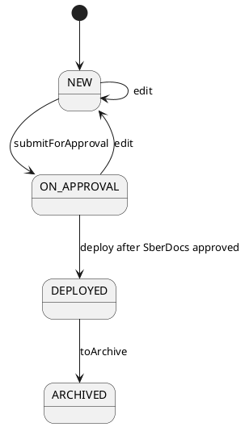

# Влияние на домен — deployments

Дата обновления: `2026-06-08`
Целевой baseline: `baseline/current/domain/`

## Реестр решений

| Decision ID | Суть | Статус | Уровень консистентности | Источник | Что заменяет | Отменено через |
|---|---|---|---|---|---|---|
| DEC-2026-05-22-DEPLOYMENTS-001 | Термин `draft` заменён реализованным статусом `NEW` и текущей машиной состояний | принято | локальный | `features/deployments/requirements.md` | прежние lifecycle-формулировки DEC-2026-04-23-DEPLOYMENTS-001 |  |
| DEC-2026-05-22-DEPLOYMENTS-002 | При создании сохраняются только поля внедрения; скоркарты и артефакты прикрепляются после сохранения в режиме редактирования | принято | межфичевый | `features/deployments/requirements.md` | старый двухшаговый `draft-shell` |  |
| DEC-2026-05-22-DEPLOYMENTS-003 | API внедрений следует текущему тегу OpenAPI: маршруты создания, карточки и действия используют `/deployment`, а `POST /api/v1/deployments` остаётся маршрутом реестра | принято | локальный | `/home/reutov/Downloads/rscon-api.yaml` | старые маршруты создания и действия через `/deployments` |  |
| DEC-2026-05-22-DEPLOYMENTS-004 | Редактирование из `ON_APPROVAL` возвращает внедрение в `NEW`; методолог только видит все внедрения и редактирует артефакты | принято | локальный | `features/deployments/requirements.md` | прежние формулировки по ON_APPROVAL edit/ролям |  |
| DEC-2026-05-22-DEPLOYMENTS-005 | Реальная модель данных имеет единственную таблицу `deployments`; версии — строки с `number`, `version`, `is_last` | принято | локальный | `/home/reutov/Downloads/111.xlsx` | формулировки про отдельную DeploymentVersion/table |  |
| DEC-2026-06-08-DEPLOYMENTS-SBERDOCS-006 | `ON_APPROVAL` у внедрения является read-only отражением SberDocs-согласования; локальные действия `approve`/`reject` исключены из Deployments, `deploy` доступен только после подтверждённого SberDocs approved status | принято | межфичевый | `features/deployments/requirements.md` | локальные approval/ratification действия внедрения |  |

## Затронутые ограниченные контексты

- `Research and Execution`
- `Scorecards`
- `Artifacts`
- `Approval`
- `Integration / SberDocs`

## Новые или изменённые агрегаты

- `Deployment` с реализованной машиной состояний и версионированием через строки таблицы `deployments`.
- Связь `Deployment` с `ApprovalChain` из `features/approvals` как read-only источник статуса/ссылки SberDocs для состояния `ON_APPROVAL`.

## Бизнес-правила и инварианты

- Новое внедрение создаётся как `NEW`, а не как `draft`/`draft-shell`.
- Тело create содержит только поля внедрения; вложенных скоркарт/артефактов нет.
- Скоркарты и артефакты требуют существующий `deployment.id` и управляются после сохранения.
- `DeploymentStatus`: `NEW`, `ON_APPROVAL`, `REJECTED`, `DEPLOYED`, `ARCHIVED`.
- `DeploymentAction`: `submitForApproval`, `edit`, `deploy`, `toArchive`.
- `REJECTED` и `ARCHIVED` — конечные статусы.
- Редактирование из `ON_APPROVAL` создаёт новую строку в `deployments` со статусом `NEW` только если бэкенд явно разрешил сброс согласования; штатные правки уже отправленного документа выполняются в SberDocs.
- `ON_APPROVAL` означает наличие связанного SberDocs-согласования; решения, комментарии, отзыв и правки маршрута выполняются в SberDocs/`features/approvals`.
- Raw `REJECTED` из SberDocs не переводит Deployment в `REJECTED` автоматически: внедрение остаётся в `ON_APPROVAL`, пользователь видит raw status/комментарии и ссылку на SberDocs.
- `deploy` доступен только после подтверждённого mapped approved status из SberDocs.
- Методолог видит все внедрения и редактирует только артефакты; поля внедрения и действия ЖЦ ему недоступны.
- Модель данных использует одну таблицу `deployments`; отдельной таблицы версий нет.

## Переходы состояний

## Влияние на API и интеграции

- Реестр: `POST /api/v1/deployments?spaceCode=...`.
- Создание: `POST /api/v1/deployment`.
- Последняя версия: `GET /api/v1/deployment/{number}`.
- Обновление: `PUT /api/v1/deployment/{number}?id=...`.
- Действие: `PUT /api/v1/deployment/{number}/action?id=...&action=...`.
- `submitForApproval` запускает связанный SberDocs-процесс через `features/approvals`; локальные `approve`/`reject` не являются действиями Deployments.
- Скоркарты остаются в контуре скоркарт с `entityType=deployment`, `entityId`.
- Артефакты остаются в общем контуре артефактов и доступны только после сохранения внедрения.

## Затронутые требования

| Путь | Влияние | Статус синхронизации |
|---|---|---|
| `features/deployments/requirements.md` | Корневой контрольный документ актуализирован | синхронизировано |
| `features/deployments/feature.md` | Feature-level описание актуализировано под текущий Deployments API и SberDocs boundary | синхронизировано |
| `features/deployments/references.md` | Входная порция `/home/reutov/Downloads/coda_docs` просмотрена и классифицирована, старые документы не назначены source of truth | синхронизировано |
| `features/deployments/slices/*/requirements/*.md` | Срезы сокращены и синхронизированы с текущей реализацией | синхронизировано |
| `features/approvals/requirements.md` | SberDocs integration является источником согласования и статусов | синхронизировано |
| `features/scorecards/slices/*/requirements/*` | Может потребоваться сверить формулировки про прикрепление скоркарт после сохранения внедрения | открыто |
| `features/artifacts/slices/*/requirements/*` | Может потребоваться сверить формулировки про прикрепление артефактов после сохранения внедрения | открыто |

## Затронутые baseline-артефакты

| Путь | Влияние | Статус синхронизации |
|---|---|---|
| `baseline/current/domain/contexts/research-and-execution.md` | Терминология ЖЦ внедрений требует сверки перед релизом | можно отложить |
| `baseline/current/domain/aggregates/deployment.md` | Реализованный ЖЦ и сценарий создания требуют промоушена | можно отложить |
| `baseline/current/domain/state-machines/README.md` | Машину состояний надо проверить перед промоушеном | можно отложить |
| `baseline/current/api/endpoints.md` | Текущие маршруты Deployments требуют промоушена | можно отложить |
| `baseline/current/domain/contexts/approval.md` | Связь Deployment approval со SberDocs требует промоушена | можно отложить |

## Затронутые прототипы

| Путь | Влияние | Статус синхронизации |
|---|---|---|
| `features/deployments/planning/scope-prototype/prototype.html` | Форма создания не должна показывать скоркарты/артефакты до сохранения | можно отложить |
| `features/deployments/planning/scope-prototype/prototype.html` | `ON_APPROVAL` должен показывать SberDocs status/link вместо локальных approval actions | можно отложить |
| `features/deployments/slices/form-editing/delivery-prototype/prototype.html` | Нужно обновить сценарий создания/редактирования и названия статусов | можно отложить |
| `features/deployments/slices/lifecycle/delivery-prototype/prototype.html` | Нужно обновить машину состояний и действия | можно отложить |
| `features/deployments/slices/db-api/delivery-prototype/prototype.html` | Нужно обновить памятку API, если она есть в прототипе | можно отложить |

## Обязательные действия по консистентности

- [x] локальные требования фичи обновлены
- [x] feature/references обновлены после просмотра входной порции документов 2026-06-08
- [x] срезы обновлены
- [x] влияние на домен проверено основным агентом
- [ ] соседние формулировки в scorecards/artifacts проверить, если пользователь попросит межфичевую синхронизацию
- [ ] baseline обновить в режиме release-finalization
- [ ] planning stories/estimates обновить в planning mode
- [ ] прототипы обновить, если/когда пользователь скажет `актуализируй прототипы`

## Заметки по откату

- До релиза: вернуть старую модель можно отдельным решением, но надо одновременно восстановить API, ЖЦ и прототипы.
- После релиза: откат оформлять отдельной change/release единицей со ссылкой на `DEC-2026-05-22-DEPLOYMENTS-*` и `DEC-2026-06-08-DEPLOYMENTS-SBERDOCS-006`.
