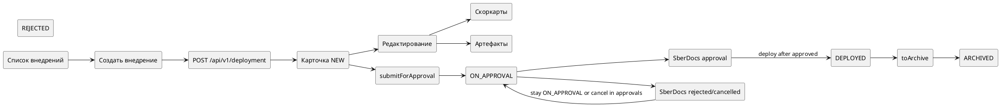
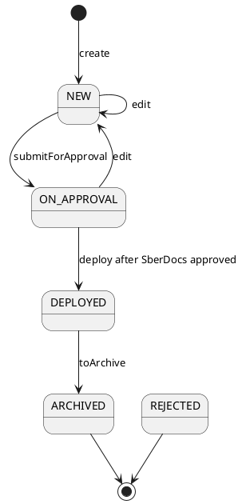

# Требования по фиче — Внедрения (Deployments)

Статус: **актуализировано после реализации**
Фича: `features/deployments/feature.md`
Квартал: `2026-Q2`
Дата обновления: `2026-06-08`
Шаблон: `.workflow/templates/requirements/feature-requirements.template.md`
Связанное решение: `DEC-2026-06-08-DEPLOYMENTS-SBERDOCS-006`

## Как читать документ

- Этот файл — главный источник бизнес-правил и спорных решений по фиче.
- Файлы срезов ниже — короткие рабочие пакеты для разработки и тестирования.
- В текущей реализации нет отдельного сценария `draft-shell`: новое внедрение сохраняется сразу как `NEW`, а скоркарты и артефакты добавляются только после сохранения через редактирование.
- Актуальный контракт API берём из `/home/reutov/Downloads/rscon-api.yaml`, тег `Deployments`.
- Реальная модель данных берётся из `/home/reutov/Downloads/111.xlsx`: единственная таблица внедрений — `deployments`.
- Актуальное описание реализованного ЖЦ берём из `/home/reutov/Downloads/2026-05-13-deployment-state-machine-summary.md`.
- Согласование выполняется через `features/approvals` и SberDocs: внедрение хранит только mapped status `ON_APPROVAL`, а решения согласования, комментарии, отзыв и правки маршрута выполняются в SberDocs.

## Оглавление

1. Общий контур фичи
2. Быстрая схема MVP
3. Порядок срезов для контроля
4. Бизнес-правила
5. ЖЦ и действия
6. Контракт API Deployments
7. Контроль срезов
8. Общий чеклист для тестирования

## Общий контур фичи

- Назначение: дать пользователю единый контур работы с внедрениями изменений риск-стратегий.
- Что уже есть в baseline/current: списки, карточки, артефакты, скоркарты, симуляции, пилоты и согласование как отдельные доменные контуры.
- Дельта фичи: сущность `Deployment`, её список, карточка, форма создания/редактирования, ЖЦ и связи со скоркартами/артефактами.
- Срезы: `workspace`, `list`, `form-editing`, `detail`, `lifecycle`, `db-api`.
- Визуальная база: `planning/scope-prototype/prototype.html` и прототипы в `slices/*/delivery-prototype/`.

## Быстрая схема MVP



Ключевые упрощения для команды:

| Тема | Как должно быть сейчас | Что больше не требуем |
|---|---|---|
| Первичное сохранение | `POST /api/v1/deployment` создаёт внедрение со статусом `NEW` | двухшаговый `draft-shell` с автоудалением |
| Поля создания | только поля самого внедрения | скоркарты и артефакты на форме создания |
| Скоркарты | доступны после сохранения внедрения, через редактирование | обязательная скоркарта до первого сохранения |
| Артефакты | доступны после сохранения внедрения, через редактирование | создание артефактов до появления `deployment.id` |
| ЖЦ | `NEW -> ON_APPROVAL`; дальше SberDocs является источником согласования, а `DEPLOYED` допускается только после подтверждённого согласования и разрешённого бэкендом действия | `draft`, `ratified`, `cancelled`, `recall`, `start_ratification`, локальные `approve/reject` как действия внедрения |
| Статус в UI | показываем статус бэкенда русским названием | локальную машину состояний фронта поверх бэкенда |

## Порядок срезов для контроля

1. `01 workspace` — общая рабочая область внедрений и единые правила UI
2. `02 list` — список внедрений
3. `03 form-editing` — создание и редактирование внедрения
4. `04 detail` — детальная карточка внедрения
5. `05 lifecycle` — ЖЦ и действия
6. `06 db-api` — модель данных и контракт API

---

## Бизнес-правила

### Сущность `Deployment`

`Deployment` — доменная сущность в пространстве (`spaceCode`), которая хранится в единственной таблице `deployments`. Отдельной таблицы `deployment_versions` или отдельной сущности `DeploymentVersion` в текущей модели данных нет: версии представлены строками той же таблицы через `number`, `version` и `is_last`.

### Таблица `deployments`

| # | Колонка | Тип | Обяз. | По умолчанию | Комментарий |
|---:|---|---|---:|---|---|
| 1 | `id` | `uuid` | да | — | UUID внедрения |
| 2 | `number` | `varchar(255)` | да | — | Номер внедрения |
| 3 | `space_code` | `varchar(10)` | да | — | Код пространства |
| 4 | `deployment_type` | `varchar(50)` | да | — | Тип внедрения |
| 5 | `lineage_simulation_id` | `uuid` | нет | — | ID симуляции для `SIMULATION_BASED` |
| 6 | `name` | `varchar(255)` | да | — | Название |
| 7 | `goal` | `varchar(2000)` | нет | — | Цель |
| 8 | `change_description` | `varchar(2000)` | нет | — | Описание изменений |
| 9 | `application_perimeter` | `varchar(2000)` | нет | — | Периметр применения |
| 10 | `status` | `varchar(50)` | да | — | Статус |
| 11 | `version` | `int4` | да | — | Версия |
| 12 | `is_last` | `bool` | да | — | Признак последней актуальной версии |
| 13 | `employee_number` | `varchar(255)` | нет | — | Табельный номер редактора |
| 14 | `author_employee_number` | `varchar(255)` | да | — | Табельный номер создавшего внедрение |
| 15 | `create_datetime` | `timestamp` | да | — | Дата создания |
| 16 | `initial_create_datetime` | `timestamp` | да | — | Дата заведения первой версии |
| 17 | `update_datetime` | `timestamp` | нет | — | Дата обновления |
| 18 | `criticality` | `varchar(50)` | да | `'LOW'::character varying` | Критичность внедрения |


### Соответствие API DTO и БД

| API поле | Колонка БД | Правило |
|---|---|---|
| `spaceCode` | `space_code` | обязательно при создании |
| `deploymentType` | `deployment_type` | `GENERAL` или `SIMULATION_BASED`; обязательно в БД |
| `lineageSimulationId` / `lineageSimulation` | `lineage_simulation_id` | может быть пустым; заполняется для `SIMULATION_BASED` |
| `changeDescription` | `change_description` | может быть пустым, до 2000 в БД |
| `applicationPerimeter` | `application_perimeter` | может быть пустым, до 2000 в БД |
| `criticality` | `criticality` | обязательно в БД, по умолчанию `LOW`; рассчитывается бэкендом |
| `authorEmployee` | `author_employee_number` | создатель, обязательно в БД |
| `employeeNumber` | `employee_number` | последний редактор, может быть пустым |
| `initialCreateDateTime` | `initial_create_datetime` | дата первой версии |
| `createdDateTime` | `create_datetime` | дата строки/версии |
| `updateDateTime` | `update_datetime` | может быть пустым |
| `isLast` | `is_last` | признак последней актуальной строки для `number` |

### Типы внедрения

| Тип в API | Название в UI | Правила |
|---|---|---|
| `GENERAL` | Общее внедрение | не требует симуляции-источника |
| `SIMULATION_BASED` | Внедрение по результатам симуляции | связано с `Simulation`; перед согласованием симуляция должна быть завершена (`COMPLETED`) |

### Создание нового внедрения

1. Пользователь нажимает `Создать внедрение`.
2. Форма показывает только поля внедрения: `name`, `goal`, `changeDescription`, `applicationPerimeter`, при наличии в UI — `deploymentType` и `lineageSimulation`.
3. Пользователь сохраняет.
4. Фронт вызывает `POST /api/v1/deployment`.
5. Бэкенд создаёт внедрение со статусом `NEW`.
6. После успешного сохранения пользователь попадает в карточку/редактирование, где уже можно прикреплять скоркарты и артефакты.

Не допускается требовать от пользователя скоркарты или артефакты до первого сохранения: до создания внедрения нет устойчивого `deployment.id`/`number` для привязки.

### Скоркарты

- Скоркарты прикрепляются к уже сохранённому внедрению через контур скоркарт.
- Для API скоркарт используется `entityType=deployment` и `entityId=<deployment.id>`.
- Лимит берём из API скоркарт: максимум 15 на связанную сущность.
- Критичность внедрения пересчитывается бэкендом по связанным скоркартам: `HIGH`, если хотя бы одна скоркарта high; иначе `LOW`.
- Для `SIMULATION_BASED` должна быть связана скоркарта, подтверждающая симуляцию-источник; удалять последнюю обязательную связь с симуляцией нельзя.

### Артефакты

- Артефакты — внешние ссылки/документы из общей фичи `artifacts`.
- Артефакты добавляются только после сохранения внедрения.
- В форме создания блока артефактов нет; при редактировании он доступен при наличии прав.
- В карточке просмотра артефакты показываются списком/ссылками только для чтения.

### Связанные сущности

- Блок `Связанные сущности` доступен только для чтения.
- Источник связей — скоркарты, симуляция-источник и контуры пилотов/симуляций.
- Вручную добавлять `Pilot` или `Simulation` в этом блоке нельзя.

### Роли и доступность

| Роль | Просмотр | Создание/редактирование | Действия ЖЦ | Скоркарты/артефакты |
|---|---|---|---|---|
| `prm` | свои и другие продукты | свой продукт | свой продукт, если действие вернул бэкенд | свой продукт |
| `methodologist` | все продукты | не создаёт и не редактирует поля внедрения | нет действий ЖЦ во внедрениях | только редактирует артефакты в разрешённом продуктовом контуре |
| `admin` | все продукты | все продукты | все действия, разрешённые бэкендом | все продукты |
| `approver/ratifier` | через SberDocs/экраны согласования | нет | решения выполняются в SberDocs, не через действие Deployment | нет |

---

## ЖЦ и действия

### Статусы бэкенда

| Статус бэкенда | Название в UI | Редактирование | Конечный | Комментарий |
|---|---|---:|---:|---|
| `NEW` | Черновик / Новое | да | нет | стартовый статус после создания |
| `ON_APPROVAL` | На согласовании | да, если бэкенд вернул `edit`; после сохранения возвращается в `NEW` | нет | состояние после `submitForApproval` |
| `REJECTED` | Отклонено | нет | да | конечный статус по реализации |
| `DEPLOYED` | Внедрено | нет | нет | можно архивировать |
| `ARCHIVED` | Архив | нет | да | конечный статус |

`ON_APPROVAL` означает, что для внедрения есть связанный процесс `features/approvals` / SberDocs. АС КОДА не показывает локальные действия согласующего по внедрению: согласовать, отклонить, отозвать, изменить документ или маршрут нужно в SberDocs. Raw `REJECTED` из SberDocs не должен автоматически переводить внедрение в `REJECTED`: пользователь видит `ON_APPROVAL`, raw status/комментарии и ссылку на SberDocs для исправления. Raw `ON_DELETING`/`DELETED` обрабатывается в контуре `features/approvals`; если для внедрения понадобится отдельный terminal status отмены, это должно быть новым изменением требований к Deployments/OpenAPI.

### Матрица переходов



| Текущий статус | Действие | Новый статус | Что проверить |
|---|---|---|---|
| `NEW` | `edit` | `NEW` | создаётся новая строка в `deployments`, статус сохраняется |
| `NEW` | `submitForApproval` | `ON_APPROVAL` | запускает интеграцию `features/approvals` / SberDocs; happy path возвращает ссылку/номер SberDocs в контуре согласований |
| `ON_APPROVAL` | `edit` | `NEW` | доступно только если бэкенд явно разрешил сброс согласования; штатные правки уже созданного документа выполняются в SberDocs |
| `ON_APPROVAL` | `deploy` | `DEPLOYED` | доступно только после подтверждённого mapped approved status из SberDocs и если бэкенд вернул `deploy` |
| `DEPLOYED` | `toArchive` | `ARCHIVED` | статус конечный |

Примечание: старые локальные действия `approve`/`reject` больше не являются требованиями к Deployments. Если они остаются в старом OpenAPI-перечислении, UI и backend не должны использовать их для нового SberDocs-сценария без отдельного решения.

---

## Контракт API Deployments

Актуальные маршруты из `/home/reutov/Downloads/rscon-api.yaml`:

| Метод | Маршрут | Назначение |
|---|---|---|
| `POST` | `/api/v1/deployments?spaceCode={spaceCode}` | реестр внедрений с фильтрами, сортировкой и пагинацией |
| `POST` | `/api/v1/deployment` | создание внедрения |
| `GET` | `/api/v1/deployment/{number}` | получение последней версии по номеру |
| `PUT` | `/api/v1/deployment/{number}?id={id}` | обновление последней актуальной строки/версии по номеру и UUID |
| `DELETE` | `/api/v1/deployment/{number}` | удаление/служебное удаление по номеру, если доступно бэкенду |
| `GET` | `/api/v1/deployment/id/{id}` | получение конкретной версии по UUID |
| `PUT` | `/api/v1/deployment/{number}/action?id={id}&action={action}` | действие ЖЦ |

### OpenAPI-фрагмент

```yaml
DeploymentStatus:
  type: string
  enum: [NEW, ON_APPROVAL, REJECTED, DEPLOYED, ARCHIVED]

DeploymentAction:
  type: string
  enum: [submitForApproval, edit, deploy, toArchive]

CreateDeployment:
  required: [spaceCode, name]
  properties:
    spaceCode: { type: string }
    name: { type: string, maxLength: 1000 }
    goal: { type: string }
    changeDescription: { type: string }
    applicationPerimeter: { type: string }
    deploymentType: { $ref: '#/components/schemas/DeploymentMode' }
    lineageSimulationId: { type: string, format: uuid }

UpdateDeployment:
  properties:
    name: { type: string, maxLength: 255 }
    goal: { type: string }
    changeDescription: { type: string }
    applicationPerimeter: { type: string }
```

### Пример создания

```http
POST /api/v1/deployment HTTP/1.1
Content-Type: application/json
```

```json
{
  "spaceCode": "CC",
  "name": "Внедрение новой стратегии Премиум",
  "goal": "Перевести результат анализа в продуктив",
  "changeDescription": "Обновление порогов отсечения и весов факторов",
  "applicationPerimeter": "Новые заявки по кредитным картам Премиум",
  "deploymentType": "GENERAL"
}
```

Ожидаемый результат: `201 Created`, тело `DeploymentOperationResult`, `deployment.status = NEW`.

---

## Контроль срезов

## STORY-DEPLOYMENTS-001 — Общая рабочая область внедрений

Карточка среза: `slices/workspace/slice.md`
Детализация FE: `slices/workspace/requirements/frontend.md`
Детализация BE: `slices/workspace/requirements/backend.md`
Плановая история: `planning/stories/STORY-DEPLOYMENTS-001.md`

**Бизнес-требования**

- Цель: собрать единые правила навигации, статусов, прав и блоков рабочей области внедрений.
- Бизнес-правила: все экраны используют один статус бэкенда и один набор действий; FE не держит собственный ЖЦ.
- Ограничения: подробный API находится в `db-api`, поля формы — в `form-editing`, ЖЦ — в `lifecycle`.

**Критерии приемки**

1. Все экраны внедрений используют одинаковые названия статусов.
2. Действия показываются по `availableActions`/разрешениям бэкенда.
3. После сохранения нового внедрения доступны переход в детальную карточку и редактирование.
4. В `ON_APPROVAL` экран показывает связь со SberDocs и не предлагает локальные действия согласования.

## STORY-DEPLOYMENTS-002 — Список внедрений

Карточка среза: `slices/list/slice.md`
Детализация FE: `slices/list/requirements/frontend.md`
Детализация BE: `slices/list/requirements/backend.md`
Плановая история: `planning/stories/STORY-DEPLOYMENTS-002.md`

**Критерии приемки**

1. Список загружается через `POST /api/v1/deployments?spaceCode=...`.
2. В таблице видны номер, название, тип, статус, критичность, автор, дата создания, дата внедрения.
3. Клик по строке открывает детальную карточку по номеру/версии.

## STORY-DEPLOYMENTS-003 — Создание и редактирование внедрения

Карточка среза: `slices/form-editing/slice.md`
Детализация FE: `slices/form-editing/requirements/frontend.md`
Детализация BE: `slices/form-editing/requirements/backend.md`
Плановая история: `planning/stories/STORY-DEPLOYMENTS-003.md`

**Критерии приемки**

1. Форма создания содержит только поля внедрения и сохраняет через `POST /api/v1/deployment`.
2. Новое внедрение получает статус `NEW`.
3. Скоркарты и артефакты появляются только после сохранения, в режиме редактирования.
4. Форма обновления сохраняет только поля `UpdateDeployment`; связи меняются через свои контуры.

## STORY-DEPLOYMENTS-004 — Детальная карточка внедрения

Карточка среза: `slices/detail/slice.md`
Детализация FE: `slices/detail/requirements/frontend.md`
Детализация BE: `slices/detail/requirements/backend.md`
Плановая история: `planning/stories/STORY-DEPLOYMENTS-004.md`

**Критерии приемки**

1. Детальная карточка показывает последнюю версию по `GET /api/v1/deployment/{number}` или конкретную по `GET /api/v1/deployment/id/{id}`.
2. Блоки скоркарт, артефактов и связанных сущностей в просмотре доступны только для чтения.
3. Для пустых скоркарт/артефактов/связанных сущностей есть пустое состояние.

## STORY-DEPLOYMENTS-005 — ЖЦ и БД/API

Карточка среза: `slices/lifecycle/slice.md`, `slices/db-api/slice.md`
Детализация FE/BE: `slices/lifecycle/requirements/*`, `slices/db-api/requirements/*`
Плановая история: `planning/stories/STORY-DEPLOYMENTS-005.md`

**Критерии приемки**

1. ЖЦ соответствует схеме `NEW -> ON_APPROVAL`, `ON_APPROVAL -> DEPLOYED` только после подтверждённого SberDocs approved status, `ON_APPROVAL edit -> NEW` только при явном разрешении бэкенда, `DEPLOYED -> ARCHIVED`.
2. Старые `draft`, `recall`, `start_ratification`, `ratified`, `cancelled`, локальные `approve`/`reject` не требуются в UI/API внедрений.
3. Версионирование сохраняет `version` и `isLast` в единственной таблице `deployments`.

---

## Общий чеклист для тестирования

| Проверка | Где детализировано |
|---|---|
| Список: загрузка, фильтр, переход в детальную карточку | `slices/list/requirements/*` |
| Создание без скоркарт и артефактов | `slices/form-editing/requirements/*` |
| Редактирование после сохранения | `slices/form-editing/requirements/*` |
| Скоркарты/артефакты недоступны до сохранения | `slices/form-editing/requirements/frontend.md` |
| Блоки детальной карточки и пустые состояния | `slices/detail/requirements/*` |
| Переходы ЖЦ и негативные сценарии | `slices/lifecycle/requirements/*` |
| Маршруты OpenAPI и тела запросов | `slices/db-api/requirements/backend.md` |

## Открытые вопросы и допущения

- `deploy` присутствует в перечислении OpenAPI; UI должен доверять `availableActions`, а не жёстко заданной логике утверждения. Действие допустимо только после подтверждённого согласования в SberDocs.
- Контракт артефактов находится в общей фиче `artifacts`, а не в теге `Deployments` текущего OpenAPI.
- Если бэкенд позже вернёт отдельную модель согласования/утверждения для внедрений, это должно быть новым изменением требований, а не восстановлением старого текста. Текущая модель согласования живёт в `features/approvals` и SberDocs.
