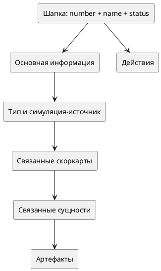

# Детальная карточка внедрения (Фронтенд)

Статус: **актуализировано после реализации**
Фича: `deployments`
Срез: `detail`
Область: `MVP`
Дата обновления: `2026-06-08`
Шаблон: `.workflow/templates/requirements/frontend.template.md`

## Цель среза

Показать пользователю одну понятную карточку внедрения: поля, статус, скоркарты, артефакты, связанные сущности и доступные действия.

## Структура страницы

## Блоки карточки

| Блок | Содержимое | Пустое состояние |
|---|---|---|
| Шапка | `number`, `name`, чип статуса, кнопка назад | нет |
| Основная информация | `goal`, `changeDescription`, `applicationPerimeter`, критичность, автор, даты | `—` для пустых полей |
| Тип и симуляция-источник | `deploymentType`, `lineageSimulation` для `SIMULATION_BASED` | для `GENERAL`: `Не требуется` |
| Скоркарты | список связанных скоркарт, критичность, признак обязательности | `Скоркарты пока не добавлены` |
| Связанные сущности | pilots/simulations из модели чтения | `Связанные сущности не найдены` |
| Артефакты | внешние ссылки общего контура артефактов | `Артефакты пока не добавлены` |
| Действия | кнопки по правам/статусу бэкенда; в `ON_APPROVAL` дополнительно ссылка/номер SberDocs из контура согласований, если доступны | скрыты/недоступны, если нет прав; для методолога только редактирование артефактов |

## Статусы и действия

- UI показывает статус из бэкенда без локальной подмены.
- `NEW` — доступны действия по правам.
- `ON_APPROVAL` — показываем статус ожидания SberDocs, ссылку/номер SberDocs и только действия, которые вернул бэкенд; локальные `approve`/`reject` не показываем.
- `REJECTED` и `ARCHIVED` — конечные статусы, редактирование не показываем.
- `DEPLOYED` — редактирование не показываем; `toArchive` только если бэкенд разрешил.

## Интеграция

| Маршрут | Где используется |
|---|---|
| `GET /api/v1/deployment/{number}` | открыть последнюю карточку |
| `GET /api/v1/deployment/id/{id}` | открыть конкретную версию |
| API скоркарт | блок скоркарт |
| общий API артефактов | блок артефактов |
| Модель чтения связанных пилотов/симуляций | блок связанных сущностей |

## Чеклист для тестирования среза

- [ ] Карточка открывается по `number` из списка.
- [ ] Все пустые блоки имеют явное пустое состояние.
- [ ] `NEW`, `ON_APPROVAL`, `REJECTED`, `DEPLOYED`, `ARCHIVED` отображаются корректно.
- [ ] Для `SIMULATION_BASED` симуляция-источник видна отдельной строкой/ссылкой.
- [ ] Для `GENERAL` симуляция-источник не требует заполнения и не выглядит ошибкой.
- [ ] Действия на карточке соответствуют правам бэкенда, а не старому перечислению на фронте.
- [ ] В `ON_APPROVAL` карточка не предлагает локальное согласование/отклонение; пользователь переходит в SberDocs.
- [ ] Артефакты открываются как внешние ссылки.
- [ ] Методолог видит все карточки, но из действий редактирования получает только управление артефактами.
