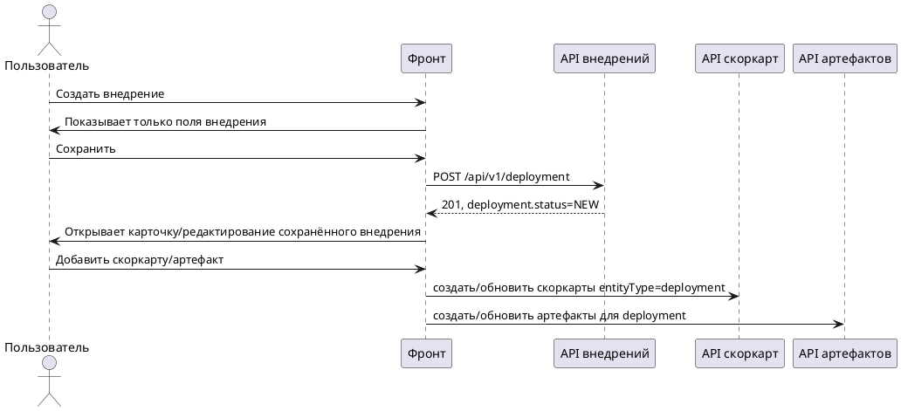

# Создание и редактирование внедрения (Фронтенд)

Статус: **актуализировано после реализации**
Фича: `deployments`
Срез: `form-editing`
Область: `MVP`
Дата обновления: `2026-05-22`
Шаблон: `.workflow/templates/requirements/frontend.template.md`

## Цель среза

Сделать понятный сценарий создания и редактирования без старого двухшагового `draft-shell`.

## Главная схема

## Форма создания

| Поле | Обязательность | Комментарий |
|---|---|---|
| `name` | обязательно | показать ошибку до отправки |
| `goal` | опционально | многострочное поле |
| `changeDescription` | опционально | многострочное поле |
| `applicationPerimeter` | опционально | многострочное поле |
| `deploymentType` | если показывается в UI | `GENERAL`/`SIMULATION_BASED` |
| `lineageSimulation` | только для `SIMULATION_BASED` | выбирается из завершённых симуляций, если поле доступно |

На форме создания нет:

- списка скоркарт;
- добавления/редактирования скоркарт;
- блока артефактов;
- требования выбрать минимум одну скоркарту.

## Форма редактирования

| Блок | Что можно делать |
|---|---|
| Поля внедрения | менять `name`, `goal`, `changeDescription`, `applicationPerimeter` |
| Тип/симуляция-источник | показывать только для чтения после фиксации; не менять обычным обновлением |
| Скоркарты | добавлять/обновлять после сохранения внедрения через API скоркарт |
| Артефакты | добавлять/удалять ссылки после сохранения внедрения через API артефактов; для методолога это единственный доступный сценарий редактирования |
| Критичность | только читать, бэкенд пересчитывает |

## Интеграция

| Действие UI | Маршрут |
|---|---|
| создать внедрение | `POST /api/v1/deployment` |
| загрузить актуальную карточку | `GET /api/v1/deployment/{number}` |
| сохранить поля | `PUT /api/v1/deployment/{number}?id={id}` |
| добавить/обновить скоркарты | `POST/PUT /api/v1/scorecards?entityType=deployment` |
| добавить/удалить артефакт | общий API артефактов |

## Валидация на фронте

| Ситуация | Сообщение |
|---|---|
| пустое название | `Укажите название внедрения` |
| `SIMULATION_BASED` без симуляции-источника | `Выберите симуляцию-источник` |
| попытка добавить скоркарту до сохранения | кнопка скрыта/недоступна; подсказка `Доступно после сохранения внедрения` |
| попытка добавить артефакт до сохранения | кнопка скрыта/недоступна; подсказка `Доступно после сохранения внедрения` |
| ошибка сохранения | `Не удалось сохранить внедрение` |

## Чеклист для тестирования среза

- [ ] На форме создания нет секций скоркарт и артефактов.
- [ ] `POST /api/v1/deployment` уходит один раз при сохранении формы создания.
- [ ] После успешного создания открывается карточка со статусом `NEW`.
- [ ] В режиме редактирования доступны скоркарты и артефакты.
- [ ] Обновление полей внедрения не отправляет вложенные скоркарты/артефакты в `UpdateDeployment`.
- [ ] При ошибке создания пользователь остаётся на форме и не видит несуществующую карточку.
- [ ] При пустом `name` запрос не отправляется.
- [ ] Методолог не видит/не может сохранить поля внедрения, скоркарты и действия ЖЦ; ему доступно только редактирование артефактов.
