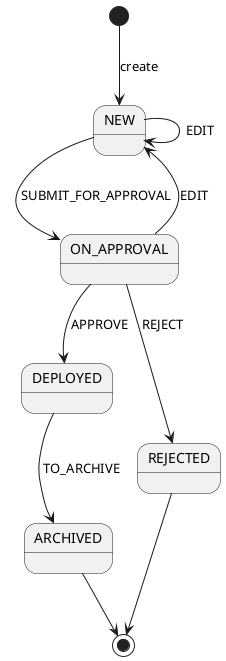

# Жизненный цикл внедрения (Бэкенд)

Статус: **актуализировано после реализации**
Фича: `deployments`
Срез: `lifecycle`
Область: `MVP`
Дата обновления: `2026-05-22`
Шаблон: `.workflow/templates/requirements/backend.template.md`

## Цель среза

Синхронизировать требования с реализованной машиной состояний из отчёта `2026-05-13-deployment-state-machine-summary.md`.

## Статусы

| Статус | haveStrategies | updatable | Смысл |
|---|---:|---:|---|
| `NEW` | true | true | новое/черновое внедрение |
| `ON_APPROVAL` | true | true | на согласовании; редактирование возвращает в `NEW` |
| `REJECTED` | false | false | отклонено, конечный статус |
| `DEPLOYED` | true/действие архивации | false | внедрено |
| `ARCHIVED` | false | false | архив, конечный статус |

## Переходы



## Правила версионирования

Версионирование реализовано в единственной таблице `deployments`: каждая версия — отдельная строка той же таблицы. Для каждого изменения:

1. старая строка того же `number` получает `is_last=false`;
2. новая строка получает `is_last=true`;
3. `version` увеличивается;
4. статус новой строки определяется действием:
   - создание: `NEW`;
   - edit из `NEW`: `NEW`;
   - edit из `ON_APPROVAL`: `NEW`;
   - submit: `ON_APPROVAL`;
   - approve: `DEPLOYED`;
   - reject: `REJECTED`;
   - архивация: `ARCHIVED`.

## Маршрут действия

```yaml
paths:
  /api/v1/deployment/{number}/action:
    put:
      parameters:
        - name: number
          in: path
          required: true
        - name: id
          in: query
          required: true
          schema: { type: string, format: uuid }
        - name: action
          in: query
          required: true
          schema:
            type: string
            enum: [submitForApproval, approve, reject, deploy, toArchive]
```

`edit` есть в `DeploymentAction`/`availableActions`, но выполняется через маршрут обновления, а не через маршрут действий.

## Бизнес-ограничения

- Правило второй руки: согласующий не должен быть автором внедрения, если правило включено бэкендом.
- Для `SIMULATION_BASED` перед согласованием симуляция должна быть `COMPLETED`.
- После `DEPLOYED` редактирование запрещено; доступна только архивация, если бэкенд вернул `toArchive`.
- `REJECTED` и `ARCHIVED` — конечные состояния.

## Ошибки

| Код | Условие |
|---|---|
| `400` | неизвестное действие, некорректный id/number |
| `403` | нет прав на действие |
| `404` | строка/версия внедрения не найдена |
| `409` | действие недоступно из текущего статуса, нарушение правила второй руки или связи с симуляцией |

## Чеклист для тестирования среза

- [ ] Все переходы из диаграммы покрыты тестами.
- [ ] Невалидные переходы возвращают `409`, а не молча меняют статус.
- [ ] При каждом переходе создаётся новая строка в `deployments` и корректно обновляется `isLast`.
- [ ] `REJECTED` и `ARCHIVED` не имеют дальнейших действий.
- [ ] `DEPLOYED` нельзя редактировать через маршрут обновления.
- [ ] Редактирование из `ON_APPROVAL` возвращает новую версию в `NEW`.
- [ ] Старые действия `recall`, `start_ratification`, `archive` в snake_case не принимаются как действия Deployments.
