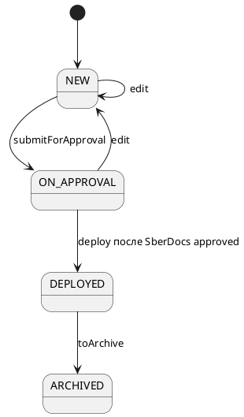

# Жизненный цикл внедрения (Фронтенд)

Статус: **актуализировано после реализации**
Фича: `deployments`
Срез: `lifecycle`
Область: `MVP`
Дата обновления: `2026-06-08`
Шаблон: `.workflow/templates/requirements/frontend.template.md`

## Цель среза

Показать пользователю только те действия ЖЦ, которые реально поддержаны бэкендом, и не дублировать действия согласования, которые выполняются в SberDocs.

## Машина состояний для UI

## Что UI должен забыть из старой модели

| Старое | Новое |
|---|---|
| `draft` | `NEW` |
| `recall` | не является обязательным действием внедрений |
| `start_ratification` | не используется в текущем теге `Deployments` |
| `approved`/`ratified` как статусы внедрения | не входят в `DeploymentStatus` |
| `cancelled` | не входит в `DeploymentStatus` |
| локальные `approve`/`reject` | решения выполняются в SberDocs, не в карточке внедрения |

## Действия

| Действие | Когда показывать | Маршрут |
|---|---|---|
| `edit` | если бэкенд/роль разрешили редактирование | открыть форму редактирования, затем `PUT /api/v1/deployment/{number}?id=...` |
| `edit` | `ON_APPROVAL`, если бэкенд/роль явно разрешили сброс согласования | открыть форму редактирования; сохранение возвращает статус `NEW`; штатные правки отправленного документа выполняются в SberDocs |
| `submitForApproval` | `NEW` и есть права | `PUT .../action?action=submitForApproval` |
| `deploy` | только если бэкенд вернул действие после подтверждённого согласования в SberDocs | `PUT .../action?action=deploy` |
| `toArchive` | `DEPLOYED` или другое разрешённое бэкендом состояние | `PUT .../action?action=toArchive` |

## Правила поведения UI

- На время запроса кнопка недоступна, повторный клик блокируется.
- После успешного действия карточка перезагружается или обновляется из ответа.
- Если бэкенд вернул `409`, показываем `Действие недоступно в текущем статусе`.
- FE не пересчитывает переходы сам; таблица выше нужна для отображения и тестов, источник истины — бэкенд.
- В `ON_APPROVAL` FE показывает ссылку/номер SberDocs из контура `features/approvals`, если они доступны, и не рисует кнопки локального согласования/отклонения.

## Чеклист для тестирования среза

- [ ] `submitForApproval` переводит `NEW` в `ON_APPROVAL`.
- [ ] В `ON_APPROVAL` нет локальных кнопок `approve`/`reject`; пользователь переходит в SberDocs.
- [ ] `deploy` из `ON_APPROVAL` доступен только если бэкенд вернул его после подтверждённого согласования.
- [ ] `toArchive` из `DEPLOYED` переводит в `ARCHIVED`.
- [ ] `edit` из `NEW` сохраняет статус `NEW`; `edit` из `ON_APPROVAL` после сохранения возвращает статус `NEW`.
- [ ] Для `REJECTED` и `ARCHIVED` нет кнопок редактирования/повторной отправки.
- [ ] Старые кнопки `Отозвать`, `Отправить на утверждение`, локальные `Согласовать`/`Отклонить` не появляются, если бэкенд их не возвращает.
