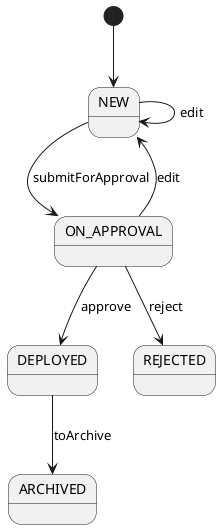

# Жизненный цикл внедрения (Фронтенд)

Статус: **актуализировано после реализации**
Фича: `deployments`
Срез: `lifecycle`
Область: `MVP`
Дата обновления: `2026-05-22`
Шаблон: `.workflow/templates/requirements/frontend.template.md`

## Цель среза

Показать пользователю только те действия ЖЦ, которые реально поддержаны бэкендом.

## Машина состояний для UI

## Что UI должен забыть из старой модели

| Старое | Новое |
|---|---|
| `draft` | `NEW` |
| `recall` | не является обязательным действием внедрений |
| `start_ratification` | не используется в текущем теге `Deployments` |
| `approved`/`ratified` как статусы внедрения | не входят в `DeploymentStatus` |
| `cancelled` | не входит в `DeploymentStatus` |

## Действия

| Действие | Когда показывать | Маршрут |
|---|---|---|
| `edit` | если бэкенд/роль разрешили редактирование | открыть форму редактирования, затем `PUT /api/v1/deployment/{number}?id=...` |
| `edit` | `ON_APPROVAL`, если бэкенд/роль разрешили редактирование | открыть форму редактирования; сохранение возвращает статус `NEW` |
| `submitForApproval` | `NEW` и есть права | `PUT .../action?action=submitForApproval` |
| `approve` | `ON_APPROVAL` и пользователь может согласовать | `PUT .../action?action=approve` |
| `reject` | `ON_APPROVAL` и пользователь может отклонить | `PUT .../action?action=reject` |
| `deploy` | только если бэкенд вернул действие | `PUT .../action?action=deploy` |
| `toArchive` | `DEPLOYED` или другое разрешённое бэкендом состояние | `PUT .../action?action=toArchive` |

## Правила поведения UI

- На время запроса кнопка недоступна, повторный клик блокируется.
- После успешного действия карточка перезагружается или обновляется из ответа.
- Если бэкенд вернул `409`, показываем `Действие недоступно в текущем статусе`.
- FE не пересчитывает переходы сам; таблица выше нужна для отображения и тестов, источник истины — бэкенд.

## Чеклист для тестирования среза

- [ ] `submitForApproval` переводит `NEW` в `ON_APPROVAL`.
- [ ] `approve` из `ON_APPROVAL` переводит в `DEPLOYED` по текущей реализации.
- [ ] `reject` из `ON_APPROVAL` переводит в `REJECTED`.
- [ ] `toArchive` из `DEPLOYED` переводит в `ARCHIVED`.
- [ ] `edit` из `NEW` сохраняет статус `NEW`; `edit` из `ON_APPROVAL` после сохранения возвращает статус `NEW`.
- [ ] Для `REJECTED` и `ARCHIVED` нет кнопок редактирования/повторной отправки.
- [ ] Старые кнопки `Отозвать`, `Отправить на утверждение` не появляются, если бэкенд их не возвращает.
