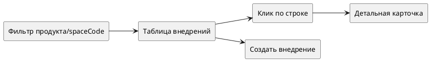

# Список внедрений (Фронтенд)

Статус: **актуализировано после реализации**
Фича: `deployments`
Срез: `list`
Область: `MVP`
Дата обновления: `2026-06-08`
Шаблон: `.workflow/templates/requirements/frontend.template.md`

## Цель среза

Пользователь видит реестр внедрений, фильтрует его по продукту/пространству и открывает карточку внедрения.

## Экран



## UI-состав

| Блок | Требование |
|---|---|
| Заголовок | `Внедрения` |
| Фильтр | продукт/пространство; выбранное значение передаётся как `spaceCode` |
| Таблица | номер, название, тип, статус, критичность, автор, создано, внедрено |
| Пустое состояние | `Внедрения не найдены` |
| Клик по строке | открывает детальную карточку последней версии |
| Кнопка создания | `Создать внедрение`, если есть права |

## Статусы в списке

| API статус | Название в UI | Цвет |
|---|---|---|
| `NEW` | Черновик | синий/нейтральный |
| `ON_APPROVAL` | На согласовании | жёлтый/акцентный |
| `REJECTED` | Отклонено | красный/серый конечный |
| `DEPLOYED` | Внедрено | зелёный/фиолетовый по дизайн-системе |
| `ARCHIVED` | Архив | серый |

## Интеграция

| Метод и маршрут | Что отправляем | Что читаем |
|---|---|---|
| `POST /api/v1/deployments?spaceCode={spaceCode}` | `pagination`, `sort`, `filter` | `records[]`, `pagination` |

Минимальная модель строки:

```typescript
interface DeploymentListItemVm {
  id: string;
  number: string;
  name?: string;
  deploymentType?: 'GENERAL' | 'SIMULATION_BASED';
  status?: 'NEW' | 'ON_APPROVAL' | 'REJECTED' | 'DEPLOYED' | 'ARCHIVED';
  criticality?: 'HIGH' | 'LOW';
  authorEmployee?: string;
  initialCreateDateTime?: string;
  createdDateTime?: string;
  deployedAt?: string | null;
}
```

## Ошибки и состояния

| Ситуация | UI |
|---|---|
| загрузка | скелетон таблицы |
| пустой результат | пустое состояние без ошибки |
| `400` | сообщение о некорректном фильтре/запросе |
| `500`/сеть | уведомление + кнопка повторить |

## Чеклист для тестирования среза

- [ ] При выборе продукта вызывается `POST /api/v1/deployments` с нужным `spaceCode`.
- [ ] Пагинация и сортировка не сбрасывают выбранный фильтр.
- [ ] Все 5 статусов бэкенда отображаются русскими названиями.
- [ ] Для `NEW` нет старого названия `draft` в UI.
- [ ] Строка с `number` открывает детальную карточку корректного внедрения.
- [ ] Пустой список отличается от ошибки загрузки.
