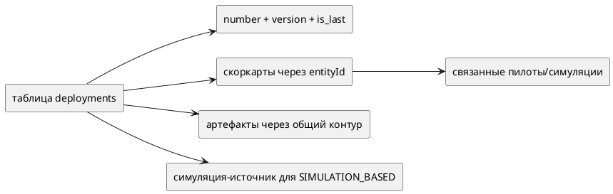

# Общая рабочая область внедрений (Бэкенд)

Статус: **актуализировано после реализации**
Фича: `deployments`
Срез: `workspace`
Область: `MVP`
Дата обновления: `2026-05-22`
Шаблон: `.workflow/templates/requirements/backend.template.md`

## Цель среза

Зафиксировать общий бэкенд-контракт рабочей области: один источник статуса, один набор действий, создание без черновика-оболочки.

## Системные правила

| Правило | Поведение бэкенда |
|---|---|
| Стартовое состояние | `POST /api/v1/deployment` создаёт `Deployment` со статусом `NEW` |
| Нет черновика-оболочки | бэкенд не ждёт второго автоматического `PUT` и не удаляет черновик по таймеру |
| Версионирование | изменение создаёт новую строку в `deployments`, старая строка того же `number` получает `isLast=false` |
| Статус | только `NEW`, `ON_APPROVAL`, `REJECTED`, `DEPLOYED`, `ARCHIVED` |
| Действия | `submitForApproval`, `edit`, `approve`, `reject`, `deploy`, `toArchive`; `edit` из `ON_APPROVAL` возвращает в `NEW` |
| Критичность | рассчитывается по скоркартам, не принимается как ручной ввод |

## Контекстные связи

## Разделение ответственности

| Контур | За что отвечает |
|---|---|
| API внедрений | поля внедрения, версия, статус, действия ЖЦ |
| API скоркарт | создание/обновление/привязка скоркарт к `entityType=deployment` |
| API артефактов | ссылки-документы после появления `deployment.id` |
| Симуляции/пилоты | источники связанных сущностей только для чтения |

## Чеклист для тестирования среза

- [ ] Создание внедрения не требует скоркарт/артефактов.
- [ ] Созданная строка `deployments` имеет `status=NEW`, `version=1`, `isLast=true`.
- [ ] API скоркарт принимает `entityId` уже созданного внедрения.
- [ ] Артефакты не создаются для несуществующего внедрения.
- [ ] Бэкенд не возвращает старые статусы `draft`, `ratified`, `cancelled` в `DeploymentStatus`.
- [ ] Для методолога бэкенд не разрешает создание/обновление полей внедрения и действия ЖЦ; доступно только редактирование артефактов по правилам общего контура артефактов.
