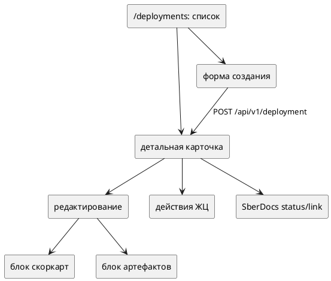

# Общая рабочая область внедрений (Фронтенд)

Статус: **актуализировано после реализации**
Фича: `deployments`
Срез: `workspace`
Область: `MVP`
Дата обновления: `2026-06-08`
Шаблон: `.workflow/templates/requirements/frontend.template.md`

## Цель среза

Короткий рабочий пакет про единые правила UI для всех экранов внедрений. Бизнес-детали живут в `../../requirements.md`.

## Карта экранов

## Единые UI-правила

| Правило | Требование |
|---|---|
| Источник статуса | `deployment.status` из бэкенда |
| Лейблы UI | `NEW` = `Черновик`, `ON_APPROVAL` = `На согласовании`, `DEPLOYED` = `Внедрено`, `REJECTED` = `Отклонено`, `ARCHIVED` = `Архив` |
| Действия | показываем только то, что разрешено бэкендом/ролью; не добавляем фронтовые переходы и локальные `approve`/`reject` |
| Согласование | в `ON_APPROVAL` показываем read-only связь со SberDocs, решения выполняются в SberDocs |
| Создание | до первого сохранения показываем только поля внедрения |
| Редактирование | скоркарты и артефакты доступны только после успешного создания внедрения |
| Пустые состояния | явно показываем пустые блоки скоркарт, артефактов и связанных сущностей |

## UI-состояния

| Состояние | Что видно | Доступные действия |
|---|---|---|
| загрузка | индикатор/скелетон страницы | нет |
| пустой список | текст `Внедрения не найдены` | создать внедрение, если есть права |
| создание | поля внедрения | сохранить / отменить |
| карточка `NEW` | карточка + пустые/заполненные блоки | редактировать, отправить, архивировать по правам |
| карточка `ON_APPROVAL` | карточка на согласовании + ссылка/номер SberDocs, если доступны | действия по `availableActions`; локальные согласовать/отклонить не показываем |
| конечная карточка | карточка без редактирования | нет или `toArchive` для `DEPLOYED` |

## Интеграция

| Маршрут | Использование |
|---|---|
| `POST /api/v1/deployments?spaceCode=...` | список |
| `POST /api/v1/deployment` | создание |
| `GET /api/v1/deployment/{number}` | детальная карточка последней версии |
| `PUT /api/v1/deployment/{number}?id=...` | обновление полей внедрения |
| `PUT /api/v1/deployment/{number}/action?id=...&action=...` | действие ЖЦ |
| API скоркарт с `entityType=deployment` | блок скоркарт после сохранения |
| общий API артефактов | блок артефактов после сохранения |

## Чеклист для тестирования среза

- [ ] На всех экранах `NEW` отображается одинаково как черновое/новое внедрение.
- [ ] Нет упоминаний `draft`, `ratified`, `cancelled`, `recall`, `start_ratification` в UI как обязательной логики внедрений.
- [ ] Нет локальных кнопок `approve`/`reject` для внедрения; согласование выполняется в SberDocs.
- [ ] При ошибке любого API UI не показывает частично сохранённый успешный сценарий.
- [ ] До успешного `POST /api/v1/deployment` нет кнопок добавления скоркарт и артефактов.
- [ ] После создания пользователь может перейти в детальную карточку/редактирование и добавить связанные данные.
- [ ] Методолог видит все внедрения, но в UI внедрений может редактировать только артефакты.
