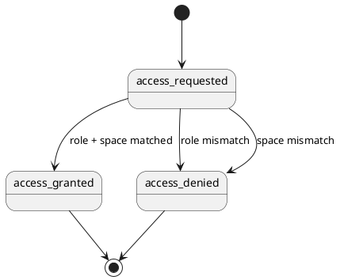

# Влияние на домен — roles-industrialization

Дата обновления: `2026-06-01`
Целевой baseline: `baseline/current/domain/`

## Реестр решений

| Decision ID | Суть | Статус | Уровень консистентности | Источник | Что заменяет | Отменено через |
|---|---|---|---|---|---|---|
| DEC-2026-06-01-ROLES-INDUSTRIALIZATION-001 | Промышленная ролевая модель оформляется как отдельная Q3 feature и не переписывает existing Q2 control layer `features/roles/` | принято | межфичевый | `features/roles-industrialization/feature.md` |  |  |
| DEC-2026-06-01-ROLES-INDUSTRIALIZATION-002 | Каталог ролей расширяется до глобальных `auditor`, `experiment_limited_view`, `experiment_admin` и product-scoped семейств `experiment_editor_{space.code}`, `metodolog_{space.code}`, `simulation_specialist_{space.code}` | принято | доменный | `/home/reutov/Downloads/roll_model_koda.md` | Q2 MVP-only role catalog |  |
| DEC-2026-06-01-ROLES-INDUSTRIALIZATION-003 | Compatibility matrix разрешает множественные роли семейства `experiment_editor_{space.code}` и не расширяет остальные совмещения без явного правила | принято | доменный | `features/roles-industrialization/requirements.md` |  |  |
| DEC-2026-06-01-ROLES-INDUSTRIALIZATION-004 | Endpoint access matrix становится новым source-of-truth для FE visibility и backend authorization; propagation в соседние feature packs выполняется отдельно и не смешивается с Q2 planning | принято | межфичевый | `features/roles-industrialization/requirements.md` | упрощённые MVP RBAC wording без endpoint table |  |

## Затронутые ограниченные контексты

- `Identity and Access`
- `Research and Execution`
- `Artifacts`

## Новые или изменённые агрегаты

- `UserRoleAssignment` получает расширенный промышленный каталог ролей.
- `EndpointRoleAccess` становится явным агрегатом требований для endpoint-level authorization.

## Новые или изменённые сущности

- `auditor`
- `experiment_limited_view`
- `experiment_admin`
- `experiment_editor_{space.code}`
- `metodolog_{space.code}`
- `simulation_specialist_{space.code}`
- `role compatibility pair`
- `endpoint access rule`

## Новые или изменённые value objects

- `space.code`
- `scope_type`
- `access_mode`
- `endpoint_operation`

## Новые или изменённые доменные события

- вычисление effective role set пользователя;
- проверка совместимости назначаемых ролей;
- принятие access decision для endpoint operation;
- отказ в действии по причине role mismatch;
- отказ в действии по причине product scope mismatch.

## Бизнес-правила и инварианты

- Новая feature не отменяет и не переписывает Q2 `features/roles/`; она добавляет отдельную Q3 дельту.
- Product-scoped роли не действуют вне своего `space.code`.
- `experiment_admin` имеет полный доступ ко всем продуктовым пространствам.
- `auditor` и `experiment_limited_view` в текущем living requirements трактуются как общий read-only профиль до появления более детальной спецификации.
- Документы и файлы наследуют доступ от родительской сущности и не создают обходного RBAC-канала.
- Compatibility matrix должна быть одинаково понятна FE, BE и тестированию.

## Переходы состояний

## Влияние на API и интеграции

- `GET /api/v1/user` должен возвращать достаточно данных для различения global/product roles.
- `GET /api/v1/access` должен поддерживать role-aware и при необходимости product-aware проверки.
- Domain endpoints `Experiments`, `Spaces`, `Documents`, `Simulations`, `Files`, `NotificationParameters` и связанные read-only справочники должны сверяться с endpoint matrix этой feature.

## Затронутые требования

| Путь | Влияние | Статус синхронизации |
|---|---|---|
| `features/roles-industrialization/requirements.md` | новый root source-of-truth для Q3 промышленной модели | синхронизировано |
| `features/roles-industrialization/slices/*/requirements/*.md` | срезы и FE/BE packs созданы в readable-формате | синхронизировано |
| `features/roles/requirements.md` | нужно явно развести Q2 control layer и Q3 industrial model wording | открыто |
| `features/pilots/slices/workspace/requirements/frontend.md` | role gating и labels требуют последующей синхронизации | открыто |
| `features/pilots/slices/workspace/requirements/backend.md` | endpoint rules и product scope требуют последующей синхронизации | открыто |
| `features/simulations/requirements.md` | simulation specialist и read-only roles нужно учесть в соседних пакетах | открыто |
| `features/artifacts/slices/core/requirements/backend.md` | права на документы/файлы нужно сверить с новой матрицей | открыто |

## Затронутые baseline-артефакты

| Путь | Влияние | Статус синхронизации |
|---|---|---|
| `baseline/current/domain/contexts/identity-and-access.md` | требуется промоушен новой role catalog и compatibility semantics | можно отложить |
| `baseline/current/api/endpoints.md` | endpoint-level access wording нужно синхронизировать с новой матрицей | можно отложить |
| `baseline/current/domain/ubiquitous-language.md` | новые role names и `space.code` должны появиться в словаре | можно отложить |

## Затронутые прототипы

| Путь | Влияние | Статус синхронизации |
|---|---|---|
| `features/pilots/planning/scope-prototype/prototype.html` | видимость действий и read-only states потребуется пересмотреть | можно отложить |
| `features/simulations/planning/scope-prototype/prototype.html` | specialist/admin/read-only gating потребуется пересмотреть | можно отложить |
| `features/simulations/slices/detail/delivery-prototype/prototype.html` | action set и role gating потребуется пересмотреть | можно отложить |

## Обязательные действия по консистентности

- [x] локальные требования фичи обновлены
- [x] срезы обновлены
- [x] влияние на домен проверено основным агентом
- [ ] соседние feature requirements синхронизировать отдельным requirements-проходом
- [ ] baseline обновить в режиме release-finalization
- [ ] прототипы обновить, если пользователь скажет `актуализируй прототипы`

## Заметки по откату

- До релиза: отмена этой дельты должна вернуть только Q3 industrial wording, не затрагивая Q2 `features/roles/`.
- После релиза: rollback оформляется отдельной change/release единицей со ссылкой на `DEC-2026-06-01-ROLES-INDUSTRIALIZATION-*`.
