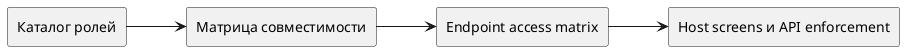
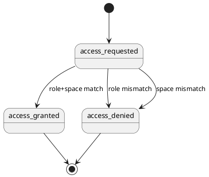

# Требования по фиче — Промышленная ролевая модель АС КОДА (roles-industrialization)

Статус: **draft**
Фича: `features/roles-industrialization/feature.md`
Квартал: `2026-Q3`
Дата обновления: `2026-06-01`
Формат: **новый лёгкий**
Шаблон: `.workflow/templates/requirements/feature-requirements.readable.template.md`

## Как читать документ

- Этот файл фиксирует новую Q3-дельту по ролевой модели и не переписывает existing Q2 control layer из `features/roles/`.
- Срезы ниже коротко делят работу на каталог ролей, endpoint matrix и cross-feature propagation.
- Подробные FE/BE пакеты лежат в `slices/*/requirements/*.md`.
- Диаграммы в этой feature используем только в PlantUML.

## Оглавление

1. Общий контур фичи
2. Быстрая схема
3. Порядок срезов
4. Бизнес-правила
5. Системные правила и интеграции
6. Контроль срезов
7. Общий чеклист для тестирования
8. Открытые вопросы и допущения

## Общий контур фичи

- Назначение: описать промышленную ролевую модель АС КОДА как отдельную Q3 feature.
- Что уже есть в `baseline/current`: существующий RBAC-контур и `features/roles/` как imported Q2 control layer.
- Дельта фичи: новый каталог ролей, справочник `{space.code}`, матрица совместимости и endpoint-level matrix из `/home/reutov/Downloads/roll_model_koda.md`.
- Основные пользователи и роли: аудитор, контролер, администратор, ПРМ продукта, методолог продукта, специалист по симуляциям.
- Визуальная база: отдельный прототип пока не создаётся; источником истины служит таблица ролей и endpoint matrix.
- Источники: `references.md`, `/home/reutov/Downloads/roll_model_koda.md`, `features/roles/requirements.md`.

## Быстрая схема

## Порядок срезов

1. `01 role-catalog` — Каталог ролей и совместимость
2. `02 endpoint-access-matrix` — Матрица доступа к endpoint
3. `03 cross-feature-enforcement` — Перенос в host screens и соседние фичи

---

## Бизнес-правила

### Сущности и термины

| Термин | Смысл | Важные ограничения |
|---|---|---|
| `global role` | Роль без привязки к продукту | действует во всей системе |
| `product role` | Роль, параметризованная `space.code` | действует только в рамках своего продукта |
| `space.code` | Код продуктового пространства | в этой feature фиксируются `CC`, `CL`, `AUTO`, `MG`, `MMB`, `POS`, `CASCADE`, `AFS`, `ANOMAI` |
| `endpoint access matrix` | Таблица доступа ролей к backend operations | используется как общий источник для FE visibility и BE enforcement |
| `compatibility matrix` | Таблица разрешённых совмещений ролей | требуется отдельная проверка для семейства `experiment_editor_{space.code}` |

### Роли и доступность

| Роль | Просмотр | Создание/редактирование | Действия | Ограничения |
|---|---|---|---|---|
| `auditor` | видит реестры, детали, документы, итоги, отчёты и симуляции | нет | нет | глобальная read-only роль |
| `experiment_limited_view` | использует тот же read-only профиль, что и `auditor`, пока источник не даст отдельную детализацию | нет | нет | рабочее допущение до уточнения |
| `experiment_admin` | видит все продуктовые пространства | создаёт, редактирует и удаляет сущности любого продукта | выполняет lifecycle/business actions | глобальная полная роль |
| `experiment_editor_{space.code}` | видит и меняет сущности своего продукта | CRUD и lifecycle в своём продукте | product-scoped actions в своём продукте | допускается пересечение ролей этого семейства по разным `space.code` |
| `metodolog_{space.code}` | видит свой продукт и связанные сущности | редактирует итоги, документы и подтверждение ознакомления | `Ознакомлен` по пилоту и пространству | product-scoped роль |
| `simulation_specialist_{space.code}` | видит реестр, деталку, отчёт и документы симуляций своего продукта | создаёт, редактирует и удаляет симуляции своего продукта, редактирует список документов симуляции | запускает и отменяет симуляцию, использует simulation-specific lifecycle actions в своём продукте | product-scoped роль, не даёт прав на пилоты, пространства, внедрения и общие admin-операции |

### Основные правила

1. Q2 imported feature `features/roles/` остаётся текущим control layer и не подменяется этой feature.
2. `experiment_admin` получает полные права на операции всех продуктовых пространств.
3. Продуктовые роли работают только в рамках своего `space.code`; backend не должен расширять их права на соседние продукты.
4. `auditor` и `experiment_limited_view` в текущей версии требований используют единый read-only профиль, потому что endpoint matrix объединяет их в один столбец.
5. Совмещение ролей ограничивается compatibility matrix; отдельное исключение допускает множественные роли семейства `experiment_editor_{space.code}`.
6. FE visibility и backend authorization обязаны ссылаться на одну и ту же endpoint matrix.
7. `simulation_specialist_{space.code}` управляет только simulation-контуром своего продукта: create/update/delete, lifecycle actions, документы симуляции и связанные simulation-specific справочники.
8. `simulation_specialist_{space.code}` не получает права на CRUD пилотов, пространств, внедрений, итогов пилотов и product-wide admin settings, если это не описано отдельным правилом.

## Системные правила и интеграции

### Статусы и переходы

| Текущий статус | Действие | Новый статус | Что проверить |
|---|---|---|---|
| `access_requested` | role+space подходят правилу | `access_granted` | доступ выдан только по допустимой роли и продукту |
| `access_requested` | роль не подходит | `access_denied` | FE и BE одинаково режут действие |
| `access_requested` | `space.code` не совпадает | `access_denied` | product-scoped роль не просачивается в чужой продукт |

### API

| Метод | Маршрут | Назначение |
|---|---|---|
| `POST` | `/api/v1/experiment` | create operation для experiments, доступная ограниченному набору ролей |
| `PUT` | `/api/v1/experiment/{id}` | редактирование эксперимента |
| `POST` | `/api/v1/simulation` | создание симуляции в рамках допустимого `space.code` |
| `PUT` | `/api/v1/simulation/{id}` | редактирование симуляции в рамках допустимого `space.code` |
| `DELETE` | `/api/v1/simulation/{id}` | удаление симуляции в рамках допустимого `space.code` |
| `PUT` | `/api/v1/simulation/{id}/action` | lifecycle action по симуляции |
| `GET` | `/api/v1/access` | точечная проверка прав роли |
| `GET` | `/api/v1/user` | получение профиля пользователя и ролей |

### Модель данных

| Сущность / таблица | Поле | Тип | Обяз. | Комментарий |
|---|---|---|---:|---|
| `role` | `code` | string | да | канонический код роли или role pattern |
| `role` | `scope_type` | enum | да | `global` или `product` |
| `role_space_mapping` | `space_code` | string | нет | обязателен для product-scoped roles |
| `incompatible_roles` | `left_role` | string | да | левая часть пары несовместимости |
| `incompatible_roles` | `right_role` | string | да | правая часть пары несовместимости |
| `endpoint_role_access` | `endpoint_operation` | string | да | идентификатор backend operation |
| `endpoint_role_access` | `access_mode` | enum | да | `allow`, `allow_in_space`, `deny` |

---

## Контроль срезов

## STORY-ROLES-IND-001 — Каталог ролей и совместимость

Карточка среза: `slices/role-catalog/slice.md`
Детализация FE: `slices/role-catalog/requirements/frontend.md`
Детализация BE: `slices/role-catalog/requirements/backend.md`
Плановая история: `planning/stories/STORY-ROLES-IND-001.md`

**Назначение**

- Зафиксировать каталог новых ролей, продуктовых кодов и compatibility matrix как отдельную Q3-дельту.

**Критерии приемки**

1. Все роли из источника перечислены и разделены на global/product-scoped.
2. Справочник `{space.code}` зафиксирован без смешения с Q2 MVP-терминами.
3. Правило пересечения `experiment_editor_{space.code}` описано отдельно от остальных ролей.
4. Для `simulation_specialist_{space.code}` явно зафиксированы права на simulation CRUD, документы симуляции и lifecycle actions.

**Что проверить тестировщику**

- [ ] Роль без product scope не требует `space.code`.
- [ ] Product-scoped роль не используется без продуктового кода.
- [ ] Compatibility matrix не противоречит описанию в корневом документе.

---

## STORY-ROLES-IND-002 — Матрица доступа к endpoint

Карточка среза: `slices/endpoint-access-matrix/slice.md`
Детализация FE: `slices/endpoint-access-matrix/requirements/frontend.md`
Детализация BE: `slices/endpoint-access-matrix/requirements/backend.md`
Плановая история: `planning/stories/STORY-ROLES-IND-002.md`

**Назначение**

- Зафиксировать единый mapping ролей на endpoint operations и правила BE authorization.

**Критерии приемки**

1. Таблица mapping покрывает группы endpoint из источника.
2. Product-scoped operations явно отделены от глобальных прав.
3. Read-only права `auditor`/`experiment_limited_view` и полные права `experiment_admin` описаны согласованно.
4. Права `simulation_specialist_{space.code}` на simulation endpoints отделены от прав `experiment_editor_{space.code}` и `metodolog_{space.code}`.

**Что проверить тестировщику**

- [ ] Запрещённые операции не становятся доступными только из-за UI.
- [ ] Ограничения по продукту проверяются и на чтении, и на мутациях.
- [ ] Один и тот же endpoint rule одинаково трактуется в FE и BE пакетах.

---

## STORY-ROLES-IND-003 — Перенос в host screens и соседние фичи

Карточка среза: `slices/cross-feature-enforcement/slice.md`
Детализация FE: `slices/cross-feature-enforcement/requirements/frontend.md`
Детализация BE: `slices/cross-feature-enforcement/requirements/backend.md`
Плановая история: `planning/stories/STORY-ROLES-IND-003.md`

**Назначение**

- Описать, как новая ролевая модель должна переноситься в `pilots`, `simulations`, `artifacts` и baseline/current без ретроактивного перепланирования Q2.

**Критерии приемки**

1. Список затронутых feature packs и baseline artifacts перечислен явно.
2. Зафиксировано, что propagation выполняется отдельным шагом, а не скрытым переписыванием Q2 scope.
3. Тестерский regression checklist покрывает role gating, product scope и endpoint denial.

**Что проверить тестировщику**

- [ ] Соседние экраны перечислены как impact points.
- [ ] Нет формулировок, которые превращают Q3 feature в rewrite Q2 feature.
- [ ] Deferred propagation записана в `domain-impact.md` и `.workflow/consistency-backlog.md`.

---

## Общий чеклист для тестирования

| Проверка | Где детализировано |
|---|---|
| Каталог ролей и совместимость | `slices/role-catalog/requirements/*` |
| Endpoint-level доступ | `slices/endpoint-access-matrix/requirements/*` |
| Cross-feature role gating | `slices/cross-feature-enforcement/requirements/*` |

## Открытые вопросы и допущения

- В источнике у `experiment_limited_view` не перечислены отдельные уникальные полномочия, поэтому до уточнения роль описана как read-only профиль уровня `auditor`.
- Текст про пересечение `experiment_editor_{space.code}` интерпретируется как разрешение иметь несколько ролей этого семейства по разным продуктам; если появится более строгая матрица, её нужно синхронно обновить в root и detail packs.
- Полная propagation в соседние фичи и baseline отложена и записана в impact/backlog, чтобы не смешивать Q3 дельту с текущим кварталом.
