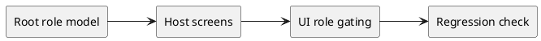

# Перенос в host screens и соседние фичи (Фронтенд)

Статус: **draft**
Фича: `roles-industrialization`
Срез: `cross-feature-enforcement`
Область: `MVP`
Дата обновления: `2026-06-01`
Формат: **новый лёгкий**
Шаблон: `.workflow/templates/requirements/frontend.readable.template.md`

## Цель среза

Зафиксировать, какие host screens и UI-пакеты должны подхватить новую ролевую модель после Q3 requirements-фазы.

## Экран / сценарий

## UI-состав

| Блок | Требование |
|---|---|
| `pilots` workspace | пересмотреть видимость действий по новым product roles |
| `simulations` list/detail/form | отделить read-only и specialist actions |
| `artifacts` / documents blocks | наследовать права от родителя и новой role matrix |
| Общие action bars | не использовать старые MVP role labels как единственный источник |
| Regression checklist | все host screens должны проверяться на `403`, hidden actions и product leakage |

## UI-состояния

| Состояние | Что видно | Доступные действия |
|---|---|---|
| загрузка | безопасный минимум без лишних мутаций | нет |
| пусто | read-only или отсутствие доступа | back/navigation |
| данные загружены | только разрешённые role-specific действия | по новой матрице |
| ошибка | сообщение о недоступности/конфликте | retry |

## Интеграция

| Метод и маршрут | Когда вызывается | Что отправляем | Что читаем |
|---|---|---|---|
| `GET /api/v1/user` | bootstrap host screen | контекст пользователя | актуальные роли |
| `GET /api/v1/access` | точечный gate для сложного действия | accessType / spaceCode / action context | allow/deny |
| host feature APIs | при mutation actions | payload доменной сущности | success / `403` / `409` |

## Валидация на фронте

| Ситуация | Поведение / сообщение |
|---|---|
| старая MVP-логика конфликтует с новой ролью | экран использует новый root requirements как source of truth |
| role допускает просмотр, но не мутацию | action hidden/disabled, данные остаются доступны только на чтение |
| product leakage на соседнем host screen | mutation controls для чужого продукта не показываются |

## Права и ограничения

| Роль / условие | Что доступно | Что недоступно |
|---|---|---|
| `auditor`, `experiment_limited_view` | просмотр host screens, документов, историй, отчётов | мутации и lifecycle actions |
| `experiment_admin` | все host screens и все product contexts | ограничений нет |
| `experiment_editor_{space.code}` | actions своего продукта на pilots/experiments | действия по чужому продукту |
| `metodolog_{space.code}` | документы, итоги и ознакомление в своём продукте | specialist/admin actions |
| `simulation_specialist_{space.code}` | simulation actions своего продукта | несвязанные пилотные/admin операции |

## Чеклист для тестирования среза

- [ ] Основной пользовательский сценарий проходит без ручных обходов.
- [ ] Пустые состояния отличаются от ошибок.
- [ ] Ошибки API не превращаются в успешное локальное состояние.
- [ ] Действия скрываются или блокируются по правам и статусам.
- [ ] UI использует актуальные статусы, названия и маршруты из `../../requirements.md`.

## Открытые вопросы и допущения

- Прототипы соседних фич пока не актуализируются в этом проходе; их impact фиксируется в `domain-impact.md` и backlog.
