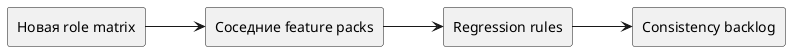

# Срез — Перенос в host screens и соседние фичи

Статус: **draft**
Фича: `features/roles-industrialization/feature.md`
Порядок в требованиях фичи: `03`
Дата обновления: `2026-06-01`
Формат: **новый лёгкий**
Шаблон: `.workflow/templates/requirements/slice.readable.template.md`

## Назначение

Описать impact новой ролевой модели на соседние feature packs и host screens без скрытого переписывания текущего квартала.

## Главное

- Главный источник бизнес-правил: `../../requirements.md`.
- Этот срез фиксирует propagation targets и tester regression rules.
- Если появляется новый затронутый host screen, сначала обновить `../../requirements.md`, затем синхронизировать этот срез.

## Границы среза

| Входит | Не входит |
|---|---|
| impact на `features/roles/`, `pilots`, `simulations`, `artifacts` | release-finalization |
| FE visibility and BE enforcement propagation rules | фактическое массовое переписывание соседних requirements в этом проходе |
| backlog/impact фиксация | Q2 re-planning |

## Схема среза

## Связанные плановые истории

- `STORY-ROLES-IND-003`

## Пакеты требований

- `../../requirements.md`
- `requirements/frontend.md`
- `requirements/backend.md`

## Связанные прототипы

- `—`

## Фокус тестирования среза

- [ ] Проверить основной успешный сценарий.
- [ ] Проверить пустые состояния.
- [ ] Проверить ошибки API и недоступные действия.
- [ ] Проверить права ролей.
- [ ] Проверить отсутствие старых терминов/маршрутов/статусов, если срез заменяет прежнюю логику.

## Связанные артефакты исполнения

- `execution/tasks.md`
