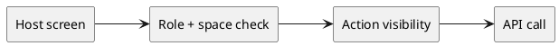

# Матрица доступа к endpoint (Фронтенд)

Статус: **draft**
Фича: `roles-industrialization`
Срез: `endpoint-access-matrix`
Область: `MVP`
Дата обновления: `2026-06-01`
Формат: **новый лёгкий**
Шаблон: `.workflow/templates/requirements/frontend.readable.template.md`

## Цель среза

Зафиксировать, как frontend применяет endpoint matrix к видимости действий, кнопок и host-screen секций.

## Экран / сценарий

## UI-состав

| Блок | Требование |
|---|---|
| Toolbar / action bar | показывает только действия, которые разрешены по endpoint matrix |
| Карточка сущности | скрывает или disable-ит недопустимые мутации |
| Реестр | read-only роли видят просмотр, но не mutation controls |
| Simulation actions | для `simulation_specialist_{space.code}` показывает simulation CRUD и lifecycle actions только на simulation host screens своего продукта |
| Ошибка | при `403` UI не должен трактовать действие как локально успешное |
| Подсказки | текст action может оставаться видимым только если продуктовая роль действительно может выполнить его в текущем `space.code` |

## UI-состояния

| Состояние | Что видно | Доступные действия |
|---|---|---|
| загрузка | skeleton + без mutation controls | нет |
| пусто | только просмотр, если backend не вернул права | navigation/back |
| данные загружены | действия, прошедшие role+space gating | create/edit/delete/action по матрице |
| ошибка | сообщение о недоступности действия или данных | retry / возврат |

## Интеграция

| Метод и маршрут | Когда вызывается | Что отправляем | Что читаем |
|---|---|---|---|
| `GET /api/v1/user` | при расчёте host-screen rights | контекст пользователя | role assignments |
| `GET /api/v1/access` | перед сложными/условными действиями | `accessType`, `spaceCode`, semantic action context | allow/deny |
| host feature API | при выполнении действия | domain payload | результат или `403/409` |

## Валидация на фронте

| Ситуация | Поведение / сообщение |
|---|---|
| read-only роль пытается выполнить мутацию | кнопка не показывается или заблокирована |
| product-scoped роль открыла чужой продукт | UI не показывает mutation action |
| backend вернул `403` на действие, которое UI ошибочно открыл | UI показывает ошибку доступа и не меняет локальное состояние на success |
| `simulation_specialist_{space.code}` открыл host screen не из simulation-контура | UI не показывает specialist-only actions и не маршрутизирует пользователя в недоступные mutation flows |

## Права и ограничения

| Роль / условие | Что доступно | Что недоступно |
|---|---|---|
| `auditor`, `experiment_limited_view` | просмотр списков, деталей, документов, историй, отчётов | create/edit/delete/action |
| `experiment_admin` | все действия на всех группах endpoint | ограничений нет |
| `experiment_editor_{space.code}` | CRUD и действия в своём продукте | действия вне своего продукта |
| `metodolog_{space.code}` | read-only + документы/итоги/ознакомлен в своём продукте | admin/simulation specialist actions |
| `simulation_specialist_{space.code}` | create/update/delete/run/cancel симуляций, просмотр деталки/отчёта, редактирование документов симуляции, чтение simulation filters и risk parameters своего продукта | pilot/deployment/space mutations, product admin actions, simulation actions в чужом продукте |

## UI-mapping для `simulation_specialist_{space.code}`

| Экран / действие | Что доступно роли | Что недоступно |
|---|---|---|
| Реестр симуляций | открыть список и перейти в деталку своего продукта | mutation controls для чужого продукта |
| Детальная страница симуляции | видеть основные блоки, документы и specialist lifecycle actions | соседние pilot/deployment actions |
| Форма симуляции | создать и отредактировать симуляцию своего продукта | изменение product-wide сущностей вне simulation scope |
| Lifecycle блок | кнопки `Запустить` и `Отменить` при допустимом статусе | actions, не описанные для simulation flow |
| Документы симуляции | просматривать и редактировать документы симуляции | документы чужого продукта и документы других доменных сущностей |

## Чеклист для тестирования среза

- [ ] Основной пользовательский сценарий проходит без ручных обходов.
- [ ] Пустые состояния отличаются от ошибок.
- [ ] Ошибки API не превращаются в успешное локальное состояние.
- [ ] Действия скрываются или блокируются по правам и статусам.
- [ ] UI использует актуальные статусы, названия и маршруты из `../../requirements.md`.

## Открытые вопросы и допущения

- Для `experiment_limited_view` UI пока использует тот же read-only набор controls, что и для `auditor`.
- Названия конкретных lifecycle-кнопок для симуляции берутся из существующего simulation UI; здесь фиксируется именно право роли на их показ и вызов.
