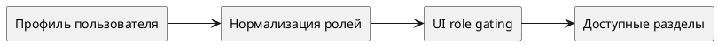

# Каталог ролей и совместимость (Фронтенд)

Статус: **draft**
Фича: `roles-industrialization`
Срез: `role-catalog`
Область: `MVP`
Дата обновления: `2026-06-01`
Формат: **новый лёгкий**
Шаблон: `.workflow/templates/requirements/frontend.readable.template.md`

## Цель среза

Зафиксировать, какие role labels, role groups и product scopes должен понимать frontend до применения role gating на host screens.

## Экран / сценарий

## UI-состав

| Блок | Требование |
|---|---|
| Профиль пользователя | frontend должен различать global roles и product roles |
| Role mapper | pattern `*_ {space.code}` интерпретируется вместе с продуктовым кодом |
| Host navigation | скрывает недоступные разделы по уже нормализованной роли |
| Simulation workspace gate | для `simulation_specialist_{space.code}` показывает simulation list/detail/form/lifecycle actions только в допустимом продукте |
| Пустое состояние | если ролей нет или они не распознаны, UI не показывает продуктовые mutation actions |
| Ошибка | нераспознанный role code не даёт расширенный доступ по умолчанию |

## UI-состояния

| Состояние | Что видно | Доступные действия |
|---|---|---|
| загрузка | skeleton/placeholder профиля | действий нет |
| пусто | пользователь без распознанных ролей | только безопасный read-only минимум, если он разрешён backend |
| данные загружены | доступные разделы и действия по роли | действия зависят от role+space |
| ошибка | сообщение о невозможности получить профиль/доступ | retry получения профиля |

## Интеграция

| Метод и маршрут | Когда вызывается | Что отправляем | Что читаем |
|---|---|---|---|
| `GET /api/v1/user` | при bootstrap и refresh профиля | данные текущего пользователя | список ролей и связанные `space.code` |
| `GET /api/v1/access` | при точечной проверке сложного действия | accessType, при необходимости product context | разрешение/запрет действия |

## Валидация на фронте

| Ситуация | Поведение / сообщение |
|---|---|
| product role без `space.code` | product-scoped действия не показываются |
| неизвестный role code | роль не интерпретируется как повышенный доступ |
| пользователь имеет несколько `experiment_editor_{space.code}` | UI агрегирует доступные продукты, не объединяя их в глобальную роль |
| пользователь имеет `simulation_specialist_{space.code}` | UI открывает только simulation-сценарии своего продукта и не показывает pilot/deployment actions |

## Права и ограничения

| Роль / условие | Что доступно | Что недоступно |
|---|---|---|
| `auditor`, `experiment_limited_view` | read-only разделы, детали, документы, отчёты | create/edit/delete/actions |
| `experiment_admin` | все разделы и actions | ограничений по продукту нет |
| `experiment_editor_{space.code}` | mutation actions только в своём продукте | действия в чужом `space.code` |
| `metodolog_{space.code}` | документы, итоги и `Ознакомлен` в своём продукте | общие admin actions |
| `simulation_specialist_{space.code}` | реестр симуляций, деталка симуляции, создание/редактирование/удаление симуляции, список документов симуляции, кнопки `Запустить` и `Отменить` в своём продукте | пилоты, пространства, внедрения, product admin actions, simulation actions в чужом `space.code` |

## Специальные UI-правила для `simulation_specialist_{space.code}`

- В navigation и на host screens роль открывает только simulation-контур своего продукта.
- На simulation list/detail UI показывает specialist-actions только если `space.code` записи совпадает с role scope пользователя.
- На simulation form роль может создавать и редактировать симуляцию своего продукта, но не получает controls для product-wide настроек или соседних доменных сущностей.
- На detail/lifecycle экране кнопки `Запустить` и `Отменить` показываются только для допустимых статусов и только при наличии `simulation_specialist_{space.code}` или `experiment_admin`.
- Блок документов симуляции доступен для просмотра и редактирования только в simulation-контуре своего продукта.

## Чеклист для тестирования среза

- [ ] Основной пользовательский сценарий проходит без ручных обходов.
- [ ] Пустые состояния отличаются от ошибок.
- [ ] Ошибки API не превращаются в успешное локальное состояние.
- [ ] Действия скрываются или блокируются по правам и статусам.
- [ ] UI использует актуальные статусы, названия и маршруты из `../../requirements.md`.

## Открытые вопросы и допущения

- Роль `experiment_limited_view` пока трактуется как read-only профиль одного уровня с `auditor`.
- Для `simulation_specialist_{space.code}` предполагается, что frontend использует уже существующие simulation host screens и добавляет только role gating, а не отдельный новый UI-контур.
