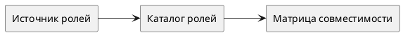

# Срез — Каталог ролей и совместимость

Статус: **draft**
Фича: `features/roles-industrialization/feature.md`
Порядок в требованиях фичи: `01`
Дата обновления: `2026-06-01`
Формат: **новый лёгкий**
Шаблон: `.workflow/templates/requirements/slice.readable.template.md`

## Назначение

Зафиксировать перечень глобальных и продуктовых ролей, справочник `{space.code}` и compatibility matrix новой промышленной модели.

## Главное

- Главный источник бизнес-правил: `../../requirements.md`.
- Срез отделяет Q3-дельту от existing Q2 control-layer в `features/roles/`.
- Если выяснится новое правило по совместимости, сначала обновить `../../requirements.md`, затем синхронизировать этот срез.

## Границы среза

| Входит | Не входит |
|---|---|
| каталог ролей из источника | release-promotion в baseline/current |
| список продуктовых кодов `{space.code}` | фактическая реализация host screens |
| матрица совместимости ролей | Q2 перепланирование `features/roles/` |

## Схема среза

## Связанные плановые истории

- `STORY-ROLES-IND-001`

## Пакеты требований

- `../../requirements.md`
- `requirements/frontend.md`
- `requirements/backend.md`

## Связанные прототипы

- `—`

## Фокус тестирования среза

- [ ] Проверить основной успешный сценарий.
- [ ] Проверить пустые состояния.
- [ ] Проверить ошибки API и недоступные действия.
- [ ] Проверить права ролей.
- [ ] Проверить отсутствие старых терминов/маршрутов/статусов, если срез заменяет прежнюю логику.

## Связанные артефакты исполнения

- `execution/tasks.md`
