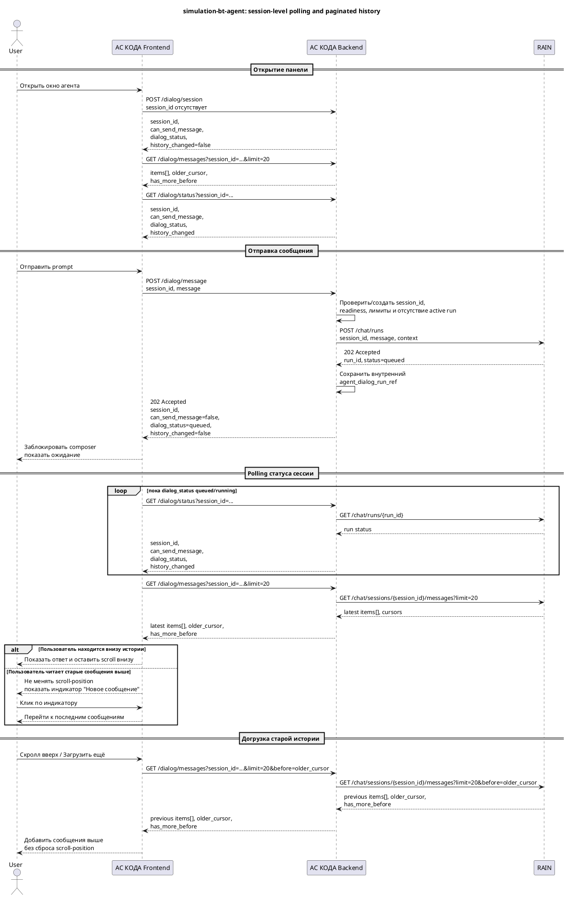

# Требования по feature — Формирование БТ из симуляции через AI-агента RAIN

Статус: **draft**
Feature: `features/simulation-bt-agent/feature.md`
Квартал: `2026-Q2`
Дата обновления: `2026-04-30`
Шаблон: `.workflow/templates/requirements/feature-requirements.template.md`

## Оглавление

Используются заголовки до уровня `####`.

## Общий контур feature

- Назначение feature: встроить в интерфейс симуляций окно агента для консультационного диалога и формирования БТ по данным завершённой симуляции.
- Что уже есть в baseline/current: список симуляций, деталка симуляции, вкладки деталки, форма редактирования, данные симуляции и существующая ролевая модель.
- Какая дельта добавляется этой feature: глобальная точка входа в окно агента, правая неблокирующая панель диалога, UI-сессия АС КОДА с backend-managed `session_id`, проксирование принятого async REST API RAIN через backend АС КОДА, polling статуса сессии и текущего run, health-статус агента по `/health/liveness` и `/health/readiness`, действие подготовки БТ, публикация БТ через агента, показ ссылки из ответа агента для ручного копирования, аудит сценария и контроль ограничений длины prompt/истории.
- Какие slice входят в контрольный документ: `agent-entrypoint`, `dialog-session`, `bt-publication`.
- Какой общий feature prototype используется как визуальная база: `features/simulation-bt-agent/prototype.html`.

## Источники и приоритет

1. Принятый целевой контракт RAIN: `context/change-requests/simulation-bt-agent/rain_api_proposal.md`.
2. Исходный контракт агента: `context/change-requests/simulation-bt-agent/agent_openapi.yaml`.
3. Системные требования и SLA: `context/change-requests/simulation-bt-agent/Системные_требования_для_интеграции_АС_КОДА_и_AI_Агента_RAIN.md`.
4. Existing simulation API: `context/change-requests/simulation-bt-agent/simulations_api.md`.
5. Ранее подготовленные feature/slice artifacts.

Если системные требования или исходный `agent_openapi.yaml` противоречат принятому `rain_api_proposal.md`, для целевой API-интеграции используется `rain_api_proposal.md`. Системные требования остаются источником бизнес-сценариев, SLA, ограничений HTTPS/mTLS/OTT и требований к UI-сессии.

## Интеграционное решение MVP

- Frontend АС КОДА не вызывает RAIN напрямую и не получает OTT.
- Backend АС КОДА является `agent integration boundary`: авторизует пользователя, управляет UI-сессией АС КОДА, проксирует RAIN server-to-server по HTTPS/mTLS/OTT и скрывает внутренний контракт агента от браузера.
- RAIN по принятому целевому контракту предоставляет `GET /health/liveness`, `GET /health/readiness`, `POST /chat/runs`, `GET /chat/runs/{run_id}`, `GET /chat/runs/{run_id}/result`, `GET /chat/sessions/{session_id}/messages` и `GET /chat/messages/{message_id}`.
- Terminal status run принадлежит RAIN. Backend АС КОДА не переводит RAIN run в terminal status, а читает статус RAIN, нормализует его для frontend и может краткоживуще кэшировать состояние для UI.
- Frontend не работает с конкретным `run_id` и не получает объект текущего run в обычном UI-контракте. Backend АС КОДА отдаёт session-level view по `GET /dialog/status?session_id=...`, потому что в одной `session_id` допускается только один active run.
- `session_id` создаётся и валидируется backend АС КОДА. Frontend хранит полученный opaque `session_id` только для продолжения сессии; если frontend вызывает dialog API без `session_id`, backend создаёт новую UI-сессию и тем самым сбрасывает предыдущий диалоговый контекст для текущего окна.
- История диалога и агентский контекст принадлежат RAIN; backend АС КОДА проксирует/нормализует историю и может хранить локальную копию для UI/аудита по правилам синхронизации, но не является владельцем агентского контекста.
- `btUrl` как отдельное поле RAIN не используется в текущих требованиях; целевой контракт RAIN возвращает структурированные `artifacts[]` для результата run, включая возможную ссылку на БТ.

## Порядок slice для контроля

1. `01 agent-entrypoint — Точка входа, UI-сессия и статус агента`
2. `02 dialog-session — Асинхронная отправка сообщения, polling и история`
3. `03 bt-publication — Действия по БТ, контекст симуляции и публикация`

---

## STORY-SIMULATION-BT-AGENT-001 — Точка входа, UI-сессия и статус агента

Slice card: `slices/agent-entrypoint/slice.md`
Детализация FE: `slices/agent-entrypoint/requirements/frontend.md`
Детализация BE: `slices/agent-entrypoint/requirements/backend.md`
Общий prototype: `prototype.html`
Slice prototype: `slices/agent-entrypoint/delivery-prototype/prototype.html`
Planning story: `planning/stories/STORY-SIMULATION-BT-AGENT-001.md`

**Бизнес-требования**

- Цель: дать пользователю единую точку входа в окно агента на страницах симуляций и явно показать готовность агента к работе.
- Бизнес-правила: окно агента доступно со списка, деталки, вкладок деталки и формы редактирования; `session_id` создаёт backend АС КОДА при первом открытии или сбросе сессии, а frontend только хранит и передаёт его как opaque token; статус агента определяется readiness/liveness агента через backend АС КОДА; действие по БТ доступно только для конкретной успешно завершённой симуляции с опцией вывода в ПРОМ.
- Ограничения: открытие окна не должно блокировать основной интерфейс; RAIN не имеет отдельного API открытия или восстановления диалога; frontend не вызывает RAIN напрямую и не работает с OTT.

**Пользовательские требования к АС КОДА**

- Пользователь может открыть окно агента с любой страницы раздела симуляций.
- Пользователь остаётся на текущей странице, а окно открывается без смены маршрута.
- Пользователь видит в шапке окна status chip агента.
- Если агент не готов, пользователь видит понятный статус, а ввод/отправка сообщения блокируются до восстановления готовности.
- На странице подходящей симуляции пользователь видит inline-действие `Сформировать БТ для текущей симуляции`.

**Критерии приемки**

1. Окно агента открывается со списка симуляций, с деталки, с вкладок деталки и с формы редактирования.
2. При первом открытии окна frontend вызывает backend без `session_id`, backend создаёт UI-сессию и возвращает `session_id`; RAIN при этом не вызывается.
3. Status chip использует readiness/liveness агента, полученные через backend АС КОДА.
4. При `readiness=not ready` или потере связи с агентом поле ввода, отправка и agent actions недоступны.

**USE CASES**

- **осн. сценарий 1** пользователь открывает окно агента со списка симуляций.
- **альт. сценарий 1.1** пользователь открывает окно агента с деталки симуляции или с её вкладки.
- **альт. сценарий 1.2** readiness агента недоступен, и окно открывается в состоянии `Агент недоступен`.
- **осн. сценарий 2** frontend периодически обновляет статус агента через backend.

### Функциональные требования

#### Реализация для FRONTEND

**Описание UI**

| Экран | Результат |
| --- | --- |
| Список симуляций | Доступна точка входа в окно агента |
| Деталка симуляции, вкладки деталки, форма редактирования | Доступна точка входа в окно агента без смены маршрута |
| Окно агента | В шапке отображается status chip агента, ниже история, composer и контекстные agent actions |

Требования на фронт:

- добавить единую точку входа в окно агента на ключевых страницах раздела симуляций;
- открыть окно как неблокирующую панель без сброса состояния страницы;
- при первом открытии окна вызвать backend без `session_id`, получить `session_id` и дальше передавать его параметром для продолжения той же UI-сессии;
- при намеренном сбросе сессии вызвать dialog API без `session_id`, чтобы backend создал новую UI-сессию и вернул новый `session_id`;
- при открытии окна не отправлять `contextPrompt`, историю, риск-параметры или ФИО в RAIN;
- показывать status chip агента по данным backend status API;
- блокировать поле ввода, отправку и agent actions, если агент не готов или есть активный run.

Связанный детальный FE pack: `slices/agent-entrypoint/requirements/frontend.md`

#### Реализация BACKEND

Требования на бэк:

- предоставить frontend endpoint для открытия/восстановления UI-сессии АС КОДА без вызова RAIN;
- создавать, хранить и восстанавливать UI-сессию по backend-managed `session_id` в рамках пользовательской СУДИР-сессии;
- предоставить frontend endpoint статуса агента, агрегирующий `GET RAIN /health/liveness` и `GET RAIN /health/readiness`;
- использовать короткие таймауты и кэш статуса агента, чтобы status chip не создавал лишнюю нагрузку;
- не отдавать в браузер OTT, mTLS details и внутренний endpoint RAIN.

Связанный детальный BE pack: `slices/agent-entrypoint/requirements/backend.md`

| | |
| --- | --- |
| **Сервис** | `АС КОДА agent integration boundary` |
| ИФТ URL | `POST /dialog/session`, `GET /dialog/agent/status`; server-to-server: `GET /health/liveness`, `GET /health/readiness` |
| База данных | `agent_ui_session`, `agent_dialog_message` или эквивалентное хранилище UI-сессии |
| Методы | `slices/agent-entrypoint/requirements/backend.md` |

**Изменения в ролевой модели**

- Новая отдельная роль в рамках MVP не вводится.
- Доступ к окну агента наследуется от доступа к разделу симуляций.
- Действие по БТ дополнительно зависит от контекста завершённой симуляции.

**Отправка в Аудит**

- Технически логируются открытие окна, проверка статуса агента и ошибки восстановления UI-сессии.
- Бизнес-аудит публикации БТ фиксируется в slice `bt-publication`.

**BUGS (Если есть)**

- Пока не зафиксированы.

### Доп. пояснения

- Этот раздел задаёт вход в feature и должен оставаться первым в контрольной последовательности.
- Health endpoints RAIN используются только backend АС КОДА; frontend получает нормализованный статус.

---

## STORY-SIMULATION-BT-AGENT-002 — Асинхронная отправка сообщения, polling и история

Slice card: `slices/dialog-session/slice.md`
Детализация FE: `slices/dialog-session/requirements/frontend.md`
Детализация BE: `slices/dialog-session/requirements/backend.md`
Общий prototype: `prototype.html`
Slice prototype: `slices/dialog-session/delivery-prototype/prototype.html`
Planning story: `planning/stories/STORY-SIMULATION-BT-AGENT-002.md`

**Бизнес-требования**

- Цель: обеспечить устойчивый диалог с агентом внутри АС КОДА без долгого блокирующего браузерного REST-запроса.
- Бизнес-правила: frontend отправляет сообщение в backend АС КОДА и получает быстрый `202 Accepted` с состоянием сессии; backend вызывает RAIN `POST /chat/runs` и сохраняет внутренний `agent_dialog_run_ref` для связи `session_id` с `run_id` RAIN; frontend polling-ом читает статус диалоговой сессии по `session_id`; новая отправка по той же сессии запрещена, пока у RAIN есть активный run; история диалога читается страницами через backend АС КОДА из RAIN.
- Ограничения: frontend не вызывает RAIN напрямую; RAIN владеет run status и историей; для одного `session_id` в MVP допускается только один активный run; frontend не должен загружать всю длинную историю сразу.

**Пользовательские требования к АС КОДА**

- Диалог открывается в неблокирующей правой панели.
- Пользователь может продолжать работу со страницей симуляции вне панели агента.
- На время активного run поле ввода и отправка заблокированы, а пользователь видит состояние ожидания.
- После ответа агента сообщение появляется в истории.
- Если история длинная, пользователь видит последние сообщения и может догрузить более ранние.
- После ошибки или timeout пользователь видит понятное сообщение и может перезапустить сессию.

**Критерии приемки**

1. Отправка сообщения возвращает быстрый `202 Accepted` без ожидания полного ответа RAIN.
2. Frontend polling-ом по `session_id` получает `dialog_status`: `queued`/`running`, затем terminal status: `succeeded`, `failed` или `timeout`.
3. Пока run активен, повторная отправка по тому же `session_id` недоступна на frontend и отклоняется backend.
4. История сообщений грузится порциями, а не целиком.
5. Ограничения длины prompt и отображаемой истории применяются и на frontend, и на backend.

**USE CASES**

- **осн. сценарий 1** пользователь отправляет сообщение и получает ответ после polling.
- **альт. сценарий 1.1** RAIN отвечает дольше обычного SLA, UI остаётся в состоянии ожидания.
- **альт. сценарий 1.2** run завершается ошибкой или timeout, UI предлагает перезапуск.
- **осн. сценарий 2** пользователь догружает более ранние сообщения истории.

**Sequence diagram**

### Функциональные требования

#### Реализация для FRONTEND

**Описание UI**

| Экран | Результат |
| --- | --- |
| Правая панель агента | В шапке отображается status chip; ниже история, загрузка run, поле ввода, inline actions и кнопка отправки |
| Длинная история | Сначала загружаются последние сообщения; более ранние догружаются по действию пользователя или прокрутке вверх |

Требования на фронт:

- отправлять сообщение через backend АС КОДА и получать быстрый `202 Accepted` с состоянием сессии;
- запускать polling статуса сессии через `GET /dialog/status?session_id=...` и завершать ожидание только по terminal `dialog_status`;
- блокировать composer на время активного run и когда readiness агента не готов;
- показывать loading, timeout и error states без блокировки основного интерфейса;
- отображать Markdown в сообщениях агента;
- ограничивать длину вводимого prompt и показывать счётчик/ошибку при превышении;
- загружать историю сообщений страницами, например последние `20` сообщений при открытии и более ранние через cursor;
- если пользователь прокрутил историю вверх и последние сообщения не видны, при появлении нового сообщения не сбрасывать scroll-position, а показать индикатор `Новое сообщение`/счётчик и загрузить последние сообщения по действию пользователя;
- не хранить клиентскую историю как единственный источник правды после отправки: после terminal status синхронизироваться с backend history.

Связанный детальный FE pack: `slices/dialog-session/requirements/frontend.md`

#### Реализация BACKEND

Требования на бэк:

- принять пользовательское сообщение и создать run в RAIN через `POST /chat/runs`;
- маппить данные АС КОДА в поля RAIN: `session_id`, `message`, `risk_params`, `simulation_id`, `start_datetime`, `fio`;
- хранить внутренний `agent_dialog_run_ref` между UI-сессией АС КОДА и `run_id` RAIN и проксировать статус RAIN;
- предоставить polling endpoint статуса сессии с `session_id` в параметрах запроса, возвращающий `session_id`, `dialog_status`, `can_send_message`, `history_changed` и ошибку без раскрытия `run_id`;
- проксировать/нормализовать историю RAIN и отдавать её frontend порциями через cursor/limit;
- применять server-side ограничения длины prompt, response и истории;
- не выполнять автоматический retry для операций, которые могли создать БТ, если нет идемпотентного ключа от RAIN.

Связанный детальный BE pack: `slices/dialog-session/requirements/backend.md`

| | |
| --- | --- |
| **Сервис** | `АС КОДА agent integration boundary` |
| ИФТ URL | `POST /dialog/message`, `GET /dialog/status?session_id=...`, `GET /dialog/messages?session_id=...`; server-to-server: `POST /chat/runs`, `GET /chat/runs/{run_id}`, `GET /chat/sessions/{session_id}/messages` |
| База данных | `agent_dialog_run`, `agent_dialog_message`, `agent_ui_session` или эквивалент |
| Методы | `slices/dialog-session/requirements/backend.md` |

**Изменения в ролевой модели**

- Ролевая модель не расширяется.
- Доступ к диалогу наследуется от точки входа feature.

**Отправка в Аудит**

- Технически логируются отправка сообщения, создание run, terminal status, timeout и ошибки агента.
- Бизнес-аудит публикации БТ фиксируется отдельно в slice `bt-publication`.

**BUGS (Если есть)**

- Пока не зафиксированы.

### Доп. пояснения

- Этот раздел должен оставаться вторым в порядке контроля, потому что зависит от согласованной точки входа.
- Для UI не используется долгий браузерный REST до полного ответа агента.

---

## STORY-SIMULATION-BT-AGENT-003 — Действия по БТ, контекст симуляции и публикация

Slice card: `slices/bt-publication/slice.md`
Детализация FE: `slices/bt-publication/requirements/frontend.md`
Детализация BE: `slices/bt-publication/requirements/backend.md`
Общий prototype: `prototype.html`
Slice prototype: `slices/bt-publication/delivery-prototype/prototype.html`
Planning story: `planning/stories/STORY-SIMULATION-BT-AGENT-003.md`

**Бизнес-требования**

- Цель: дать пользователю управляемый сценарий формирования БТ через окно агента и показать ссылку на созданный БТ для ручного копирования.
- Бизнес-правила: action `Сформировать БТ для текущей симуляции` доступен только для конкретной успешно завершённой симуляции с опцией вывода в ПРОМ; клик по action только вставляет черновик запроса; пользователь может редактировать текст или не отправлять его; публикация БТ выполняется только после явного подтверждения внутри диалога с агентом; после успешной публикации агент возвращает ответ, в котором должна быть ссылка на БТ; автоматическое сохранение ссылки на БТ в данных симуляции в MVP не выполняется.
- Ограничения: черновик запроса формируется на стороне АС КОДА по данным existing simulation detail API; RAIN `POST /chat/runs` принимает optional `risk_params` и `simulation_id`; результат создания БТ должен читаться через `GET /chat/runs/{run_id}/result` и структурированные `artifacts[]`.

**Пользовательские требования к АС КОДА**

- В подходящем контексте пользователь видит inline action `Сформировать БТ для текущей симуляции`.
- По клику пользователь получает черновик запроса в поле ввода и может его свободно менять.
- После успешной публикации пользователь видит ответ агента; если RAIN вернул `artifacts[]` с `bt_page.url`, ссылка отображается и доступна для копирования.
- При желании пользователь сам сохраняет скопированную ссылку в соответствующем разделе симуляции вне автоматического сценария MVP.

**Критерии приемки**

1. Action по БТ доступен только в подходящем контексте симуляции и только когда агент готов.
2. По клику action вставляет черновик запроса, который не отправляется автоматически.
3. При отправке БТ-контекста backend передаёт RAIN `simulation_id` и `risk_params`, если данные доступны и валидны.
4. После успешной публикации ответ агента отображается в окне; URL на БТ можно открыть и скопировать, если он присутствует в `artifacts[]` результата RAIN run.
5. В рамках MVP данные симуляции не обновляются автоматически ссылкой на БТ после публикации.

**USE CASES**

- **осн. сценарий 1** пользователь открывает окно из подходящей симуляции и вставляет черновик запроса.
- **альт. сценарий 1.1** окно открыто из неподходящей страницы, и action по БТ недоступен.
- **альт. сценарий 1.2** пользователь редактирует черновик запроса или отказывается от отправки.
- **осн. сценарий 2** после успешной публикации пользователь получает ответ агента со ссылкой на созданный БТ.

### Функциональные требования

#### Реализация для FRONTEND

**Описание UI**

| Экран | Результат |
| --- | --- |
| Окно агента | Над composer divider отображается inline action `Сформировать БТ для текущей симуляции`; под полем ввода остаётся основная отправка |
| Страница симуляции | Автоматическое обновление ссылки на БТ после публикации в MVP не выполняется |

Требования на фронт:

- показать inline action БТ только в подходящем контексте и при готовом агенте;
- по клику вставлять в поле ввода черновик запроса по шаблону, используя данные уже реализованного `GET /api/v1/simulation/{number}`;
- не отправлять черновик автоматически;
- при отправке связать run с текущей симуляцией, чтобы backend мог передать RAIN `simulation_id` и `risk_params`;
- после успеха отобразить ответ агента и структурированную ссылку из `artifacts[]`, если RAIN её вернул, без автоматического обновления данных симуляции.

Связанный детальный FE pack: `slices/bt-publication/requirements/frontend.md`

#### Реализация BACKEND

Требования на бэк:

- переиспользовать existing simulation detail API как источник признаков доступности действия по БТ и данных риск-параметров;
- перед вызовом RAIN проверять, что пользователь имеет доступ к указанной симуляции и что она подходит для BT-сценария, если run связан с БТ;
- создать RAIN run через `POST /chat/runs` с `message`, `fio`, backend `start_datetime`, `session_id`, а также optional `simulation_id` и `risk_params`;
- после terminal status получить результат RAIN run через `GET /chat/runs/{run_id}/result`;
- использовать структурированные `artifacts[]`, включая `bt_page.url`, если они присутствуют в результате;
- аудировать успешный и неуспешный сценарий публикации по признакам ответа и terminal status.

Связанный детальный BE pack: `slices/bt-publication/requirements/backend.md`

| | |
| --- | --- |
| **Сервис** | `АС КОДА agent integration boundary + RAIN /chat/runs` |
| ИФТ URL | `GET /api/v1/simulation/{number}`, `POST /dialog/message`, server-to-server `POST /chat/runs`, `GET /chat/runs/{run_id}/result` |
| База данных | `новое автоматическое хранение btUrl в Simulation в рамках MVP не требуется` |
| Методы | `slices/bt-publication/requirements/backend.md` |

**Изменения в ролевой модели**

- Дополнительные роли не вводятся.
- Проверка прав наследуется от точки входа и страниц симуляций.

**Отправка в Аудит**

- Обязателен аудит успешной и неуспешной публикации БТ, если из ответа/сценария можно определить факт публикации.
- Отдельное событие автоматического обновления ссылки у симуляции в MVP не формируется, потому что такого обновления нет.

**BUGS (Если есть)**

- Пока не зафиксированы.

### Доп. пояснения

- Этот раздел завершает контрольную последовательность feature и должен идти после диалогового slice.
- Ссылка на БТ должна обрабатываться из `artifacts[]` результата RAIN run; отдельное поле `btUrl` в frontend API АС КОДА не требуется.
