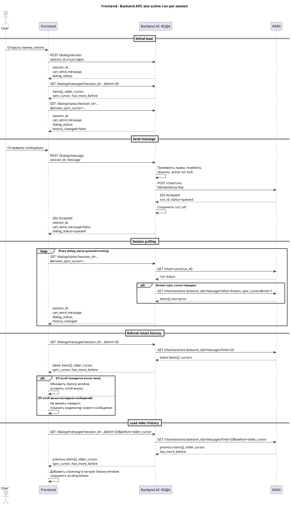

# Асинхронная отправка сообщения, polling и история (Backend)

Статус: **draft**
Feature: `simulation-bt-agent`
Slice: `dialog-session`
Область: `MVP`
Дата обновления: `2026-05-05`
Шаблон: `.workflow/templates/requirements/backend.template.md`

## Связь с feature-level документом

- Главный контрольный документ: `../../requirements.md`
- Этот файл детализирует раздел `Реализация BACKEND` для текущего slice.

## Назначение пакета

- Зафиксировать backend boundary над принятым async REST API RAIN.
- Описать хранение UI-сессии АС КОДА, связки с RAIN `run_id` и нормализованного frontend status view.
- Описать session-level polling endpoint для frontend.
- Зафиксировать ограничения длины, таймауты, terminal statuses и запрет параллельных runs.

## Источники и трассировка

### Основные источники

- `../slice.md`
- `../../feature.md`
- `../../references.md`
- `../../requirements.md`
- `context/change-requests/simulation-bt-agent/agent_openapi_1.yaml`
- `context/change-requests/simulation-bt-agent/rain_api_proposal.md` как предыдущая проектная версия, не приоритетнее `agent_openapi_1.yaml`
- `context/change-requests/simulation-bt-agent/agent_openapi.yaml` как исходная устаревшая версия
- `context/change-requests/simulation-bt-agent/Системные_требования_для_интеграции_АС_КОДА_и_AI_Агента_RAIN.md`
- `context/change-requests/simulation-bt-agent/simulations_api.md`

### Связанные planning stories

- `STORY-SIMULATION-BT-AGENT-002`

### Связанные доменные решения

- `DEC-2026-04-24-SIMULATION-BT-AGENT-001`
- `DEC-2026-04-27-SIMULATION-BT-AGENT-002`
- `DEC-2026-04-29-SIMULATION-BT-AGENT-007`
- `DEC-2026-04-30-SIMULATION-BT-AGENT-008`
- `DEC-2026-04-30-SIMULATION-BT-AGENT-009`
- `DEC-2026-05-05-SIMULATION-BT-AGENT-010`

### Связанные артефакты

- Feature requirements: `../../requirements.md`
- Frontend requirements: `frontend.md`
- Domain impact: `../../domain-impact.md`
- Implementation tasks: `../execution/tasks.md`

## Контекст и бизнес-смысл

### Цель

Скрыть от frontend прямой контракт RAIN, OTT/mTLS и работу с конкретным `run_id` или объектом текущего run, сохранив для пользователя управляемый диалог через session-level API АС КОДА.

### Источник правды

Источником правды для run status, terminal status, истории и агентского контекста является RAIN по принятому `agent_openapi_1.yaml`. Backend АС КОДА является integration boundary: авторизует пользователя, хранит UI-сессию и внутренний `agent_dialog_run_ref` между `session_id` и `run_id` RAIN, вызывает RAIN server-to-server, нормализует ответы для frontend и может вести локальную копию/кэш истории для UI и аудита.

### Затронутые bounded contexts / aggregates

- прикладное состояние UI-сессии агента вне базовой модели `Simulation`
- `Research and Execution`
- `Identity and Access`

### Термины и определения

- `agent_ui_session` — UI-сессия окна агента в АС КОДА, связанная с `session_id` и пользовательской СУДИР-сессией.
- `agent_dialog_run_ref` — локальная связка UI-сессии АС КОДА с `run_id`, созданным RAIN.
- `agent_dialog_message_cache` — необязательная локальная копия/кэш сообщения для UI/аудита; каноническая история находится в RAIN.
- `RAIN /chat/runs` — server-to-server метод создания async run в RAIN.
- `terminal status` — конечное состояние run, которое выставляет RAIN: `succeeded`, `failed`, `timeout`, `cancelled`.
- `dialog_status` — frontend-проекция состояния диалога: `idle`, `queued`, `running`, `succeeded`, `failed`, `timeout`, `cancelled`.
- `can_send_message` — вычисляемый backend-флаг для composer; `false`, если RAIN не готов или `dialog_status` активный.
- `sync_cursor` — opaque cursor из ответа истории, который frontend хранит как маркер последней синхронизации актуального хвоста истории.
- `known_sync_cursor` — optional query-параметр `GET /dialog/status`; frontend передаёт его, если хочет получить `history_changed` относительно уже загруженной истории.
- `history_changed` — optional вычисляемый признак, а не хранимое backend-состояние; backend возвращает его только когда frontend передал `known_sync_cursor` и backend выполнил проверку истории относительно этого cursor.

## Бизнес-правила и системные ограничения

### BR-1. RAIN вызывается только backend АС КОДА
- frontend не вызывает RAIN напрямую;
- OTT, mTLS и внутренние endpoints RAIN не передаются в браузер;
- backend АС КОДА маппит данные frontend/АС КОДА в принятый контракт RAIN `/chat/runs`.

### BR-2. Run создаётся в RAIN, а не внутри АС КОДА
- `POST /dialog/message` не ждёт полного ответа RAIN;
- backend вызывает RAIN `POST /chat/runs` и получает `run_id`;
- backend сохраняет внутренний `agent_dialog_run_ref` между `session_id` и `run_id`;
- terminal status получает и хранит RAIN; backend АС КОДА его не выставляет, а читает через `GET /chat/runs/{run_id}`;
- frontend читает статус сессии через polling `GET /dialog/status?session_id=...`.

### BR-3. В рамках одного `session_id` допускается один active run
- если для `session_id` уже есть run в статусе `queued` или `running`, новый `POST /message` отклоняется;
- это защищает от смешивания контекста и повторной публикации БТ;
- повторная отправка после terminal status считается новым пользовательским действием;
- отдельный frontend endpoint статуса по `run_id` не требуется, потому что для `session_id` одновременно может существовать только один active run; backend возвращает `dialog_status` в статусе сессии и не раскрывает frontend `run_id` или объект текущего run.

### BR-4. История принадлежит RAIN и отдаётся страницами через backend АС КОДА
- backend не передаёт frontend прямой endpoint RAIN;
- frontend не должен загружать всю историю сразу;
- backend проксирует/нормализует `GET /chat/sessions/{session_id}/messages` и поддерживает cursor/limit во frontend API;
- если история длинная, backend отдаёт последние сообщения и признак наличия более ранних;
- `GET /dialog/messages` возвращает `older_cursor` для движения в прошлое и `sync_cursor` как opaque marker актуального хвоста;
- status endpoint не знает, что уже видел frontend, если frontend не передал `known_sync_cursor`.

### BR-5. `history_changed` вычисляется от frontend marker
- backend АС КОДА остаётся stateless относительно history window frontend и не хранит пользовательский scroll-position, загруженные страницы или последний увиденный frontend message;
- frontend после `GET /dialog/messages` сохраняет `sync_cursor` последней синхронизации;
- frontend передаёт `known_sync_cursor` в `GET /dialog/status`, когда ему нужен ответ, появились ли сообщения после этого cursor;
- backend возвращает `history_changed=true`, если RAIN `GET /chat/sessions/{session_id}/messages?after=<known_sync_cursor>&limit=1` или эквивалентная проверка показывает новые сообщения;
- backend возвращает `history_changed=false`, если `known_sync_cursor` передан и RAIN не вернул новых сообщений после него;
- backend не возвращает `history_changed` или возвращает `null`, если `known_sync_cursor` не передан, cursor невалиден или проверка истории недоступна; frontend в этом случае после terminal `succeeded` просто запрашивает latest page.

### BR-6. Ограничения длины обязательны на backend
- backend валидирует длину `message` независимо от frontend;
- backend валидирует frontend payload до вызова RAIN;
- максимальная длина пользовательского `message` для отправки в RAIN в MVP равна `3000` символов;
- лимиты страниц истории применяются при отображении и проксировании истории; backend не меняет terminal status RAIN из-за UI-лимита;
- числовые лимиты должны быть конфигурируемыми.

### BR-7. SLA RAIN учитывается через timeout policy
- SLA системных требований: стандартный запрос около `24.9 + 13.9` секунд, диалоговое взаимодействие около `91.6 + 69.2` секунд;
- backend не должен держать браузерный запрос открытым на это время;
- server-to-server вызов `POST /chat/runs` должен быть коротким и возвращать `202 Accepted`;
- долгую работу выполняет RAIN, а backend АС КОДА читает статус через `GET /chat/runs/{run_id}`;
- timeout frontend polling не означает timeout RAIN run; terminal timeout должен приходить из статуса RAIN.

## Границы MVP

### Входит в MVP

- `POST /dialog/message` с быстрым ответом `202` и состоянием сессии;
- вызов RAIN `POST /chat/runs`;
- `GET /dialog/status?session_id=...` для polling статуса сессии;
- `GET /dialog/messages?session_id=...` с cursor/limit;
- проксирование/нормализация истории RAIN;
- active run lock;
- server-side validation prompt length;
- обработка `succeeded`, `failed`, `timeout`, `cancelled`;
- логирование и метрики run.

### Не входит в MVP

- frontend SSE/WebSocket;
- streaming partial responses;
- параллельные runs в одной сессии;
- подмена terminal status RAIN статусами АС КОДА;
- хранение истории только в АС КОДА как источник правды.

### Отложено после MVP

- переход на SSE между frontend и backend при необходимости;
- отмена run с propagation cancel в RAIN;
- идемпотентный ключ публикации БТ;
- архивирование длинной истории.

## Пользовательские и системные сценарии

### Сценарий BE-1. Создание async run
1. Frontend вызывает `POST /dialog/message`.
2. Backend проверяет пользователя, optional `session_id`, readiness агента, лимит длины и отсутствие active run.
3. Если `session_id` отсутствует, backend создаёт новую UI-сессию и использует её `session_id` для RAIN run.
4. Backend вызывает RAIN `POST /chat/runs` с `Idempotency-Key`.
5. RAIN возвращает `202 Accepted`, `run_id` и начальный `status`.
6. Backend сохраняет внутренний `agent_dialog_run_ref` и возвращает frontend `202 Accepted` со статусом сессии.

### Сценарий BE-2. Завершение run успехом
1. Frontend вызывает `GET /dialog/status?session_id=...`.
2. Backend вызывает RAIN `GET /chat/runs/{run_id}`.
3. RAIN возвращает terminal status `succeeded` и `message_id`/`result_url`.
4. Backend нормализует ответ в `dialog_status` и отдаёт frontend.
5. Frontend запрашивает последние сообщения через `GET /dialog/messages?session_id=...&limit=20`.

### Сценарий BE-3. Timeout или ошибка RAIN
1. Frontend вызывает `GET /dialog/status?session_id=...`.
2. Backend вызывает RAIN `GET /chat/runs/{run_id}`.
3. RAIN возвращает `failed` или `timeout`.
4. Backend нормализует ошибку для frontend, не раскрывая внутренние детали RAIN.
5. Composer разблокируется, потому что `dialog_status` стал terminal.

### Сценарий BE-4. Порционная история
1. Frontend запрашивает историю с `limit`.
2. Backend вызывает RAIN `GET /chat/sessions/{session_id}/messages`.
3. Backend возвращает последние сообщения, `older_cursor`, если есть более ранние, и `sync_cursor` для будущих проверок новых сообщений.
4. При запросе с `before` backend проксирует предыдущую страницу из RAIN.

### Сценарий BE-5. Session-level polling
1. Frontend вызывает `GET /dialog/status?session_id=...&known_sync_cursor=...`, если у него есть cursor последней синхронизации истории.
2. Backend находит внутренний `run_id` RAIN по `session_id`, если он есть.
3. Backend читает RAIN `GET /chat/runs/{run_id}`.
4. Если `known_sync_cursor` передан и нужна проверка истории, backend проверяет RAIN history через `after=<known_sync_cursor>&limit=1`.
5. Backend возвращает `session_id`, `dialog_status`, `can_send_message`, optional `history_changed` и ошибку.
6. Frontend после terminal status или `history_changed=true` запрашивает последние сообщения истории, обычно `GET /dialog/messages?session_id=...&limit=20`.

## Функциональные требования

### BE-FR-1. Отправка сообщения создаёт async run

**Описание:**
Backend должен принимать пользовательское сообщение, создать RAIN run и возвращать быстрый `202 Accepted` со статусом сессии без ожидания полного результата RAIN.

**Правила и ограничения:**
- `session_id` передаётся в body как optional параметр; если он отсутствует, backend создаёт новую UI-сессию;
- если `session_id` передан, он должен принадлежать текущей пользовательской СУДИР-сессии;
- `message` обязателен и не может быть пустым;
- `start_datetime` берётся из backend UI-сессии;
- `fio` берётся из профиля СУДИР на backend или принимается от frontend только если это уже канонический frontend context; итоговое значение должно соответствовать профилю пользователя;
- при active run возвращается `409 run_in_progress`;
- при неготовом агенте возвращается `503 agent_not_ready`;
- успешный ответ `POST /message` имеет статус `202`, а не `200` с полным ответом агента;
- ответ содержит `session_id`, `can_send_message=false`, `dialog_status=queued`; `history_changed` не нужен, если frontend ещё не передал `known_sync_cursor`.

**Зависимости:**
- UI session store;
- status API агента;
- RAIN `POST /chat/runs`;
- локальное хранилище `agent_dialog_run_ref`.

### BE-FR-2. Backend вызывает RAIN `POST /chat/runs`

**Описание:**
Backend должен вызывать RAIN строго по принятому `agent_openapi_1.yaml`.

**Правила и ограничения:**
- server-to-server request содержит `session_id`, `message`, `start_datetime`, `fio`;
- `risk_params` и `simulation_id` передаются, когда сообщение связано с конкретной симуляцией и данные доступны;
- `risk_params.as_is` и `risk_params.to_be` собираются из доверенного existing simulation detail API или валидируются backend перед отправкой;
- backend использует HTTPS/mTLS/OTT для вызова RAIN, когда окружение это поддерживает;
- backend передаёт `Idempotency-Key` в RAIN `POST /chat/runs`;
- backend сохраняет `run_id`, полученный от RAIN;
- тестовый режим без OTT на ИФТ допускается только как явно зафиксированный технический долг, если OTT не готов во 2Q.

**Зависимости:**
- `context/change-requests/simulation-bt-agent/agent_openapi_1.yaml`;
- existing simulation detail API;
- инфраструктура mTLS/OTT.

### BE-FR-3. Session status endpoint возвращает состояние диалога

**Описание:**
Backend должен предоставить endpoint для чтения состояния диалоговой сессии по `session_id`.

**Правила и ограничения:**
- endpoint `GET /dialog/status?session_id=...&known_sync_cursor=...` возвращает `session_id`, `can_send_message`, `dialog_status`, optional `history_changed` и optional `error`;
- если `session_id` не передан, backend создаёт новую пустую UI-сессию и возвращает `dialog_status=idle`;
- `dialog_status=idle`, если в сессии ещё не было RAIN run;
- если `dialog_status` равен `queued` или `running`, composer блокируется;
- если `dialog_status` terminal, composer может быть доступен при готовом RAIN;
- terminal status берётся из RAIN `GET /chat/runs/{run_id}`;
- для `failed`/`timeout` возвращается безопасный для UI код и сообщение;
- endpoint не раскрывает OTT, внутренние URL RAIN, stack trace или полный технический лог;
- чтение чужой сессии запрещено;
- отдельный endpoint `GET /dialog/runs/{run_id}` для frontend MVP не вводится.
- если `known_sync_cursor` отсутствует, backend не должен угадывать `history_changed`; frontend после terminal `succeeded` должен сам запросить latest page истории.

**Зависимости:**
- RAIN `GET /chat/runs/{run_id}`;
- локальное хранилище `agent_dialog_run_ref`.

### BE-FR-4. История сообщений отдаётся через pagination

**Описание:**
Backend должен отдавать историю диалога страницами.

**Правила и ограничения:**
- поддерживаются параметры `limit` и `before`;
- default `limit` рекомендуемо `20`, max `50`;
- порядок ответа должен быть стабильным и позволять frontend восстановить хронологию;
- backend возвращает `older_cursor`, `has_more_before`, `sync_cursor`, `last_message_id`, `last_message_seq` и `history_version` из RAIN, если они доступны;
- frontend трактует `sync_cursor`, `last_message_seq` и `history_version` как технические markers синхронизации, а не как пользовательские счётчики;
- backend не отдаёт всю историю без лимита;

**Зависимости:**
- RAIN `GET /chat/sessions/{session_id}/messages`;
- RAIN `GET /chat/messages/{message_id}`;
- локальный cache/storage только при необходимости UI/аудита.

### BE-FR-5. Лимиты длины и размера

**Описание:**
Backend должен централизованно ограничивать размер входного prompt и frontend-страницы истории.

**Правила и ограничения:**
- `message_max_chars` конфигурируемый, согласованный MVP value `3000`;
- `history_page_max_messages` конфигурируемый, рекомендуемый max `50`;
- при превышении `message_max_chars` возвращается `400 message_too_long`;
- большие ответы RAIN не должны молча обрезаться backend без отдельного согласованного контракта; в MVP backend отдаёт `content` сообщения как получил его от RAIN в `MessageObject`;
- лимиты должны быть возвращаемы frontend через config/status endpoint или синхронизированы в deployment config.

**Зависимости:**
- frontend validation;
- storage capacity.

### BE-FR-6. Timeout и retry policy

**Описание:**
Backend должен иметь явную политику timeout/retry для вызовов RAIN API.

**Правила и ограничения:**
- server-to-server `POST /chat/runs` должен иметь короткий инфраструктурный timeout на создание run;
- долгий SLA относится к выполнению RAIN run и контролируется polling-ом `GET /chat/runs/{run_id}`;
- если `GET /chat/runs/{run_id}` вернул terminal `timeout`, backend нормализует этот статус для frontend;
- сетевой timeout polling-запроса АС КОДА к RAIN не означает terminal `timeout` run;
- retry `POST /chat/runs` допускается только с тем же `Idempotency-Key`;
- для технических ошибок до передачи запроса в RAIN допускается retry по инфраструктурной политике, но он должен быть прозрачно логирован.

**Зависимости:**
- SLA RAIN;
- бизнес-правила публикации БТ.

## Модель данных

### Основные сущности и поля

| Сущность / таблица | Поле | Тип | Обязательность | Описание |
|---|---|---|---|---|
| `agent_ui_session` | `session_id` | UUID/string | обязательно | backend-generated идентификатор UI-сессии окна агента |
| `agent_ui_session` | `user_id` | string/UUID | обязательно | пользователь СУДИР |
| `agent_ui_session` | `start_datetime` | timestamp with timezone | обязательно | дата и время первого открытия окна |
| `agent_ui_session` | `status` | string | обязательно | `active`, `restarted`, `closed` |
| `agent_dialog_run_ref` | `run_id` | UUID/string | обязательно | идентификатор run, созданный RAIN |
| `agent_dialog_run_ref` | `session_id` | UUID/string | обязательно | ссылка на UI-сессию АС КОДА |
| `agent_dialog_run_ref` | `idempotency_key` | UUID/string | обязательно | ключ идемпотентности, переданный в RAIN |
| `agent_dialog_run_ref` | `last_known_status` | enum | опционально | последний прочитанный из RAIN статус для кэша/диагностики |
| `agent_dialog_run_ref` | `created_at` / `updated_at` | timestamp | обязательно | контроль polling и диагностика |
| `agent_dialog_message_cache` | `message_id` | UUID/string | опционально | идентификатор сообщения RAIN при локальном кэше |
| `agent_dialog_message_cache` | `session_id` | UUID/string | обязательно | ссылка на UI-сессию |
| `agent_dialog_message_cache` | `run_id` | UUID/string/null | опционально | RAIN run, породивший сообщение |
| `agent_dialog_message_cache` | `role` | enum | обязательно | `user`, `assistant`, `system` |
| `agent_dialog_message_cache` | `content` | text | опционально | локальная копия текста, если кэш включён |
| `agent_dialog_message_cache` | `content_length` | integer | опционально | длина сообщения для UI-лимитов |
| `agent_dialog_message_cache` | `created_at` | timestamp | обязательно | порядок истории |

### Инварианты и ограничения

- у одного `session_id` не может быть более одного active run;
- `session_id` принадлежит пользовательской СУДИР-сессии и не должен быть доступен другому пользователю;
- RAIN является каноническим владельцем истории;
- локальный message cache АС КОДА не используется для восстановления агентского контекста;
- история отдаётся только с `limit`;
- silent truncation ответа агента запрещён без отдельного согласованного контракта.

### Индексы / уникальности / FK

- уникальный индекс по `run_id`;
- индекс текущего run по `session_id`, `updated_at`;
- индекс локального cache истории по `session_id`, `created_at` или sequence, если cache включён;
- уникальность `session_id` в рамках пользователя или пользовательской СУДИР-сессии.

## API-контракт

### Эндпоинты

| Метод и маршрут | Назначение | Кто вызывает | Примечание |
|---|---|---|---|
| `POST /dialog/message` | создать async run отправки сообщения | frontend agent window | `session_id` передаётся в body; возвращает `202` со статусом сессии |
| `GET /dialog/status?session_id=...&known_sync_cursor=...` | получить статус сессии и optional признак изменений истории | frontend polling | `run_id` не раскрывается frontend; `history_changed` вычисляется только от переданного `known_sync_cursor` |
| `GET /dialog/messages?session_id=...` | получить страницу истории | frontend agent window | параметры `session_id`, `limit`, `before`; ответ содержит `sync_cursor` для следующих status checks |
| `POST RAIN /chat/runs` | создать run агенту | backend АС КОДА | server-to-server по принятому RAIN API |
| `GET RAIN /chat/runs/{run_id}` | прочитать статус run | backend АС КОДА | terminal status принадлежит RAIN |
| `GET RAIN /chat/sessions/{session_id}/messages` | прочитать историю | backend АС КОДА | источник истории RAIN |

### Sequence diagram



### OpenAPI fragment

```yaml
openapi: 3.0.3
info:
  title: Agent Dialog Async Facade API
  version: 1.0.0
paths:
  /dialog/message:
    post:
      summary: Создать async run отправки сообщения агенту
      requestBody:
        required: true
        content:
          application/json:
            schema:
              type: object
              required: [message]
              properties:
                session_id:
                  type: string
                  format: uuid
                  nullable: true
                message:
                  type: string
                  maxLength: 3000
                simulation_id:
                  type: string
                  nullable: true
                mode:
                  type: string
                  enum: [consultation, bt_creation]
                  nullable: true
      responses:
        "202":
          description: Run создан
          content:
            application/json:
              schema:
                type: object
                required: [session_id, can_send_message, dialog_status]
                properties:
                  session_id:
                    type: string
                    format: uuid
                  can_send_message:
                    type: boolean
                    example: false
                  dialog_status:
                    $ref: "#/components/schemas/DialogStatus"
                  history_changed:
                    type: boolean
                    nullable: true
                    description: Возвращается только если frontend передал known_sync_cursor.
        "400":
          description: Ошибка валидации
        "409":
          description: По session_id уже есть активный run
        "503":
          description: Агент не готов
  /dialog/status:
    get:
      summary: Получить статус диалоговой сессии
      parameters:
        - in: query
          name: session_id
          required: false
          schema:
            type: string
            format: uuid
        - in: query
          name: known_sync_cursor
          required: false
          schema:
            type: string
          description: Opaque cursor последней синхронизации истории на frontend.
      responses:
        "200":
          description: Состояние сессии
          content:
            application/json:
              schema:
                type: object
                required: [session_id, can_send_message, dialog_status]
                properties:
                  session_id:
                    type: string
                    format: uuid
                  can_send_message:
                    type: boolean
                  dialog_status:
                    $ref: "#/components/schemas/DialogStatus"
                  history_changed:
                    type: boolean
                    nullable: true
                    description: true/false только относительно переданного known_sync_cursor; null/omitted если cursor отсутствует или проверка недоступна.
                  error:
                    $ref: "#/components/schemas/DialogError"
  /dialog/messages:
    get:
      summary: Получить страницу истории диалога
      parameters:
        - in: query
          name: session_id
          required: false
          schema:
            type: string
            format: uuid
        - in: query
          name: limit
          schema:
            type: integer
            default: 20
            maximum: 50
        - in: query
          name: before
          schema:
            type: string
      responses:
        "200":
          description: Страница сообщений
          content:
            application/json:
              schema:
                type: object
                required: [items, older_cursor, sync_cursor, has_more_before]
                properties:
                  items:
                    type: array
                    items:
                      $ref: "#/components/schemas/DialogMessage"
                  older_cursor:
                    type: string
                    nullable: true
                  sync_cursor:
                    type: string
                    description: Cursor актуального хвоста истории для последующих status checks.
                  last_message_id:
                    type: string
                    nullable: true
                  last_message_seq:
                    type: integer
                    nullable: true
                  history_version:
                    type: string
                    nullable: true
                  has_more_before:
                    type: boolean
components:
  schemas:
    DialogStatus:
      type: string
      enum: [idle, queued, running, succeeded, failed, timeout, cancelled]
    DialogError:
      type: object
      nullable: true
      properties:
        error_code:
          type: string
          nullable: true
        error_message:
          type: string
          nullable: true
    DialogMessage:
      type: object
      required: [message_id, role, content, created_at]
      properties:
        message_id:
          type: string
        role:
          type: string
          enum: [user, assistant]
        content:
          type: string
        created_at:
          type: string
          format: date-time
        run_id:
          type: string
          nullable: true
```

### Примеры запросов и ответов

#### Пример 1. Создание run

```http
POST /dialog/message HTTP/1.1
Content-Type: application/json
```

```json
{
  "session_id": "a1b2c3d4-e5f6-7890-abcd-ef1234567890",
  "message": "Сформируй БТ по этой симуляции.",
  "simulation_id": "SIM-CC-148",
  "mode": "bt_creation"
}
```

```json
{
  "session_id": "a1b2c3d4-e5f6-7890-abcd-ef1234567890",
  "can_send_message": false,
  "dialog_status": "queued"
}
```

#### Пример 2. Server-to-server создание run в RAIN

```http
POST /chat/runs HTTP/1.1
Content-Type: application/json
Idempotency-Key: 3bdb8f6e-c9e1-46d0-b469-327d4b6fd0f8
```

```json
{
  "session_id": "a1b2c3d4-e5f6-7890-abcd-ef1234567890",
  "message": "Сформируй БТ по этой симуляции.",
  "risk_params": {
    "as_is": {
      "PD_LIMIT": "0.38"
    },
    "to_be": {
      "PD_LIMIT": "0.42"
    }
  },
  "simulation_id": "SIM-CC-148",
  "start_datetime": "2026-04-29T12:30:00.123+03:00",
  "fio": "Иванов Иван Иванович"
}
```

```json
{
  "run_id": "7e1d4c3c-7ac0-41dd-a69d-7320f7f29a51",
  "session_id": "a1b2c3d4-e5f6-7890-abcd-ef1234567890",
  "status": "queued",
  "retry_after_seconds": 5
}
```

#### Пример 3. Polling terminal status по session_id

```http
GET /dialog/status?session_id=a1b2c3d4-e5f6-7890-abcd-ef1234567890&known_sync_cursor=cursor-after-1002450 HTTP/1.1
```

```json
{
  "session_id": "a1b2c3d4-e5f6-7890-abcd-ef1234567890",
  "can_send_message": true,
  "dialog_status": "succeeded",
  "history_changed": true,
  "error": null
}
```

#### Пример 4. Страница истории

```http
GET /dialog/messages?session_id=a1b2c3d4-e5f6-7890-abcd-ef1234567890&limit=20 HTTP/1.1
```

```json
{
  "items": [
    {
      "message_id": "msg-1002450",
      "role": "user",
      "content": "Сформируй БТ по этой симуляции.",
      "created_at": "2026-04-29T12:30:03.000+03:00"
    },
    {
      "message_id": "msg-1002451",
      "role": "assistant",
      "content": "Страница БТ создана: https://confluence.example.local/pages/viewpage.action?pageId=12345",
      "created_at": "2026-04-29T12:31:40.000+03:00"
    }
  ],
  "older_cursor": null,
  "sync_cursor": "cursor-after-1002451",
  "last_message_id": "msg-1002451",
  "last_message_seq": 1002451,
  "history_version": "hv-20260429-1002451",
  "has_more_before": false
}
```

## Интеграции, вычисления и фоновые процессы

- Внешние системы: AI-агент RAIN, existing simulation detail API;
- Асинхронные процессы выполняются на стороне RAIN после `POST /chat/runs`;
- Вычисление статусов / derived fields: `dialog_status`, `can_send_message`, optional `history_changed`, `has_more_before`;
- Идемпотентность / ретраи: retry `POST /chat/runs` выполняется только с тем же `Idempotency-Key`.

## Ошибки и валидация

### Валидационные правила

- если `session_id` передан, он должен быть валиден и принадлежать пользователю;
- если `session_id` отсутствует, backend создаёт новую UI-сессию;
- `message` обязателен, непустой и не длиннее `message_max_chars`;
- `start_datetime` хранится в UI-сессии и передаётся в RAIN в формате ISO 8601;
- `fio` берётся из СУДИР-профиля пользователя;
- нельзя создать второй active run по тому же `session_id`;
- чтение чужой `session_id` запрещено;
- история без `limit` использует безопасный default.

### Ошибки API

| Код/сценарий | Условие | Ответ |
|---|---|---|
| `400 message_empty` | пустой текст | ошибка валидации |
| `400 message_too_long` | prompt превышает лимит | ошибка валидации с текущим лимитом |
| `404 session_not_found` | `session_id` не найден или не принадлежит пользователю | ошибка отсутствующей сессии |
| `409 run_in_progress` | уже есть active run | конфликт |
| `503 agent_not_ready` | RAIN readiness не готов | временная недоступность |
| `504 rain_status_unavailable` | не удалось прочитать статус RAIN run | временная ошибка чтения статуса, не terminal status run |
| `502 agent_error` | RAIN вернул ошибку или некорректный ответ | terminal status `failed` |

## Миграция и обратная совместимость

- Нужны ли миграции данных: да, если связки UI-сессии с RAIN `run_id` и локальная копия/кэш истории хранятся в постоянном backend-хранилище АС КОДА.
- Нужен ли backfill: нет.
- Есть ли риски для текущего baseline: да, прежняя модель прямого синхронного ответа заменяется proxy/boundary над async REST API RAIN.
- Что должно попасть в release finalization: frontend session-level contract, RAIN async contract, лимиты, timeout/retry policy, health/status behavior и правила проксирования истории.

## Observability и аудит

- Логи: создание RAIN run, чтение статуса RAIN, terminal status, timeout чтения статуса, error_code, `session_id`, `run_id`;
- Метрики: run duration, success/failure/timeout rate, readiness state, средний размер prompt/response, количество сообщений в истории;
- Audit trail: обычные сообщения технически логируются, бизнес-аудит публикации БТ фиксируется в slice `bt-publication`.

## Критерии приемки

### BE-AC-1. Async facade
- [ ] `POST /message` возвращает `202` со статусом сессии без ожидания результата RAIN
- [ ] Backend вызывает RAIN `POST /chat/runs` и сохраняет полученный `run_id`
- [ ] Session status endpoint возвращает `dialog_status` без раскрытия `run_id` во frontend API
- [ ] Active run lock не позволяет создать второй run в той же сессии

### BE-AC-2. История и лимиты
- [ ] История читается из RAIN через backend АС КОДА
- [ ] История отдаётся только страницами с `limit`
- [ ] Backend отклоняет prompt длиннее configured limit
- [ ] Backend не отдаёт всю историю без pagination

### BE-AC-3. Timeout и ошибки
- [ ] При terminal `timeout` от RAIN frontend получает нормализованный status/error
- [ ] Ошибки RAIN нормализуются для UI
- [ ] Автоматический retry не выполняется для БТ без идемпотентности

## Открытые вопросы и допущения

- Значения `message_max_chars`, `history_page_max_messages` и инфраструктурные timeout чтения RAIN API должны быть подтверждены с командами RAIN и эксплуатации.
- Структурированная ссылка на БТ ожидается через `artifacts[]` результата RAIN run по принятому API.
